# Exocórtex.IA — Catálogo Canônico de Features

> **Objetivo:** Servir como lista canônica e evolutiva de todas as features do ecossistema,
> separando claramente o que é **Exocórtex** (identidade, método, skills proprietárias) do que
> é **Hermes Agent** (runtime, infraestrutura nativa). Cada item pode ser testado, auditado
> e evoluído de forma independente.

**Versão:** 1.2.0
**Atualizado:** 2026-06-16
**Bundle de referência:** `exocortex-alpha.yaml`

---

## Índice

- [Parte 1 — Features Nativas do Hermes Agent](#parte-1--features-nativas-do-hermes-agent)
- [Parte 2 — Features do Exocórtex](#parte-2--features-do-exocórtex)
  - [Onboarding & Assessment](#1-onboarding--assessment)
  - [Behavior & Governance](#2-behavior--governance)
  - [Memory & Acervo](#3-memory--acervo)
  - [Quality Gates](#4-quality-gates)
  - [Production & Artifacts](#5-production--artifacts)
  - [Integration](#6-integration)
  - [Harness & Infrastructure](#7-harness--infrastructure)

---

## Parte 1 — Features Nativas do Hermes Agent

Estas são capacidades fornecidas pelo runtime Hermes. O Exocórtex **consome** estas
features mas **não as implementa**. O setup.sh configura, aplica patches e hardening sobre elas.

### H-01. Runtime de Agente

| Campo              | Detalhe                                                                                                                                                                                                                |
| ------------------ | ---------------------------------------------------------------------------------------------------------------------------------------------------------------------------------------------------------------------- |
| **Funcionalidade** | Motor de execução de agentes com suporte a skills, profiles, bundles, memória de curto prazo, gateways e automação. Fornece CLI (`hermes`), persistência de sessão e orquestração de ferramentas.                      |
| **Como usar**      | `hermes` (sessão interativa) · `hermes -p manut` (profile específico)                                                                                                                                                  |
| **Instalação**     | Instalador oficial: `curl -fsSL https://raw.githubusercontent.com/NousResearch/hermes-agent/main/scripts/install.sh \| bash` — executado automaticamente pelo `install.sh` do Exocórtex se Hermes não estiver no PATH. |
| **Dependências**   | `git`, `curl`, `rsync`, Python 3.11+, sistema Linux ou macOS                                                                                                                                                           |

### H-02. Skills Engine

| Campo              | Detalhe                                                                                                                                                                      |
| ------------------ | ---------------------------------------------------------------------------------------------------------------------------------------------------------------------------- |
| **Funcionalidade** | Carregamento dinâmico de skills (arquivos `SKILL.md` com YAML frontmatter). Suporta organização por categoria, bundles YAML e profiles com seleção de subconjunto de skills. |
| **Como usar**      | Skills em `$HERMES_HOME/skills/<categoria>/<skill>/SKILL.md` são carregadas automaticamente via bundle ou profile.                                                           |
| **Instalação**     | Nativo no Hermes.                                                                                                                                                            |
| **Dependências**   | Hermes runtime                                                                                                                                                               |

### H-03. MCP Server Management

| Campo              | Detalhe                                                                                                                                                 |
| ------------------ | ------------------------------------------------------------------------------------------------------------------------------------------------------- |
| **Funcionalidade** | Registro, remoção e teste de MCP (Model Context Protocol) servers para integração com ferramentas externas. Suporte a transport stdio e HTTP com OAuth. |
| **Como usar**      | `hermes mcp add <name> --command <cmd>` · `hermes mcp list` · `hermes mcp test <name>` · `hermes mcp remove <name>`                                     |
| **Instalação**     | Nativo no Hermes.                                                                                                                                       |
| **Dependências**   | Hermes runtime                                                                                                                                          |

### H-04. Gateway System

| Campo              | Detalhe                                                                                                         |
| ------------------ | --------------------------------------------------------------------------------------------------------------- |
| **Funcionalidade** | Canais de entrega para o usuário final (Telegram, Discord, Slack, email, etc.). Separa transporte de interface. |
| **Como usar**      | `hermes gateway setup telegram --token <TOKEN>` · `hermes gateway list`                                         |
| **Instalação**     | Nativo no Hermes. Telegram configurado via `setup.sh` quando `TELEGRAM_BOT_TOKEN` está definido.                |
| **Dependências**   | Hermes runtime, token do gateway específico                                                                     |

### H-05. Profile System

| Campo              | Detalhe                                                                                                                                                       |
| ------------------ | ------------------------------------------------------------------------------------------------------------------------------------------------------------- |
| **Funcionalidade** | Profiles são configurações de sessão que selecionam SOUL.md, bundle e subconjunto de skills. Permitem separar modos operacionais (interativo vs. background). |
| **Como usar**      | `hermes -p <profile>` · Profiles em `$HERMES_HOME/profiles/<name>/profile.yaml`                                                                               |
| **Instalação**     | Nativo no Hermes.                                                                                                                                             |
| **Dependências**   | Hermes runtime                                                                                                                                                |

### H-06. LLM Wiki (research/llm-wiki)

| Campo              | Detalhe                                                                                                                                |
| ------------------ | -------------------------------------------------------------------------------------------------------------------------------------- |
| **Funcionalidade** | Skill nativa do Hermes para gestão de wiki de conhecimento. Fornece mecânicas de ingestão, query e manutenção.                         |
| **Como usar**      | Consumida indiretamente pelo Exocórtex via adapter `excrtx-memory-wikiadapt`. **Nunca** apontar `WIKI_PATH` para o Acervo diretamente. |
| **Instalação**     | Nativa no Hermes.                                                                                                                      |
| **Dependências**   | Hermes runtime                                                                                                                         |

### H-07. Google Workspace Skills

| Campo              | Detalhe                                                                                                                       |
| ------------------ | ----------------------------------------------------------------------------------------------------------------------------- |
| **Funcionalidade** | Skills nativas do Hermes para Gmail, Calendar e Drive (leitura, busca, envio com draft). Incluem `google_api.py` como driver. |
| **Como usar**      | Ativadas via skills nativas do Hermes em `$HERMES_HOME/skills/productivity/google-workspace/`.                                |
| **Instalação**     | Nativas no Hermes. O `setup.sh` aplica hardening na busca do Drive (paginação, filtro de trashed, `nextPageToken`).           |
| **Dependências**   | Hermes runtime, Google Application Default Credentials ou `gcloud auth` ativo                                                 |

### H-08. Hermes Dashboard (Web UI)

| Campo              | Detalhe                                                                                          |
| ------------------ | ------------------------------------------------------------------------------------------------ |
| **Funcionalidade** | Interface web para configuração, monitoramento, sessões, logs e supervisão. Cockpit do operador. |
| **Como usar**      | `hermes dashboard`                                                                               |
| **Instalação**     | Nativo no Hermes (pode lazy-install dependências web).                                           |
| **Dependências**   | Hermes runtime                                                                                   |

### H-09. Hermes Kanban

| Campo              | Detalhe                                                                                         |
| ------------------ | ----------------------------------------------------------------------------------------------- |
| **Funcionalidade** | Sistema nativo de kanban/backlog durável do Hermes. Suporta cards com estados, tags e metadata. |
| **Como usar**      | Operado via skill `excrtx-harness-kanban` que adiciona semântica Exocórtex.                     |
| **Instalação**     | Nativo no Hermes.                                                                               |
| **Dependências**   | Hermes runtime                                                                                  |

### H-10. Session Search & Built-in Memory

| Campo              | Detalhe                                                                                                                |
| ------------------ | ---------------------------------------------------------------------------------------------------------------------- |
| **Funcionalidade** | Memória de curto prazo e busca em histórico de sessões anteriores. Preserva invariantes compactos e histórico literal. |
| **Como usar**      | Automático no runtime.                                                                                                 |
| **Instalação**     | Nativo no Hermes.                                                                                                      |
| **Dependências**   | Hermes runtime                                                                                                         |

---

## Parte 2 — Features do Exocórtex

Estas são as features proprietárias implementadas como skills, scripts e configuração do Exocórtex.
Organizadas em 7 categorias funcionais. **57 skills no total** (43 EX-IDs formalmente catalogados, cada um com cenário de teste dogfood, + 15 skills de suporte/auxiliares sem ID formal — veja seção "Supporting / Auxiliary Skills" abaixo). Além disso, 4 serviços opcionais de infraestrutura foram promovidos a first-class GA nesta release (seção "Serviços Opcionais & Infraestrutura").

---

### 1. Onboarding & Assessment

#### EX-01. Welcome & Onboarding (`excrtx-onboard-welcome`)

| Campo                      | Detalhe                                                                                                                                                                                                                                                       |
| -------------------------- | ------------------------------------------------------------------------------------------------------------------------------------------------------------------------------------------------------------------------------------------------------------- |
| **Funcionalidade**         | Fluxo de boas-vindas para novos usuários. Detecta acervo vazio e exibe `WELCOME.md`. Inicia entrevista estruturada em 6 blocos (Identidade, Comunicação, Domínios, Contexto de Negócio, Preferências Operacionais, Integrações) que gera o `SOUL.md` personalizado — o Macroverso — incluindo um bloco parseável `{industry, companies, competitors}` para skills de pesquisa. |
| **Como usar**              | Na primeira sessão interativa, digitar: "vamos começar o onboarding". Ativado automaticamente quando `macro/SOUL.md` está pendente.                                                                                                                           |
| **Instalação**             | `setup.sh` copia de `skills/excrtx-onboard-welcome/` para `$HERMES_HOME/skills/exocortex/excrtx-onboard-welcome/`.                                                                                                                                            |
| **Dependências de Skills** | Nenhuma                                                                                                                                                                                                                                                       |
| **Dependências de Tools**  | Nenhuma                                                                                                                                                                                                                                                       |

#### EX-02. Entrevista de Onboarding (`excrtx-onboard-interview`)

| Campo                      | Detalhe                                                                                                                                                                                                                                                                                                                                                       |
| -------------------------- | ------------------------------------------------------------------------------------------------------------------------------------------------------------------------------------------------------------------------------------------------------------------------------------------------------------------------------------------------------------- |
| **Funcionalidade**         | Conduz a entrevista estruturada de calibração do Exocórtex em 6 blocos (Identidade Profissional, Estilo de Comunicação, Domínios de Atuação, Contexto de Negócio, Preferências Operacionais, Integrações). Gera `SOUL.md`, microversos iniciais, `estilo.md` e um bloco YAML parseável de contexto de negócio para auto-configuração de skills de pesquisa. Suporta interrupção parcial (salva estado), defaults para blocos pulados, e re-onboarding com merge não-destrutivo. |
| **Como usar**              | Ativada internamente por `excrtx-onboard-welcome` durante o fluxo de onboarding, ou quando SOUL.md tem seções 'Pendente'.                                                                                                                                                                                                                                     |
| **Instalação**             | `setup.sh` copia skill.                                                                                                                                                                                                                                                                                                                                       |
| **Dependências de Skills** | `excrtx-onboard-welcome`, `excrtx-memory-newmicro`, `excrtx-quality-antislop`                                                                                                                                                                                                                                                                                 |
| **Dependências de Tools**  | Nenhuma                                                                                                                                                                                                                                                                                                                                                       |

#### EX-03. Self-Test / Auto-diagnóstico (`excrtx-assess-selftest`)

| Campo                      | Detalhe                                                                                                                                                                                                   |
| -------------------------- | --------------------------------------------------------------------------------------------------------------------------------------------------------------------------------------------------------- |
| **Funcionalidade**         | Verifica o estado de configuração do Exocórtex: presença de SOUL.md, MEMORY.md, skills das 7 Natures, tools, comportamento (Draft-First, detecção socrática). Gera relatório com score `N/5 checkpoints`. |
| **Como usar**              | Digitar: "self-test", "status de configuração", "diagnóstico exocórtex" ou "checkpoint".                                                                                                                  |
| **Instalação**             | `setup.sh` copia skill.                                                                                                                                                                                   |
| **Dependências de Skills** | `excrtx-harness-promptlog`, `excrtx-behavior-briefing`, `excrtx-govern-tools`, `excrtx-assess-repofit`                                                                                                    |
| **Dependências de Tools**  | Nenhuma                                                                                                                                                                                                   |

#### EX-04. Repo Fit Assessment (`excrtx-assess-repofit`)

| Campo                      | Detalhe                                                                                                                                                                                                                                                                                                                                                                                                                  |
| -------------------------- | ------------------------------------------------------------------------------------------------------------------------------------------------------------------------------------------------------------------------------------------------------------------------------------------------------------------------------------------------------------------------------------------------------------------------ |
| **Funcionalidade**         | Due diligence técnica de repositórios. Mede delta entre o que o projeto diz ser e o que realmente entrega. Valida claims contra código, runtime e contrato operacional. Avalia 4 classes de mismatch (claim vs implementação, fallback prometido vs real, contrato de produto vs interno, arquitetura suficiente vs endurecida). Gera relatório com veredito, pontos fortes, lacunas, riscos e recomendações (P0/P1/P2). |
| **Como usar**              | Digitar: "estude este sistema", "avalie se este projeto serve como base para X", "escreva um relatório com melhorias necessárias". Draft apresentado antes de gravar o relatório final.                                                                                                                                                                                                                                  |
| **Instalação**             | `setup.sh` copia skill.                                                                                                                                                                                                                                                                                                                                                                                                  |
| **Dependências de Skills** | `excrtx-govern-draftfirst`, `excrtx-memory-manager`                                                                                                                                                                                                                                                                                                                                                                      |
| **Dependências de Tools**  | `git`, acesso ao repositório alvo, `pytest`/`mypy` (para validação runtime)                                                                                                                                                                                                                                                                                                                                              |

---

### 2. Behavior & Governance

#### EX-05. Classificador de Vetor (`excrtx-behavior-vetor`)

| Campo                      | Detalhe                                                                                                                                                                                                                                                                                                                                         |
| -------------------------- | ----------------------------------------------------------------------------------------------------------------------------------------------------------------------------------------------------------------------------------------------------------------------------------------------------------------------------------------------- |
| **Funcionalidade**         | Classifica cada input do executivo como Vetor de **Execução** (FAZER — modo agente especialista), **Evolução** (PENSAR — modo socrático) ou **Manutenção** (CUIDAR — modo zelador/auditor). Quando ambíguo, pergunta com 3 opções (executar, explorar, manter). Governa o comportamento do agente em toda interação. Log com formato `[VETOR]`. |
| **Como usar**              | Automático. Classificação ocorre internamente antes de cada resposta. Sinais de Execução: verbos de ação, deadlines. Sinais de Evolução: perguntas abertas, reflexão. Sinais de Manutenção: "revise pendências", "audite logs", "faça limpeza".                                                                                                 |
| **Instalação**             | `setup.sh` copia skill.                                                                                                                                                                                                                                                                                                                         |
| **Dependências de Skills** | Nenhuma                                                                                                                                                                                                                                                                                                                                         |
| **Dependências de Tools**  | Nenhuma                                                                                                                                                                                                                                                                                                                                         |

#### EX-06. Canvas Cognitivo (`excrtx-behavior-canvas`)

| Campo                      | Detalhe                                                                                                                                                                                                                                                                                  |
| -------------------------- | ---------------------------------------------------------------------------------------------------------------------------------------------------------------------------------------------------------------------------------------------------------------------------------------- |
| **Funcionalidade**         | Extrai a estrutura implícita de cada input e ancora a tarefa na tríade Macroverso → Microversos → Tarefa. Resolve o microverso principal, microversos de apoio, lacunas e restrições de compartilhamento antes de processar. Funciona como raio-X do pedido antes de agir. Harness v0.4. |
| **Como usar**              | Automático. Roda internamente em conjunto com o classificador de vetor.                                                                                                                                                                                                                  |
| **Instalação**             | `setup.sh` copia skill.                                                                                                                                                                                                                                                                  |
| **Dependências de Skills** | `excrtx-behavior-vetor`                                                                                                                                                                                                                                                                  |
| **Dependências de Tools**  | Nenhuma                                                                                                                                                                                                                                                                                  |

#### EX-07. Briefing Contextual (`excrtx-behavior-briefing`)

| Campo                      | Detalhe                                                                                                                                    |
| -------------------------- | ------------------------------------------------------------------------------------------------------------------------------------------ |
| **Funcionalidade**         | Gera briefing de contexto para sessões e tarefas. Sintetiza estado atual do microverso ativo, pendências, decisões recentes e prioridades. |
| **Como usar**              | Ativado quando o agente inicia tarefa em contexto de microverso ou quando o executivo pede status/resumo de situação.                      |
| **Instalação**             | `setup.sh` copia skill.                                                                                                                    |
| **Dependências de Skills** | `excrtx-memory-manager`, `excrtx-behavior-vetor`                                                                                           |
| **Dependências de Tools**  | Nenhuma                                                                                                                                    |

#### EX-08. Draft-First Protocol (`excrtx-govern-draftfirst`)

| Campo                      | Detalhe                                                                                                                                                                                                                                                                      |
| -------------------------- | ---------------------------------------------------------------------------------------------------------------------------------------------------------------------------------------------------------------------------------------------------------------------------- |
| **Funcionalidade**         | Interceptor obrigatório para ações externas/irreversíveis. Toda comunicação, publicação, deploy, commit ou modificação fora do ambiente local é criada como DRAFT com resumo de impacto. Execução só após aprovação explícita. Nunca interpreta silêncio como consentimento. |
| **Como usar**              | Automático. Intercepta: envio de emails, publicação em redes, eventos no calendário, modificações em docs compartilhados, commits, deploys, qualquer comunicação em nome do executivo.                                                                                       |
| **Instalação**             | `setup.sh` copia skill. Regras também definidas em `SOUL_SEED.md`.                                                                                                                                                                                                           |
| **Dependências de Skills** | Nenhuma                                                                                                                                                                                                                                                                      |
| **Dependências de Tools**  | Nenhuma                                                                                                                                                                                                                                                                      |

#### EX-09. Tool Governance (`excrtx-govern-tools`)

| Campo                      | Detalhe                                                                                                                                                                                                                                                             |
| -------------------------- | ------------------------------------------------------------------------------------------------------------------------------------------------------------------------------------------------------------------------------------------------------------------- |
| **Funcionalidade**         | Regras de governança para uso de ferramentas pelo agente. Define quando e como tools devem ser usadas, logging obrigatório e classificação por tipo. Garante que ferramentas são usadas quando fatos, arquivos, sistema, datas, estado ou execução são necessários. |
| **Como usar**              | Automático. Governa toda invocação de tool pelo agente.                                                                                                                                                                                                             |
| **Instalação**             | `setup.sh` copia skill.                                                                                                                                                                                                                                             |
| **Dependências de Skills** | Nenhuma                                                                                                                                                                                                                                                             |
| **Dependências de Tools**  | Nenhuma                                                                                                                                                                                                                                                             |

#### EX-10. Kanban Backlog (`excrtx-harness-kanban`)

| Campo                      | Detalhe                                                                                                                                                                                                                                                                                                                                                                                                             |
| -------------------------- | ------------------------------------------------------------------------------------------------------------------------------------------------------------------------------------------------------------------------------------------------------------------------------------------------------------------------------------------------------------------------------------------------------------------- |
| **Funcionalidade**         | Registra pendências, decisões arquiteturais e pontos de retomada no backlog durável do Hermes Kanban. Mantém vínculo com artefatos canônicos do projeto e do Acervo. Cada card aponta para caminhos absolutos de retomada, lista decisões pendentes e saída esperada. Classifica input como Execução ou Manutenção. Modo TODO leve quando não for necessário card Kanban (append a `plans/STATUS.md` ou `TODO.md`). |
| **Como usar**              | Digitar: "coloque isso no kanban", "deixe para retomada posterior", "registre como pendente", "anotar como TODO".                                                                                                                                                                                                                                                                                                   |
| **Instalação**             | `setup.sh` copia skill.                                                                                                                                                                                                                                                                                                                                                                                             |
| **Dependências de Skills** | `excrtx-govern-draftfirst`, `excrtx-memory-manager`                                                                                                                                                                                                                                                                                                                                                                 |
| **Dependências de Tools**  | Hermes Kanban (nativo H-09)                                                                                                                                                                                                                                                                                                                                                                                         |

#### EX-49. Verificação de Precisão (`excrtx-behavior-accuracy`)

| Campo                      | Detalhe                                                                                                                                                                                                                                                                                                                                                                       |
| -------------------------- | ----------------------------------------------------------------------------------------------------------------------------------------------------------------------------------------------------------------------------------------------------------------------------------------------------------------------------------------------------------------------------- |
| **Funcionalidade**         | Garante precisão nas afirmações sobre ações realizadas. Impede que o agente afirme ter feito algo que não fez (ex: fechar issues, commits, deploys, enviar mensagens). Toda afirmação de conclusão de ação externa requer verificação real do estado do sistema com prova (output do comando). Scoring: checklist de 4 pontos (executei? verifiquei? confirma? tenho prova?). |
| **Como usar**              | Automático. Intercepta toda afirmação de conclusão de ação externa. Triggers: "issue fechada", "commitado", "enviei", qualquer afirmação de conclusão.                                                                                                                                                                                                                        |
| **Instalação**             | `setup.sh` copia skill.                                                                                                                                                                                                                                                                                                                                                       |
| **Dependências de Skills** | Nenhuma (complementa `excrtx-govern-draftfirst` mas sem dependência funcional)                                                                                                                                                                                                                                                                                                |
| **Dependências de Tools**  | Nenhuma                                                                                                                                                                                                                                                                                                                                                                       |

---

### 3. Memory & Acervo

#### EX-11. Acervo Manager (`excrtx-memory-manager`)

| Campo                      | Detalhe                                                                                                                                                                                                                                                                                                                                                                                                  |
| -------------------------- | -------------------------------------------------------------------------------------------------------------------------------------------------------------------------------------------------------------------------------------------------------------------------------------------------------------------------------------------------------------------------------------------------------- |
| **Funcionalidade**         | Skill unificada para operar o Acervo Cognitivo de 4 camadas (macro/global/micro/shared). Implementa operações READ, WRITE, SEARCH e PROMOTE sobre as 11 Natures (context, knowledge, contracts, prompts, persona, workflows, skills, tools, templates, decisions, reflections). Substitui as 7 Nature skills individuais (ADR-005). Resolve scope de acesso entre microversos e gerencia frontmatter v2. |
| **Como usar**              | Ativado quando qualquer tarefa precisa ler ou escrever no Acervo. Boot de sessão: lê `macro/*` + `global/index.md`. Micro e shared carregados sob demanda por scope.                                                                                                                                                                                                                                     |
| **Instalação**             | `setup.sh` copia skill e cria estrutura de diretórios do Acervo.                                                                                                                                                                                                                                                                                                                                         |
| **Dependências de Skills** | Nenhuma (é skill raiz do subsistema de memória)                                                                                                                                                                                                                                                                                                                                                          |
| **Dependências de Tools**  | Acesso ao filesystem (`$ACERVO/`)                                                                                                                                                                                                                                                                                                                                                                        |

#### EX-12. Wiki Adapter (`excrtx-memory-wikiadapt`)

| Campo                      | Detalhe                                                                                                                                                                                                                                     |
| -------------------------- | ------------------------------------------------------------------------------------------------------------------------------------------------------------------------------------------------------------------------------------------- |
| **Funcionalidade**         | Bridge segura entre a skill nativa `research/llm-wiki` do Hermes e o Acervo Cognitivo v2. Traduz categorias LLM Wiki (entity, concept, comparison, query, raw) para a Ontologia Multifocal v2. Impede escrita direta da LLM Wiki no Acervo. |
| **Como usar**              | Ativado quando uma operação da LLM Wiki precisa afetar o Acervo. Fluxo: `llm-wiki → wikiadapt → memory-manager → Acervo`.                                                                                                                   |
| **Instalação**             | `setup.sh` copia skill.                                                                                                                                                                                                                     |
| **Dependências de Skills** | `excrtx-memory-manager`, LLM Wiki nativa do Hermes (H-06)                                                                                                                                                                                   |
| **Dependências de Tools**  | Nenhuma                                                                                                                                                                                                                                     |

#### EX-13. Criar Microverso (`excrtx-memory-newmicro`)

| Campo                      | Detalhe                                                                                                                                                                                                                                                                                                                                                                                    |
| -------------------------- | ------------------------------------------------------------------------------------------------------------------------------------------------------------------------------------------------------------------------------------------------------------------------------------------------------------------------------------------------------------------------------------------ |
| **Funcionalidade**         | Provisiona novo domínio de atuação no Acervo com estrutura wiki completa: SCHEMA.md, index.md, log.md, e 15+ diretórios funcionais (context, knowledge, contracts, prompts, skills, workflows, tools, templates, decisions, reflections, persona, \_meta, raw, \_archive). Valida pré-requisitos (Acervo dir, template dir), apresenta draft ao executivo para confirmação antes de criar. |
| **Como usar**              | Ativado quando o executivo menciona novo domínio ou solicita explicitamente criar microverso. Requer: Nome, Slug (kebab-case), Type (client/project/domain/role), Description.                                                                                                                                                                                                             |
| **Instalação**             | `setup.sh` copia skill e template em `$ACERVO/micro/_template/`.                                                                                                                                                                                                                                                                                                                           |
| **Dependências de Skills** | `excrtx-memory-manager`, `excrtx-memory-mvinstall`, `excrtx-memory-mvsetup`, `excrtx-quality-designsys`                                                                                                                                                                                                                                                                                    |
| **Dependências de Tools**  | Nenhuma                                                                                                                                                                                                                                                                                                                                                                                    |

#### EX-14. Setup de Microverso Base (`excrtx-memory-mvsetup`)

| Campo                      | Detalhe                                                                                                                                                                                                         |
| -------------------------- | --------------------------------------------------------------------------------------------------------------------------------------------------------------------------------------------------------------- |
| **Funcionalidade**         | Promove um microverso ao setup inicial replicável do Exocórtex. Faz com que microversos base sejam provisionados automaticamente em novas instalações via `setup.sh`. Garante idempotência e validação isolada. |
| **Como usar**              | Ativado quando o executivo pede que um microverso seja "inicial", "base", "padrão" ou "parte do Hermes setup".                                                                                                  |
| **Instalação**             | `setup.sh` copia skill.                                                                                                                                                                                         |
| **Dependências de Skills** | `excrtx-memory-manager`, `excrtx-memory-newmicro`                                                                                                                                                               |
| **Dependências de Tools**  | `setup.sh`                                                                                                                                                                                                      |

#### EX-15. Microverso Package Installer (`excrtx-memory-mvinstall`)

| Campo                      | Detalhe                                                                                                                                                                                                                                                               |
| -------------------------- | --------------------------------------------------------------------------------------------------------------------------------------------------------------------------------------------------------------------------------------------------------------------- |
| **Funcionalidade**         | Instala pacotes `.mvpkg` (manifesto `microverso.yaml`, schema `excrtx/v1`) via `microverso_install.py`: integridade (`MANIFEST.sum`) → manifesto → gate OKF → preflight de compat → dependências + resolução de colisão de skills (skip/update/rename) → merge seguro (`rsync --ignore-existing`) → hooks → registro global. Aceita dir, `.tar.gz` ou git URL. |
| **Como usar**              | Digitar: "instale o microverso X" ou `python3 $ACERVO/global/tools/microverso_install.py <pkg>`.                                                                                                                                                                      |
| **Instalação**             | `setup.sh` copia skill + `global/tools/microverso_install.py`.                                                                                                                                                                                                        |
| **Dependências de Skills** | `excrtx-memory-manager`, `excrtx-memory-newmicro`, `excrtx-memory-mvexport`                                                                                                                                                                                           |
| **Dependências de Tools**  | `rsync`, `git`, `uv` ou `pip` (para deps Python), `npm` (para deps Node)                                                                                                                                                                                              |

#### EX-58. Microverso Package Exporter (`excrtx-memory-mvexport`)

| Campo                      | Detalhe                                                                                                                                                                                                                                                               |
| -------------------------- | --------------------------------------------------------------------------------------------------------------------------------------------------------------------------------------------------------------------------------------------------------------------- |
| **Funcionalidade**         | Empacota um microverso num pacote portátil e autossuficiente (`.mvpkg`, Docker-like) via `microverso_package.py`: auto-gera `microverso.yaml` (`excrtx/v1`), valida o gate OKF, aplica clean-portable (remove `last_accessed_at`, exclui quarantine/_archive/raw, descarta deprecated), embute skills/deps/integrações e gera `MANIFEST.sum`. Contraparte do EX-15. |
| **Como usar**              | Digitar: "exporte/empacote o microverso X" ou `python3 $ACERVO/global/tools/microverso_package.py --microverso <slug> --out <dir> --tar`.                                                                                                                             |
| **Instalação**             | `setup.sh` copia skill + `global/tools/microverso_package.py`.                                                                                                                                                                                                        |
| **Dependências de Skills** | `excrtx-memory-mvinstall`, `excrtx-memory-manager`                                                                                                                                                                                                                    |
| **Dependências de Tools**  | `scripts/validate_frontmatter.py` (gate OKF), PyYAML, `tar`                                                                                                                                                                                                           |

#### EX-16. Memória Operacional (`excrtx-memory-opsmemory`)

| Campo                      | Detalhe                                                                                                                                                                                                                                                                                                                                               |
| -------------------------- | ----------------------------------------------------------------------------------------------------------------------------------------------------------------------------------------------------------------------------------------------------------------------------------------------------------------------------------------------------- |
| **Funcionalidade**         | Governança para providers de memória operacional do agente (Hindsight, Holographic, Honcho, Mem0, etc.). Define precedência: SOUL > contratos > skills > built-in memory > Acervo > session search > provider. Avalia suitability de providers sem substituir o Acervo Cognitivo. Apresenta draft do plano de deploy ao executivo antes de implantar. |
| **Como usar**              | Ativado quando o executivo pede para avaliar, implantar, configurar ou auditar providers de memória operacional.                                                                                                                                                                                                                                      |
| **Instalação**             | `setup.sh` copia skill. Hindsight (Docker) instalado opcionalmente com `EXOCORTEX_ENABLE_HINDSIGHT=1`.                                                                                                                                                                                                                                                |
| **Dependências de Skills** | `excrtx-memory-manager`, Hermes Agent runtime                                                                                                                                                                                                                                                                                                         |
| **Dependências de Tools**  | Docker (para Hindsight), provider específico                                                                                                                                                                                                                                                                                                          |

#### EX-17. Intake Multicanal (`excrtx-memory-intake`)

| Campo                      | Detalhe                                                                                                                                                                                                                                                                                 |
| -------------------------- | --------------------------------------------------------------------------------------------------------------------------------------------------------------------------------------------------------------------------------------------------------------------------------------- |
| **Funcionalidade**         | Pipeline de ingestão de arquivos e mídias enviados por múltiplos canais. Normaliza, extrai, tria e promove material para o Acervo sem contaminar com bruto não curado. Cada item gera `IntakeEnvelope` com manifest, routing e log em `$ACERVO/_inbox/`. Suporta OCR, STT, PDF parsing. |
| **Como usar**              | Ativado quando arquivos, áudios, imagens, PDFs ou links são enviados ao Exocórtex por qualquer canal. Fluxo: `input → _inbox → acervo semântico → _artifacts → publish`.                                                                                                                |
| **Instalação**             | `setup.sh` copia skill e cria `$ACERVO/_inbox/{incoming,processing,promoted,_archive}`.                                                                                                                                                                                                 |
| **Dependências de Skills** | `excrtx-memory-manager`, `excrtx-govern-draftfirst`, `excrtx-produce-artifacts`, `excrtx-harness-surfaces`                                                                                                                                                                              |
| **Dependências de Tools**  | OCR/STT/visão conforme tipo de mídia                                                                                                                                                                                                                                                    |

---

### 4. Quality Gates

#### EX-18. Anti-Slop Textual (`excrtx-quality-antislop`)

| Campo                      | Detalhe                                                                                                                                                                                                                                                                                                                   |
| -------------------------- | ------------------------------------------------------------------------------------------------------------------------------------------------------------------------------------------------------------------------------------------------------------------------------------------------------------------------- |
| **Funcionalidade**         | Remove padrões de escrita de IA de toda prosa gerada. Filtra: advérbios, voz passiva, throat-clearing, filler words, coisas inanimadas com verbos humanos, contrastes "não X, é Y", frases tweetáveis, declarativos vagos. Scoring 1-10 em 5 dimensões (Directness, Rhythm, Trust, Authenticity, Density). Mínimo: 35/50. |
| **Como usar**              | Automático em toda prosa para o executivo. Quick checks aplicados em cada parágrafo. Abaixo de 35/50, o texto é reescrito.                                                                                                                                                                                                |
| **Instalação**             | `setup.sh` copia skill. Referenciado em `SOUL_SEED.md` como gate obrigatório.                                                                                                                                                                                                                                             |
| **Dependências de Skills** | Nenhuma                                                                                                                                                                                                                                                                                                                   |
| **Dependências de Tools**  | Nenhuma                                                                                                                                                                                                                                                                                                                   |

#### EX-19. Anti-Slop Visual / Taste (`excrtx-quality-taste`)

| Campo                      | Detalhe                                                                                                                                                                                                                                                                                                                                                       |
| -------------------------- | ------------------------------------------------------------------------------------------------------------------------------------------------------------------------------------------------------------------------------------------------------------------------------------------------------------------------------------------------------------- |
| **Funcionalidade**         | Quality gate visual com 3 sub-skills que quebram defaults estatísticos de LLMs na geração de UI. **gpt-taste**: UI premium/landing pages (AIDA, bento grid, GSAP). **brandkit**: identidade visual/marca (logos, brand boards, sistemas de cor). **brutalist**: dados pesados/dashboards (Swiss typography, alto contraste). Routing automático por contexto. |
| **Como usar**              | Automático em todo output visual para o executivo. Anti-slop checks: headings > 3 linhas, grids vazios, meta-labels genéricos, texto invisível, layout repetitivo.                                                                                                                                                                                            |
| **Instalação**             | `setup.sh` copia skill e sub-skills (`gpt-taste.md`, `brandkit.md`, `brutalist.md`).                                                                                                                                                                                                                                                                          |
| **Dependências de Skills** | `excrtx-quality-designsys` (para resolver tokens visuais)                                                                                                                                                                                                                                                                                                     |
| **Dependências de Tools**  | Nenhuma                                                                                                                                                                                                                                                                                                                                                       |

#### EX-20. Design System (`excrtx-quality-designsys`)

| Campo                      | Detalhe                                                                                                                                                                                                                                                                                                                     |
| -------------------------- | --------------------------------------------------------------------------------------------------------------------------------------------------------------------------------------------------------------------------------------------------------------------------------------------------------------------------- |
| **Funcionalidade**         | Persiste, resolve e valida tokens visuais no Acervo Cognitivo. Formato Google DESIGN.md (YAML frontmatter + markdown prosa). Cascade: `global/DESIGN.md` (base) → `micro/{slug}/DESIGN.md` (override por deltas). Operações: RESOLVE (cascade tokens), WRITE (create/update com log), LINT (WCAG), EXPORT (Tailwind, DTCG). |
| **Como usar**              | Ativado quando tarefa precisa de tokens visuais, quando o executivo quer definir estilo visual, ou quando lint/validação WCAG é necessária. Não carregado no boot (economia de contexto).                                                                                                                                   |
| **Instalação**             | `setup.sh` copia skill.                                                                                                                                                                                                                                                                                                     |
| **Dependências de Skills** | `excrtx-memory-manager`, `excrtx-quality-taste`, `design-md`, `brandkit`                                                                                                                                                                                                                                                    |
| **Dependências de Tools**  | `npx @google/design.md` (lint/export)                                                                                                                                                                                                                                                                                       |

#### EX-21. Quality Gate Unificado (`excrtx-quality-gate`)

| Campo                      | Detalhe                                                                                                                                                                                                                                                                                                                      |
| -------------------------- | ---------------------------------------------------------------------------------------------------------------------------------------------------------------------------------------------------------------------------------------------------------------------------------------------------------------------------- |
| **Funcionalidade**         | Orquestrador dos quality gates. Classifica output como prosa (→ antislop), visual (→ taste) ou técnico (→ bypass). O **executor** aplica o gate — nunca o orquestrador. Se falhar 2x, o orquestrador devolve com feedback mas nunca corrige. Ignora: código, doc técnica, dados brutos, respostas curtas, citações literais. |
| **Como usar**              | Automático como último passo antes de entregar qualquer output substantivo ao executivo.                                                                                                                                                                                                                                     |
| **Instalação**             | `setup.sh` copia skill.                                                                                                                                                                                                                                                                                                      |
| **Dependências de Skills** | `excrtx-quality-antislop`, `excrtx-quality-taste`                                                                                                                                                                                                                                                                            |
| **Dependências de Tools**  | Nenhuma                                                                                                                                                                                                                                                                                                                      |

---

### 5. Production & Artifacts

#### EX-22. Artifacts Manager (`excrtx-produce-artifacts`)

| Campo                      | Detalhe                                                                                                                                                                                                                                                                         |
| -------------------------- | ------------------------------------------------------------------------------------------------------------------------------------------------------------------------------------------------------------------------------------------------------------------------------- |
| **Funcionalidade**         | Cria, organiza, exporta e publica artefatos finais no workspace do executivo. Mantém reprodutibilidade no Acervo via `$ACERVO/_artifacts/items/` com views indexadas por microverso, tarefa, status e tipo. Separa artefatos em andamento de artefatos prontos para publicação. |
| **Como usar**              | Ativado quando uma tarefa produz output que deve ser persistido como artefato (documento, relatório, apresentação, dashboard).                                                                                                                                                  |
| **Instalação**             | `setup.sh` copia skill e templates. Cria `$ACERVO/_artifacts/{items,views/{by_microverso,by_task,by_status,by_type},_ops}`.                                                                                                                                                     |
| **Dependências de Skills** | `excrtx-memory-manager`                                                                                                                                                                                                                                                         |
| **Dependências de Tools**  | Nenhuma                                                                                                                                                                                                                                                                         |

#### EX-23. Gerador de Slides (`excrtx-produce-slides`)

| Campo                      | Detalhe                                                                                                                                                                                                                                  |
| -------------------------- | ---------------------------------------------------------------------------------------------------------------------------------------------------------------------------------------------------------------------------------------- |
| **Funcionalidade**         | Cria apresentações premium em HTML/PDF/ZIP a partir de Markdown, Marp Markdown, PPTX ou deck briefs. Markdown como fonte canônica. Resolve Design System por microverso via cascade. Google Drive como destino padrão de export privado. |
| **Como usar**              | Ativado quando o executivo pede apresentação, slides, deck ou pitch. Suporta formatos: Markdown → Marp → HTML/PDF.                                                                                                                       |
| **Instalação**             | `setup.sh` copia skill, scripts e templates.                                                                                                                                                                                             |
| **Dependências de Skills** | `excrtx-quality-designsys`, `excrtx-quality-taste`, `excrtx-integrate-gdrive`                                                                                                                                                            |
| **Dependências de Tools**  | Marp CLI, `excrtx-quality-designsys` para tokens, Google Drive (export)                                                                                                                                                                  |

#### EX-24. Gerador de Ofícios (`excrtx-produce-oficios`)

| Campo                      | Detalhe                                                                                                                                                                                                                                                  |
| -------------------------- | -------------------------------------------------------------------------------------------------------------------------------------------------------------------------------------------------------------------------------------------------------- |
| **Funcionalidade**         | Gera ofícios profissionais em DOCX, PDF ou HTML a partir de templates. Formatação institucional com cabeçalhos, numeração e estilo oficial. Validação de campos obrigatórios antes de gerar. Quality gate anti-slop obrigatório com formalidade extrema. |
| **Como usar**              | Ativado quando o executivo pede para gerar ofício, documento oficial ou correspondência institucional.                                                                                                                                                   |
| **Instalação**             | `setup.sh` copia skill, scripts e templates.                                                                                                                                                                                                             |
| **Dependências de Skills** | `excrtx-quality-gate`, `excrtx-quality-antislop`, `excrtx-govern-draftfirst`                                                                                                                                                                             |
| **Dependências de Tools**  | Python 3.11+, `python-docx`, templates DOCX                                                                                                                                                                                                              |

---

### 6. Integration

#### EX-25. Google Drive (`excrtx-integrate-gdrive`)

| Campo              | Detalhe                                                                                                                                                                                                                                                                                                   |
| ------------------ | --------------------------------------------------------------------------------------------------------------------------------------------------------------------------------------------------------------------------------------------------------------------------------------------------------- | --- | ------------- | ------------------------------------------------------------------- | --- | -------------- | -------------------------------------------------------------------------------------------------------------------------------------------------------------------------------------------------------------------------------------------------------------------------------------------------------------------------------------------------------------------------------------------------------------------------------------------------------------------- | --- | -------------------------- | ---------------------------------------- | --- | ------------------------- | ----------------------------------------------------------------------------------------------------------------- |
| **Funcionalidade** | Opera Google Drive via API direta (sem Composio) com foco em robustez de busca e validação. Complementa as skills nativas do Hermes com hardening: filtro `trashed = false`, paginação com `nextPageToken`, campos expandidos (`id, name, mimeType, modifiedTime, webViewLink`), suporte a `--raw-query`. | \n  | **Como usar** | Ativado quando tarefas envolvem busca, leitura ou escrita no Drive. | \n  | **Instalação** | `setup.sh` aplica patch em `google_api.py` (step-06) e provisiona credenciais (step-06b): instala `gcloud` CLI (user-space ou snap/pacman) e orienta fluxo OAuth. O driver runtime esperado fica em `$HERMES_HOME/skills/productivity/google-workspace/scripts/google_api.py`. Auth primária: OAuth 2.0 (`google_token.json` via `setup.py`). Alternativa: gcloud ADC (`gcloud auth application-default login`), mas `google_api.py` usa exclusivamente OAuth token. | \n  | **Dependências de Skills** | Google Workspace nativa do Hermes (H-07) | \n  | **Dependências de Tools** | `gcloud` CLI (>= 571.0), OAuth 2.0 Client Secret (`google_client_secret.json`), token OAuth (`google_token.json`) |

#### EX-26. OAuth MCP (`excrtx-integrate-oauth`)

| Campo                      | Detalhe                                                                                                                                                                                                                                           |
| -------------------------- | ------------------------------------------------------------------------------------------------------------------------------------------------------------------------------------------------------------------------------------------------- |
| **Funcionalidade**         | Configura e valida MCP servers remotos que usam HTTP transport + OAuth. Documenta integração para reuso futuro. Separa guidance genérica de providers da guidance específica do Hermes. Valida em 3 camadas: `mcp list`, `mcp test`, sessão real. |
| **Como usar**              | Ativado quando precisar integrar novo MCP server com autenticação OAuth (ex: provedores SaaS).                                                                                                                                                    |
| **Instalação**             | `setup.sh` copia skill.                                                                                                                                                                                                                           |
| **Dependências de Skills** | Nenhuma                                                                                                                                                                                                                                           |
| **Dependências de Tools**  | Hermes MCP (H-03), browser para fluxo OAuth                                                                                                                                                                                                       |

#### EX-27. DocBrain Parser (`excrtx-integrate-docbrain`)

| Campo                      | Detalhe                                                                                                                                                                                           |
| -------------------------- | ------------------------------------------------------------------------------------------------------------------------------------------------------------------------------------------------- |
| **Funcionalidade**         | Integra engine DocBrain (parser de documentos) para ingestão ágil de PDFs e bases legadas. Valida engine local, reproduz instalação em novas instâncias.                                          |
| **Como usar**              | Ativado quando o executivo precisa processar documentos PDF ou fontes legadas para ingestão no Acervo.                                                                                            |
| **Repo Fonte**             | `github.com/elderbernardi/docbrain.git` (desenvolvimento). Fork de integração com CLI API: `github.com/ProjetoBB/docBrainBB.git`.                                                                 |
| **Instalação**             | `setup.sh` via `configure_docbrain_engine()`: fresh install clona `github.com/ProjetoBB/docBrainBB.git` em `${EXOCORTEX_DOCBRAIN_DIR:-$EXOCORTEX_HOME/tools/docbrain}`. Em runtime, a skill resolve primeiro o workspace DocBrain ativo via `api health` (repo-local ou clone gerenciado) e só então valida/builda esse workspace. |
| **Dependências de Skills** | `excrtx-memory-intake`                                                                                                                                                                            |
| **Dependências de Tools**  | `git`, `npm`, Node.js, papel LLM **auxiliar** (`EXOCORTEX_AUX_*`, herda o `default` se vazio)                                                                                                       |

#### EX-28. NotebookLM Router (`excrtx-integrate-nlmroute`)

| Campo                      | Detalhe                                                                                                                                                                                                                                                                                              |
| -------------------------- | ---------------------------------------------------------------------------------------------------------------------------------------------------------------------------------------------------------------------------------------------------------------------------------------------------- |
| **Funcionalidade**         | Política operacional para aprendizado com NotebookLM. Define rota CLI-first (`nlm`) com fallback MCP (`notebooklm-mcp`). Quando sem fontes fornecidas: busca as 10 melhores fontes por autoridade, atualidade, cobertura e diversidade. Se lacuna documental: deep research → web search → re-query. |
| **Como usar**              | Ativado automaticamente quando a tarefa exige aprender/sintetizar conhecimento. Também quando o executivo pede explicitamente NotebookLM.                                                                                                                                                            |
| **Instalação**             | `setup.sh` via `configure_notebooklm_integration()`: instala `nlm` via `uv tool install notebooklm-mcp-cli` (fallback: `pip`), registra MCP server `notebooklm`. Versão mínima: **0.7.0** (versões anteriores têm protocolo de auth quebrado).                                                       |
| **Dependências de Skills** | Nenhuma                                                                                                                                                                                                                                                                                              |
| **Dependências de Tools**  | `nlm` CLI (>= 0.7.0), `notebooklm-mcp`, `uv` (preferencial) ou `pip` (fallback), autenticação via `nlm login`                                                                                                                                                                                        |

#### EX-29. NotebookLM Ops (`excrtx-integrate-nlmops`)

| Campo                      | Detalhe                                                                                                                                                                                                                                         |
| -------------------------- | ----------------------------------------------------------------------------------------------------------------------------------------------------------------------------------------------------------------------------------------------- |
| **Funcionalidade**         | Workflow executável padrão para operações com NotebookLM. 6 etapas: gate rápido (verificar runtime/auth/MCP) → resolver notebook → ingestão de fontes → query principal → lacuna documental → entrega. Meta: 10 fontes relevantes por notebook. |
| **Como usar**              | Ativado quando o executivo pede operação concreta com NotebookLM (criar notebook, adicionar fontes, consultar, sintetizar).                                                                                                                     |
| **Instalação**             | `setup.sh` copia skill. Depende da instalação de `excrtx-integrate-nlmroute`.                                                                                                                                                                   |
| **Dependências de Skills** | `excrtx-integrate-nlmroute`                                                                                                                                                                                                                     |
| **Dependências de Tools**  | `nlm` CLI, `notebooklm-mcp`, `uv`                                                                                                                                                                                                               |

#### EX-30. Browser Automation (`excrtx-integrate-browser`)

| Campo                      | Detalhe                                                                                                                                                                                                                                                            |
| -------------------------- | ------------------------------------------------------------------------------------------------------------------------------------------------------------------------------------------------------------------------------------------------------------------ |
| **Funcionalidade**         | Automação autônoma de browser via CLI. Navega, interage, extrai dados de páginas web. Sessões persistentes para iteração rápida. Comandos: `open`, `state`, `click`, `input`, `scroll`, `screenshot`, `tab`, `close`. Modo Agent com Python para fluxos complexos. |
| **Como usar**              | Usar wrapper: `skills/excrtx-integrate-browser/scripts/browser-use.sh open <url>`. Sempre rodar `state` antes de interagir (para obter índices de elementos).                                                                                                      |
| **Instalação**             | O wrapper `scripts/browser-use.sh` faz auto-install na primeira execução: verifica `uv`, instala `browser-use` via `uv tool install --python 3.13 browser-use`, e baixa Chromium. `uv` deve estar pré-instalado no sistema.                                        |
| **Dependências de Skills** | Nenhuma                                                                                                                                                                                                                                                            |
| **Dependências de Tools**  | `uv`, Python 3.13, Chromium, papel LLM **default** (`EXOCORTEX_DEFAULT_*`, para Agent mode)                                                                                                                                                                         |

---

### 7. Harness & Infrastructure

#### EX-31. Prompt Log (`excrtx-harness-promptlog`)

| Campo                      | Detalhe                                                                                                                                                                                                                                                                |
| -------------------------- | ---------------------------------------------------------------------------------------------------------------------------------------------------------------------------------------------------------------------------------------------------------------------- |
| **Funcionalidade**         | Registra prompts de configuração no MEMORY.md para auditoria e reprodutibilidade. Cada entrada contém: Prompt ID, Timestamp ISO 8601, Fase (P1-P6), Artefatos modificados, Status (success/partial/failed), Resumo. Permite reproduzir configuração em nova instância. |
| **Como usar**              | Automático após cada prompt que altere SOUL.md, MEMORY.md, config.yaml ou instale skills/tools.                                                                                                                                                                        |
| **Instalação**             | `setup.sh` copia skill.                                                                                                                                                                                                                                                |
| **Dependências de Skills** | Nenhuma                                                                                                                                                                                                                                                                |
| **Dependências de Tools**  | Nenhuma                                                                                                                                                                                                                                                                |

#### EX-35. Surface Architecture (`excrtx-harness-surfaces`)

| Campo                      | Detalhe                                                                                                                                                                                                                                                                                                             |
| -------------------------- | ------------------------------------------------------------------------------------------------------------------------------------------------------------------------------------------------------------------------------------------------------------------------------------------------------------------- |
| **Funcionalidade**         | Decide e explica as superfícies de entrega do Hermes: Gateway (canal de entrega — Telegram, Discord, etc.), UI/Web (Dashboard, Open WebUI), TUI (CLI/terminal para operadores). Recomendação padrão: Telegram como interface primária do executivo, Dashboard como cockpit do operador, CLI/TUI para administrador. |
| **Como usar**              | Ativado quando a discussão envolve escolha entre gateway, UI e TUI, ou quando o operador e o usuário final são pessoas diferentes.                                                                                                                                                                                  |
| **Instalação**             | `setup.sh` copia skill.                                                                                                                                                                                                                                                                                             |
| **Dependências de Skills** | Nenhuma                                                                                                                                                                                                                                                                                                             |
| **Dependências de Tools**  | Hermes Gateway (H-04), Hermes Dashboard (H-08)                                                                                                                                                                                                                                                                      |

#### EX-48. Modo imbroke (`excrtx-harness-imbroke`)

| Campo                      | Detalhe                                                                                                                                                                                                                                                                                                                                                                                         |
| -------------------------- | ----------------------------------------------------------------------------------------------------------------------------------------------------------------------------------------------------------------------------------------------------------------------------------------------------------------------------------------------------------------------------------------------- |
| **Funcionalidade**         | Contingência para operar em cenários sem saldo no OpenRouter. Seleciona o melhor modelo gratuito baseado em benchmarks reais e catálogo, convertendo o índice para a escala 1-10 de capacidade com warnings transparentes. Configura o Hermes com fallback automático em duas camadas (failover nativo intra-sessão e circuit breaker persistente cross-sessão com crons de watchdog/recovery). |
| **Como usar**              | `python3 scripts/openrouter_free_model_router.py --imbroke --activate` ou via trigger `/xc imbroke`.                                                                                                                                                                                                                                                                                            |
| **Instalação**             | Ativado pelo `setup.sh` quando o papel LLM **default** (`EXOCORTEX_DEFAULT_*`) aponta para OpenRouter e a flag `--imbroke` é usada, ou executando o script principal.                                                                                                                                                                                                                            |
| **Dependências de Skills** | Nenhuma                                                                                                                                                                                                                                                                                                                                                                                         |
| **Dependências de Tools**  | `python3`, `hermes`                                                                                                                                                                                                                                                                                                                                                                             |

#### EX-50. Hermes Tool Development (`excrtx-harness-tooldev`)

| Campo                      | Detalhe                                                                                                                                                                                                                                                                                                                                         |
| -------------------------- | ----------------------------------------------------------------------------------------------------------------------------------------------------------------------------------------------------------------------------------------------------------------------------------------------------------------------------------------------- |
| **Funcionalidade**         | Capacidade e guia para desenvolvimento e registro de novas ferramentas (tools) no Hermes Agent, permitindo estender o harness via chamada direta (slash command `/tool`) ignorando o loop do LLM para economia de tokens e latência. Especifica `HermesAgent.process_command()` como ponto de inserção e `_handle_tool_command()` como handler. |
| **Como usar**              | Criar arquivos de ferramenta em `tools/` registrando com `registry.register()` e invocar diretamente via comando `/tool <nome_da_tool> [arg=val]`.                                                                                                                                                                                              |
| **Instalação**             | `setup.sh` copia a skill.                                                                                                                                                                                                                                                                                                                       |
| **Dependências de Skills** | `excrtx-hermes-extensions`, `excrtx-integrate-oauth`, `excrtx-govern-tools`                                                                                                                                                                                                                                                                     |
| **Dependências de Tools**  | Python 3.11+, Hermes runtime                                                                                                                                                                                                                                                                                                                    |

#### EX-51. Extensões do Hermes Agent (`excrtx-hermes-extensions`)

| Campo                      | Detalhe                                                                                                                                                                                                                                                                                                    |
| -------------------------- | ---------------------------------------------------------------------------------------------------------------------------------------------------------------------------------------------------------------------------------------------------------------------------------------------------------- |
| **Funcionalidade**         | Instruções e guias para estender o Hermes Agent com comandos slash personalizados adicionando registros a `commands.py`, handlers em `cli.py` e dispatches em `gateway/run.py` (cadeia principal e `_DEDICATED_HANDLERS`). Inclui guia de diagnóstico de dispatches de slash commands no Telegram/Discord. |
| **Como usar**              | Seguir a arquitetura de dispatch e registro de comandos detalhada no guia `slash-command-dispatch-debug.md`.                                                                                                                                                                                               |
| **Instalação**             | `setup.sh` copia a skill.                                                                                                                                                                                                                                                                                  |
| **Dependências de Skills** | `excrtx-harness-tooldev`, `excrtx-govern-tools`                                                                                                                                                                                                                                |
| **Dependências de Tools**  | Hermes runtime, Telegram/Discord Gateway                                                                                                                                                                                                                                                                   |

#### EX-52. Quality Gate Enforced (`excrtx-quality-gate`)

| Campo                      | Detalhe                                                                                                                                                                                                                                                                                                                                          |
| -------------------------- | ------------------------------------------------------------------------------------------------------------------------------------------------------------------------------------------------------------------------------------------------------------------------------------------------------------------------------------------------ |
| **Funcionalidade**         | Garante que todos os artefatos produzidos pelas skills de produção (`excrtx-produce-artifacts`, `excrtx-produce-slides`, `excrtx-produce-oficios`) passem obrigatoriamente pelos gates de qualidade anti-slop e taste, com validação programática rigorosa do conteúdo e rejeição pelo harness de verificação (`validate_artifact_manifest.py`). |
| **Como usar**              | Automático ao validar o manifesto de qualquer artefato. Rejeita prosa com anti-slop score < 35 ou visual com layouts repetitivos ou meta-labels.                                                                                                                                                                                                 |
| **Instalação**             | Atualizado via setup.sh e harness de verificação.                                                                                                                                                                                                                                                                                                |
| **Dependências de Skills** | `excrtx-quality-gate` (EX-21)                                                                                                                                                                                                                                                                                                                    |
| **Dependências de Tools**  | Python 3.11+, `validate_artifact_manifest.py`                                                                                                                                                                                                                                                                                                    |

---

#### EX-54. Skill Judge — LLM-as-Judge (`excrtx-quality-skilljudge`)

| Campo                      | Detalhe                                                                                                                                                                                                                                                                                                                                                      |
| -------------------------- | ------------------------------------------------------------------------------------------------------------------------------------------------------------------------------------------------------------------------------------------------------------------------------------------------------------------------------------------------------------ |
| **Funcionalidade**         | Framework LLM-as-Judge para avaliar e melhorar skills do Exocórtex. Executa rubric de 5 dimensões (D1 Structural, D2 Clarity, D3 Alignment, D4 Fitness, D5 Economy) com gate D1 determinístico (sem LLM) e D2-D5 via DeepSeek/Claude. Gera baselines JSON, priority fixes, e vereditos (PASS/IMPROVE/REWRITE). Suporta batch `--all` e individual `--skill`. |
| **Como usar**              | `python -m scripts.skill_judge --all --save-baseline baselines/output.json` ou `python -m scripts.skill_judge --skill excrtx-memory-manager`.                                                                                                                                                                                                                |
| **Instalação**             | `scripts/skill_judge.py`. Usa o papel LLM **default** (`EXOCORTEX_DEFAULT_*`).                                                                                                                                                                                                                                                                               |
| **Dependências de Skills** | `excrtx-quality-gate` (EX-21)                                                                                                                                                                                                                                                                                                                                |
| **Dependências de Tools**  | Python 3.11+, DeepSeek V4 Pro API (ou OpenRouter fallback)                                                                                                                                                                                                                                                                                                   |

#### EX-55. Brandkit Generator (`excrtx-brandkit-generator`)

| Campo                      | Detalhe                                                                                                                                                                                                                                                                                                                                                                       |
| -------------------------- | ----------------------------------------------------------------------------------------------------------------------------------------------------------------------------------------------------------------------------------------------------------------------------------------------------------------------------------------------------------------------------- |
| **Funcionalidade**         | Extrai identidade visual de logo corporativa (PNG/JPG/SVG) e gera `DESIGN.md` com tokens WCAG-ready. Pipeline de 5 fases: extração de paleta (K-Means n=5), classificação + derivação de sistema cromático, validação WCAG AA (≥4.5:1), geração DESIGN.md com `extends: global`, lint + persistência em `acervo/micro/{slug}/DESIGN.md`. Dry-run para prévia antes de gravar. |
| **Como usar**              | `python3 scripts/brandkit-extract.py --logo <path> --slug <slug> --name "<name>"`. Dry-run com `--dry-run`. Draft apresentado ao executivo antes da gravação final.                                                                                                                                                                                                           |
| **Instalação**             | `setup.sh` copia skill e scripts.                                                                                                                                                                                                                                                                                                                                             |
| **Dependências de Skills** | `excrtx-quality-designsys`, `excrtx-quality-taste`, `design-md`                                                                                                                                                                                                                                                                                                               |
| **Dependências de Tools**  | Python 3.11+, `Pillow`, `scikit-learn`, `cairosvg` (opcional para SVG), `npx @google/design.md` (lint)                                                                                                                                                                                                                                                                        |

#### EX-53. GEPA — Automated Skill Rewriting (`excrtx-quality-gepa`)

| Campo                      | Detalhe                                                                                                                                                                                                                                                                             |
| -------------------------- | ----------------------------------------------------------------------------------------------------------------------------------------------------------------------------------------------------------------------------------------------------------------------------------- |
| **Funcionalidade**         | Loop fechado de melhoria automática de skills: judge → rewrite → re-judge → accept/rollback. Promove skills de IMPROVE/REWRITE para PASS usando LLM-as-Judge como avaliador e LLM como rewriter, com safety gates (D1 nunca regredir, compiled_rules preservado, PT-BR preservado). |
| **Como usar**              | `python -m scripts.gepa_loop --all` para batch, `--skill <name>` para individual, `--dry-run` para simulação.                                                                                                                                                                       |
| **Instalação**             | `scripts/gepa_rewriter.py` + `scripts/gepa_loop.py`. Usa o papel LLM **default** (`EXOCORTEX_DEFAULT_*`).                                                                                                                                                                            |
| **Dependências de Skills** | `excrtx-quality-skilljudge` (EX-54), `excrtx-quality-gate` (EX-21)                                                                                                                                                                                                                  |
| **Dependências de Tools**  | Python 3.11+, DeepSeek V4 Pro API                                                                                                                                                                                                                                                   |

#### EX-56. Manutenção & Síndico (`excrtx-harness-maintenance`)

| Campo                      | Detalhe                                                                                                                                                                                                                                                                                                                                                                     |
| -------------------------- | --------------------------------------------------------------------------------------------------------------------------------------------------------------------------------------------------------------------------------------------------------------------------------------------------------------------------------------------------------------------------- |
| **Funcionalidade**         | Skill orquestradora que encapsula a persona síndico para tarefas de zeladoria do ecossistema cognitivo. Executa varredura de saúde dos microversos, auditoria de artefatos, triagem de inbox, revisão de pendências e gera relatório padronizado. Usa `cronjob` e `todo` nativos do Hermes exclusivamente. Permissões restritas: `can_modify_acervo: false`, reports only. |
| **Como usar**              | Via cron: `hermes cron create --schedule "0 8 * * 0" --name "maintenance-weekly" --prompt "Execute manutenção com persona síndico."` Ou sob demanda: "execute manutenção", "síndico, status", "o que precisa de atenção?".                                                                                                                                                   |
| **Instalação**             | `setup.sh` copia skill. Rotinas YAML em `$ACERVO/global/workflows/rtn_*.yaml`.                                                                                                                                                                                                                                                                                              |
| **Dependências de Skills** | `excrtx-memory-manager`, `excrtx-harness-kanban`, `excrtx-assess-selftest`                                                                                                                                                                                                                                                                                                  |
| **Dependências de Tools**  | Hermes `cronjob`, `todo`, `send_message`                                                                                                                                                                                                                                                                                                                                     |

#### EX-57. last30days Research (`last30days`)

| Campo                      | Detalhe                                                                                                                                                                                                                                                                             |
| -------------------------- | ----------------------------------------------------------------------------------------------------------------------------------------------------------------------------------------------------------------------------------------------------------------------------------- |
| **Funcionalidade**         | Skill de pesquisa multi-plataforma (community skill de mvanhorn, 43k⭐, MIT) que varre 15 fontes nos últimos 30 dias. Pipeline: resolve → search → cluster → synthesize. Modos: comparação, hiring signals, deep research, briefing HTML, ELI5.                                     |
| **Como usar**              | No Hermes: `/skill last30days` e depois `last30days "AI coding tools" --days=7 --search=reddit,x`. Ou diretamente pelo engine: `python3.13 skills/last30days/scripts/last30days.py "topic"`. O engine requer Python 3.12+.                                                          |
| **Instalação**             | `setup.sh` verifica keys (step 12). Skill versionada em `skills/last30days/` com patch de provider customizável (DeepSeek V4 Flash). Symlink: `~/.hermes/skills/research/last30days` → repo canônico. Instalável também via `hermes skills install mvanhorn/last30days-skill`.     |
| **Fontes gratuitas**       | Reddit (RSS público), Hacker News (Algolia), YouTube (yt-dlp), Polymarket (API pública), GitHub (gh CLI).                                                                                                                                                                           |
| **Fontes com key**         | X/Twitter (`XAI_API_KEY`), TikTok/Instagram/Threads/Pinterest (`SCRAPECREATORS_API_KEY`), Bluesky (`BSKY_HANDLE`+`BSKY_APP_PASSWORD`), Web Search (`BRAVE_API_KEY`), Deep Research (papel LLM **default**).                                                                         |
| **Dependências de Tools**  | Python 3.12+, yt-dlp, Node.js, gh CLI. Reasoning (planner/reranker) usa o papel LLM **default** (`EXOCORTEX_DEFAULT_*`).                                                                                                                                                            |

---

## Supporting / Auxiliary Skills

Skills de suporte que não carregam um ID EX-catalogado próprio, mas sustentam features catalogadas ou fornecem capacidades transversais. Cada uma tem `SKILL.md` em `skills/` e é carregada pelo bundle principal.

| Skill | Propósito | Suporta |
| ----- | --------- | ------- |
| `assessment-question-authoring` | Produz e revisa questões de múltipla escolha de alta qualidade a partir de materiais de curso locais e/ou NotebookLM, com foco em distratores plausíveis e entrega de rascunho para curadoria manual. | EX-03, EX-04 |
| `excrtx-adapter-docbrain-acervo` | Transforma a saída estruturada do DocBrain em markdown com proveniência pronto para entrada no Acervo. | EX-27, EX-11 |
| `excrtx-crawler-brasil` | Crawler setorial brasileiro para pesquisa CPG/FMCG; varre 10+ fontes RSS com cache local e saída JSON normalizada compatível com o pipeline de pesquisa do Exocórtex. | `excrtx-research-cpg-brasil`, EX-57 |
| `excrtx-github-issue-planning` | Transforma planos, refatorações e trabalhos de microverso do Exocórtex em grafos de issues no GitHub com meta-issue, subissues dependentes e critérios de aceitação legíveis por subagentes. | EX-10, infraestrutura de desenvolvimento |
| `excrtx-harness-delivery` | Arquitetura de entrega Hermes — conectores OAuth, publicação de artefatos, APIs CLI locais, separação runtime/workspace e ativação de superfície de contingência. | EX-22, EX-24, EX-25 |
| `excrtx-integrate-agent-reach` | Skill adaptadora para a CLI Agent-Reach; produz itens de pesquisa normalizados para o pipeline de pesquisa do Exocórtex. | EX-57, `excrtx-research-cpg-brasil` |
| `excrtx-integrate-last30days` | Opera e mantém a skill de pesquisa `last30days` — motor multi-plataforma que varre 15 fontes nos últimos 30 dias. Cobre instalação, configuração de provider, isolamento de env, patching e testes. | EX-57 |
| `excrtx-integrate-mcp` | Adiciona, configura e testa servidores MCP no Hermes para o ecossistema Exocórtex. Cobre transportes stdio e HTTP, descoberta e armadilhas de CLI com soluções. | EX-26, H-03 |
| `excrtx-memory-deprecate` | Revisão semântica na inserção — detecta contradições entre uma nova memória do Acervo e as existentes no mesmo microverso; depreca arquivos voláteis superados automaticamente (ADR-014/016). | EX-11 (Acervo Manager), EX-56 (Síndico) |
| `excrtx-memory-quarantine` | Ciclo de quarentena do Acervo — move arquivos obsoletos ou deprecados para quarentena, purga itens expirados, restaura dentro da janela de 30 dias (ADR-015). | EX-11 (Acervo Manager), EX-56 (Síndico) |
| `excrtx-memory-syndic` | Agente autônomo de limpeza do Acervo — varre arquivos obsoletos/deprecados, coloca elegíveis em quarentena, purga quarentenas expiradas, reporta candidatos à consolidação. Executa sob o perfil `manut` (ADR-018). | EX-11 (Acervo Manager), EX-56 (Síndico) |
| `excrtx-research-cpg-brasil` | Wrapper de pesquisa setorial para a indústria de bens de consumo no Brasil. Orquestra `last30days`, Agent-Reach, `excrtx-crawler-brasil` e documentos locais via DocBrain, entregando briefing executivo unificado em PT-BR. | EX-57, EX-07, EX-27 |
| `excrtx-source-cnpj` | Coletor público de dados de CNPJ do registro de empresas brasileiro via BrasilAPI e ReceitaWS, com envelope JSON normalizado e cache local. | `excrtx-research-cpg-brasil`, EX-27 |
| `excrtx-source-google-trends` | Consulta pública do Google Trends para interesse ao longo do tempo, interesse regional e consultas relacionadas via API Explore, com envelope JSON normalizado. | `excrtx-research-cpg-brasil`, EX-57 |
| `excrtx-source-reclameaqui` | Coletor público de reputação de empresas brasileiras no Reclame Aqui, com tratamento de erros Cloudflare-aware e envelope JSON estruturado. | `excrtx-research-cpg-brasil` |

> **Nota sobre o trio de memória:** `excrtx-memory-deprecate`, `excrtx-memory-quarantine` e `excrtx-memory-syndic` implementam o ciclo de vida autônomo do Acervo (ADR-014/015/018) orquestrado por EX-11 (Acervo Manager) e ativado sob o perfil de manutenção pelo EX-56 (Síndico).

---

## Serviços Opcionais & Infraestrutura

Estes quatro serviços foram promovidos a **first-class GA** nesta release: cada um possui provisionamento dedicado, health check, smoke test e documentação própria.

### Context7

| Campo | Detalhe |
| ----- | ------- |
| **Toggle / Env** | `EXOCORTEX_ENABLE_CONTEXT7=1` / `CONTEXT7_API_KEY` |
| **O que fornece** | Documentação técnica atualizada de bibliotecas via MCP (Context7 cloud). Resolve docs pelo nome do pacote/versão em tempo real. |
| **Ativação** | `setup/step-11-integration-context7.sh` (executado pelo `setup.sh` quando habilitado) |
| **Health / Smoke** | `provision/context7/scripts/smoke.sh` |
| **Documentação** | `docs/setup-context7.md` |

### Hindsight

| Campo | Detalhe |
| ----- | ------- |
| **Toggle / Env** | `EXOCORTEX_ENABLE_HINDSIGHT=1` |
| **O que fornece** | Memória operacional Docker — armazenamento persistente de observações de sessão fora do Acervo Cognitivo. Usado pelo EX-16 (Memória Operacional). |
| **Ativação** | `setup/step-01-hindsight.sh` |
| **Health / Smoke** | Endpoint `/health` em runtime; `provision/hindsight/scripts/smoke.sh` |
| **Documentação** | `docs/setup-hindsight.md` |

### Hermes WebUI

| Campo | Detalhe |
| ----- | ------- |
| **Toggle / Env** | `EXOCORTEX_ENABLE_HERMES_WEBUI=1` |
| **O que fornece** | Cockpit web opcional para o runtime Hermes — fork controlado com customizações do Exocórtex (catálogo em `hermes-webui/EXOCRTX_MODIFICATIONS.md`). |
| **Ativação** | `setup/step-10b-hermes-webui.sh` |
| **Health / Smoke** | `provision/hermes-webui/scripts/smoke.sh` |
| **Documentação** | `provision/hermes-webui/README.md` |

### Firecrawl

| Campo | Detalhe |
| ----- | ------- |
| **Toggle / Env** | `EXOCORTEX_ENABLE_FIRECRAWL=1` (três níveis: self-host → servidor existente → degradar para alternativa) |
| **O que fornece** | Scraping e extração web de alta fidelidade; usado por EX-30 (Browser Automation) e pelo pipeline de pesquisa. |
| **Ativação** | `setup/step-11c-integration-firecrawl.sh` |
| **Health / Smoke** | `provision/firecrawl/` (compose + install + smoke) |
| **Documentação** | `docs/setup-firecrawl.md` |

### Acervo MCP (infraestrutura central)

O servidor MCP do Acervo (`provision/acervo-mcp/`) é infraestrutura central madura — não é opcional, mas está incluído aqui para completeza. Expõe o Acervo Cognitivo como fonte MCP para ferramentas externas e para o próprio runtime Hermes.

---

## Mapa de Dependências

```mermaid
graph TD
    subgraph "Hermes Runtime (Nativo)"
        H01[H-01 Runtime]
        H02[H-02 Skills Engine]
        H03[H-03 MCP Mgmt]
        H04[H-04 Gateways]
        H05[H-05 Profiles]
        H06[H-06 LLM Wiki]
        H07[H-07 Google Workspace]
        H08[H-08 Dashboard]
        H09[H-09 Kanban]
        H10[H-10 Session/Memory]
    end

    subgraph "Exocórtex Core"
        EX05[EX-05 Vetor] --> EX06[EX-06 Canvas]
        EX05 --> EX07[EX-07 Briefing]
        EX08[EX-08 Draft-First]
        EX09[EX-09 Tool Gov]
        EX49[EX-49 Accuracy]
        EX11[EX-11 Acervo Mgr]
    end

    subgraph "Memory"
        EX11 --> EX12[EX-12 Wiki Adapt]
        EX11 --> EX13[EX-13 New Micro]
        EX11 --> EX14[EX-14 MV Setup]
        EX11 --> EX15[EX-15 MV Install]
        EX11 --> EX16[EX-16 Ops Memory]
        EX11 --> EX17[EX-17 Intake]
    end

    subgraph "Quality"
        EX18[EX-18 Anti-Slop]
        EX19[EX-19 Taste]
        EX20[EX-20 Design Sys] --> EX19
        EX21[EX-21 Quality Gate] --> EX18
        EX21 --> EX19
        EX52[EX-52 Quality Enforced] --> EX21
        EX54[EX-54 Skill Judge] --> EX21
        EX53[EX-53 GEPA] --> EX54
        EX55[EX-55 Brandkit Gen] --> EX20
    end

    subgraph "Production"
        EX22[EX-22 Artifacts]
        EX23[EX-23 Slides]
        EX24[EX-24 Ofícios]
    end

    subgraph "Integration"
        EX25[EX-25 GDrive]
        EX27[EX-27 DocBrain]
        EX28[EX-28 NLM Route]
        EX29[EX-29 NLM Ops] --> EX28
        EX30[EX-30 Browser]
        EX57[EX-57 last30days]
    end

    subgraph "Harness & Maintenance"
        EX56[EX-56 Maintenance]
    end

    H06 --> EX12
    H07 --> EX25
    H09 --> EX10[EX-10 Kanban]
    EX11 --> EX07
    EX11 --> EX20
    EX11 --> EX22
    EX22 --> EX52
    EX23 --> EX52
    EX24 --> EX52
    EX11 --> EX56
    H09 --> EX56
```



---

## Setup & Provisioning

### Instalação Completa

```bash
# Instalação padrão
curl -fsSL https://raw.githubusercontent.com/elderbernardi/exocortex.saas/main/install.sh | bash

# Com Telegram
TELEGRAM_BOT_TOKEN="token" curl -fsSL ... | bash

# Com Hindsight (memória operacional Docker)
EXOCORTEX_ENABLE_HINDSIGHT=1 bash setup.sh

# Versão específica
VERSION=v1.0.0-rc2 curl -fsSL ... | bash
```

### Baselines de Segurança (aplicados pelo setup.sh)

| Baseline    | Ação                                                                                               | Motivo                                                                                          |
| ----------- | -------------------------------------------------------------------------------------------------- | ----------------------------------------------------------------------------------------------- |
| Email       | Remove skill `himalaya`/`hymalaia`                                                                 | Padrão: Google Workspace                                                                        |
| MCP         | Remove server `composio`                                                                           | API direta preferida                                                                            |
| Drive       | Patch em `google_api.py`                                                                           | Paginação + filtro trashed                                                                      |
| LLM Routing | Executa `openrouter_free_model_router.py` somente quando acionado com `--imbroke` ou `/xc imbroke` | Selecionar o melhor modelo gratuito do OpenRouter com fallback determinístico sem virar default |

### Variáveis de Ambiente

| Variável                     | Obrigatória                                     | Uso                                         |
| ---------------------------- | ----------------------------------------------- | ------------------------------------------- |
| `HERMES_HOME`                | Sim (default: `~/.hermes`)                      | Diretório do runtime Hermes                 |
| `EXOCORTEX_HOME`             | Sim (default: `~/exocortex`)                    | Workspace cognitivo                         |
| `ACERVO`                     | Sim (default: `$EXOCORTEX_HOME/acervo`)         | Acervo Cognitivo                            |
| `EXOCORTEX_DEFAULT_PROVIDER`  | Sim                                            | Papel LLM **default** (sempre usado): LLM routing/reasoning, skill_judge, GEPA, last30days, browser Agent |
| `EXOCORTEX_DEFAULT_MODEL`     | Sim                                            | Modelo do papel default                     |
| `EXOCORTEX_DEFAULT_API_KEY`   | Sim                                            | Chave do papel default                      |
| `EXOCORTEX_DEFAULT_BASE_URL`  | Não (vazio → `setup/providers.json`)           | Base URL do papel default                   |
| `EXOCORTEX_VISION_*`          | Não (herda `default`)                          | Papel LLM **visão** (`{PROVIDER,MODEL,API_KEY,BASE_URL}`) |
| `EXOCORTEX_AUX_*`             | Não (herda `default`)                          | Papel LLM **auxiliar** — DocBrain e backend LLM do Hindsight (`{PROVIDER,MODEL,API_KEY,BASE_URL}`) |
| `TELEGRAM_BOT_TOKEN`         | Não                                             | Gateway Telegram                            |
| `EXOCORTEX_DOCBRAIN_DIR`     | Não (default: `$EXOCORTEX_HOME/tools/docbrain`) | Path da instância DocBrain                  |
| `CONTEXT7_API_KEY`           | Não                                             | Context7 MCP (docs técnicos)                |
| `EXOCORTEX_ENABLE_HINDSIGHT` | Não                                             | Ativar Hindsight Docker                     |
| `XAI_API_KEY`                | Não                                             | last30days X/Twitter                         |
| `BRAVE_API_KEY`              | Não                                             | last30days web search (auto-resolve)         |
| `SCRAPECREATORS_API_KEY`     | Não                                             | last30days TikTok/Instagram/Threads/Pinterest |
| `BSKY_HANDLE`                | Não                                             | last30days Bluesky handle                    |
| `BSKY_APP_PASSWORD`          | Não                                             | last30days Bluesky app password              |

> **Modelo de 3 papéis LLM.** Toda chamada LLM deste repo é configurada por um
> de três papéis — **default** (sempre usado; obrigatório), **vision** e **aux**
> (auxiliar) — cada um um quádruplo `EXOCORTEX_<ROLE>_{PROVIDER,MODEL,API_KEY,BASE_URL}`.
> `vision` e `aux` herdam o `default` campo a campo quando vazios; `BASE_URL`
> vazia é resolvida pelo catálogo `setup/providers.json`. Resolvedores:
> `scripts/lib/llm_roles.py` (Python) e `setup/lib/llm-roles.sh` (shell).
> Instalações antigas (`OPENROUTER_API_KEY`, `DEEPSEEK_API_KEY`,
> `DOCBRAIN_LLM_API_KEY`, …) são migradas automaticamente para os papéis por
> `scripts/migrate-env-roles.py`, executado pelo `setup.sh`.

---

## Convenções para Evolução

1. **IDs são estáveis.** `H-01` a `H-10` (Hermes) e `EX-01` a `EX-56` (Exocórtex) não mudam. Novas features recebem IDs sequenciais.
2. **Cada feature é testável isoladamente.** Self-test (`EX-03`) valida checkpoints. Testes de regressão devem referenciar o ID da feature.
3. **Dependências são explícitas.** Toda skill documenta de quais outras skills e tools depende.
4. **Versionamento semântico.** Cada skill tem `version` no frontmatter. Bump obrigatório em mudanças funcionais.
5. **Changelog por feature.** Melhorias e bugfixes referenciam o ID `EX-XX` ou `H-XX`.
