# Exocórtex.IA — Catálogo Canônico de Features

> **Objetivo:** Servir como lista canônica e evolutiva de todas as features do ecossistema,
> separando claramente o que é **Exocórtex** (identidade, método, skills proprietárias) do que
> é **Hermes Agent** (runtime, infraestrutura nativa). Cada item pode ser testado, auditado
> e evoluído de forma independente.

**Versão:** 1.0.0
**Atualizado:** 2026-06-05
**Bundle de referência:** `exocortex-alpha.yaml`

---

## Índice

- [Parte 1 — Features Nativas do Hermes Agent](#parte-1--features-nativas-do-hermes-agent)
- [Parte 2 — Features do Exocórtex](#parte-2--features-do-exocórtex)
  - [Onboarding & Assessment](#1-onboarding--assessment)
  - [Behavior & Governance](#2-behavior--governance)
  - [Memory & Acervo](#3-memory--acervo)
  - [Quality Gates](#4-quality-gates)
  - [Production & Artifacts](#5-production--artifacts)
  - [Integration](#6-integration)
  - [Harness & Infrastructure](#7-harness--infrastructure)

---

## Parte 1 — Features Nativas do Hermes Agent

Estas são capacidades fornecidas pelo runtime Hermes. O Exocórtex **consome** estas
features mas **não as implementa**. O setup.sh configura, aplica patches e hardening sobre elas.

### H-01. Runtime de Agente

| Campo | Detalhe |
|---|---|
| **Funcionalidade** | Motor de execução de agentes com suporte a skills, profiles, bundles, memória de curto prazo, gateways e automação. Fornece CLI (`hermes`), persistência de sessão e orquestração de ferramentas. |
| **Como usar** | `hermes` (sessão interativa) · `hermes -p manut` (profile específico) |
| **Instalação** | Instalador oficial: `curl -fsSL https://raw.githubusercontent.com/NousResearch/hermes-agent/main/scripts/install.sh \| bash` — executado automaticamente pelo `install.sh` do Exocórtex se Hermes não estiver no PATH. |
| **Dependências** | `git`, `curl`, `rsync`, Python 3.11+, sistema Linux ou macOS |

### H-02. Skills Engine

| Campo | Detalhe |
|---|---|
| **Funcionalidade** | Carregamento dinâmico de skills (arquivos `SKILL.md` com YAML frontmatter). Suporta organização por categoria, bundles YAML e profiles com seleção de subconjunto de skills. |
| **Como usar** | Skills em `$HERMES_HOME/skills/<categoria>/<skill>/SKILL.md` são carregadas automaticamente via bundle ou profile. |
| **Instalação** | Nativo no Hermes. |
| **Dependências** | Hermes runtime |

### H-03. MCP Server Management

| Campo | Detalhe |
|---|---|
| **Funcionalidade** | Registro, remoção e teste de MCP (Model Context Protocol) servers para integração com ferramentas externas. Suporte a transport stdio e HTTP com OAuth. |
| **Como usar** | `hermes mcp add <name> --command <cmd>` · `hermes mcp list` · `hermes mcp test <name>` · `hermes mcp remove <name>` |
| **Instalação** | Nativo no Hermes. |
| **Dependências** | Hermes runtime |

### H-04. Gateway System

| Campo | Detalhe |
|---|---|
| **Funcionalidade** | Canais de entrega para o usuário final (Telegram, Discord, Slack, email, etc.). Separa transporte de interface. |
| **Como usar** | `hermes gateway setup telegram --token <TOKEN>` · `hermes gateway list` |
| **Instalação** | Nativo no Hermes. Telegram configurado via `setup.sh` quando `TELEGRAM_BOT_TOKEN` está definido. |
| **Dependências** | Hermes runtime, token do gateway específico |

### H-05. Profile System

| Campo | Detalhe |
|---|---|
| **Funcionalidade** | Profiles são configurações de sessão que selecionam SOUL.md, bundle e subconjunto de skills. Permitem separar modos operacionais (interativo vs. background). |
| **Como usar** | `hermes -p <profile>` · Profiles em `$HERMES_HOME/profiles/<name>/profile.yaml` |
| **Instalação** | Nativo no Hermes. |
| **Dependências** | Hermes runtime |

### H-06. LLM Wiki (research/llm-wiki)

| Campo | Detalhe |
|---|---|
| **Funcionalidade** | Skill nativa do Hermes para gestão de wiki de conhecimento. Fornece mecânicas de ingestão, query e manutenção. |
| **Como usar** | Consumida indiretamente pelo Exocórtex via adapter `excrtx-memory-wikiadapt`. **Nunca** apontar `WIKI_PATH` para o Acervo diretamente. |
| **Instalação** | Nativa no Hermes. |
| **Dependências** | Hermes runtime |

### H-07. Google Workspace Skills

| Campo | Detalhe |
|---|---|
| **Funcionalidade** | Skills nativas do Hermes para Gmail, Calendar e Drive (leitura, busca, envio com draft). Incluem `google_api.py` como driver. |
| **Como usar** | Ativadas via skills nativas do Hermes em `$HERMES_HOME/skills/productivity/google-workspace/`. |
| **Instalação** | Nativas no Hermes. O `setup.sh` aplica hardening na busca do Drive (paginação, filtro de trashed, `nextPageToken`). |
| **Dependências** | Hermes runtime, Google Application Default Credentials ou `gcloud auth` ativo |

### H-08. Hermes Dashboard (Web UI)

| Campo | Detalhe |
|---|---|
| **Funcionalidade** | Interface web para configuração, monitoramento, sessões, logs e supervisão. Cockpit do operador. |
| **Como usar** | `hermes dashboard` |
| **Instalação** | Nativo no Hermes (pode lazy-install dependências web). |
| **Dependências** | Hermes runtime |

### H-09. Hermes Kanban

| Campo | Detalhe |
|---|---|
| **Funcionalidade** | Sistema nativo de kanban/backlog durável do Hermes. Suporta cards com estados, tags e metadata. |
| **Como usar** | Operado via skill `excrtx-harness-kanban` que adiciona semântica Exocórtex. |
| **Instalação** | Nativo no Hermes. |
| **Dependências** | Hermes runtime |

### H-10. Session Search & Built-in Memory

| Campo | Detalhe |
|---|---|
| **Funcionalidade** | Memória de curto prazo e busca em histórico de sessões anteriores. Preserva invariantes compactos e histórico literal. |
| **Como usar** | Automático no runtime. |
| **Instalação** | Nativo no Hermes. |
| **Dependências** | Hermes runtime |

---

## Parte 2 — Features do Exocórtex

Estas são as features proprietárias implementadas como skills, scripts e configuração do Exocórtex.
Organizadas em 7 categorias funcionais, totalizando **36 skills**.

---

### 1. Onboarding & Assessment

#### EX-01. Welcome & Onboarding (`excrtx-onboard-welcome`)

| Campo | Detalhe |
|---|---|
| **Funcionalidade** | Fluxo de boas-vindas para novos usuários. Detecta acervo vazio e exibe `WELCOME.md`. Inicia entrevista estruturada em 5 blocos (Identidade, Comunicação, Domínios, Preferências Operacionais, Integrações) que gera o `SOUL.md` personalizado — o Macroverso. |
| **Como usar** | Na primeira sessão interativa, digitar: "vamos começar o onboarding". Ativado automaticamente quando `macro/soul.md` está pendente. |
| **Instalação** | `setup.sh` copia de `skills/excrtx-onboard-welcome/` para `$HERMES_HOME/skills/exocortex/excrtx-onboard-welcome/`. |
| **Dependências de Skills** | Nenhuma |
| **Dependências de Tools** | Nenhuma |

#### EX-02. Entrevista de Onboarding (`excrtx-onboard-interview`)

| Campo | Detalhe |
|---|---|
| **Funcionalidade** | Conduz a entrevista estruturada de calibração do Exocórtex. Cada bloco captura dimensões específicas da identidade do executivo e gera seções do Macroverso. |
| **Como usar** | Ativada internamente por `excrtx-onboard-welcome` durante o fluxo de onboarding. |
| **Instalação** | `setup.sh` copia skill. |
| **Dependências de Skills** | `excrtx-onboard-welcome` |
| **Dependências de Tools** | Nenhuma |

#### EX-03. Self-Test / Auto-diagnóstico (`excrtx-assess-selftest`)

| Campo | Detalhe |
|---|---|
| **Funcionalidade** | Verifica o estado de configuração do Exocórtex: presença de SOUL.md, MEMORY.md, skills das 7 Natures, tools, comportamento (Draft-First, detecção socrática). Gera relatório com score `N/5 checkpoints`. |
| **Como usar** | Digitar: "self-test", "status de configuração", "diagnóstico exocórtex" ou "checkpoint". |
| **Instalação** | `setup.sh` copia skill. |
| **Dependências de Skills** | `excrtx-harness-promptlog` (para verificar MEMORY.md) |
| **Dependências de Tools** | Nenhuma |

#### EX-04. Repo Fit Assessment (`excrtx-assess-repofit`)

| Campo | Detalhe |
|---|---|
| **Funcionalidade** | Due diligence técnica de repositórios. Mede delta entre o que o projeto diz ser e o que realmente entrega. Valida claims contra código, runtime e contrato operacional. Gera relatório com veredito, pontos fortes, lacunas, riscos e recomendações (P0/P1/P2). |
| **Como usar** | Digitar: "estude este sistema", "avalie se este projeto serve como base para X", "escreva um relatório com melhorias necessárias". |
| **Instalação** | `setup.sh` copia skill. |
| **Dependências de Skills** | Nenhuma |
| **Dependências de Tools** | `git`, acesso ao repositório alvo |

---

### 2. Behavior & Governance

#### EX-05. Classificador de Vetor (`excrtx-behavior-vetor`)

| Campo | Detalhe |
|---|---|
| **Funcionalidade** | Classifica cada input do executivo como Vetor de **Execução** (FAZER — modo agente especialista), **Evolução** (PENSAR — modo socrático) ou **Manutenção** (CUIDAR — modo zelador). Quando ambíguo, pergunta explicitamente. Governa o comportamento do agente em toda interação. |
| **Como usar** | Automático. Classificação ocorre internamente antes de cada resposta. Sinais de Execução: verbos de ação, deadlines. Sinais de Evolução: perguntas abertas, reflexão. Sinais de Manutenção: pedidos de revisão, limpeza, validação. |
| **Instalação** | `setup.sh` copia skill. |
| **Dependências de Skills** | Nenhuma |
| **Dependências de Tools** | Nenhuma |

#### EX-06. Canvas Cognitivo (`excrtx-behavior-canvas`)

| Campo | Detalhe |
|---|---|
| **Funcionalidade** | Extrai a estrutura implícita de cada input e ancora a tarefa na tríade Macroverso → Microversos → Tarefa. Resolve o microverso principal, microversos de apoio, lacunas e restrições de compartilhamento antes de processar. Funciona como raio-X do pedido antes de agir. Harness v0.4. |
| **Como usar** | Automático. Roda internamente em conjunto com o classificador de vetor. |
| **Instalação** | `setup.sh` copia skill. |
| **Dependências de Skills** | `excrtx-behavior-vetor` |
| **Dependências de Tools** | Nenhuma |

#### EX-07. Briefing Contextual (`excrtx-behavior-briefing`)

| Campo | Detalhe |
|---|---|
| **Funcionalidade** | Gera briefing de contexto para sessões e tarefas. Sintetiza estado atual do microverso ativo, pendências, decisões recentes e prioridades. |
| **Como usar** | Ativado quando o agente inicia tarefa em contexto de microverso ou quando o executivo pede status/resumo de situação. |
| **Instalação** | `setup.sh` copia skill. |
| **Dependências de Skills** | `excrtx-memory-manager`, `excrtx-behavior-vetor` |
| **Dependências de Tools** | Nenhuma |

#### EX-08. Draft-First Protocol (`excrtx-govern-draftfirst`)

| Campo | Detalhe |
|---|---|
| **Funcionalidade** | Interceptor obrigatório para ações externas/irreversíveis. Toda comunicação, publicação, deploy, commit ou modificação fora do ambiente local é criada como DRAFT com resumo de impacto. Execução só após aprovação explícita. Nunca interpreta silêncio como consentimento. |
| **Como usar** | Automático. Intercepta: envio de emails, publicação em redes, eventos no calendário, modificações em docs compartilhados, commits, deploys, qualquer comunicação em nome do executivo. |
| **Instalação** | `setup.sh` copia skill. Regras também definidas em `SOUL_SEED.md`. |
| **Dependências de Skills** | Nenhuma |
| **Dependências de Tools** | Nenhuma |

#### EX-09. Tool Governance (`excrtx-govern-tools`)

| Campo | Detalhe |
|---|---|
| **Funcionalidade** | Regras de governança para uso de ferramentas pelo agente. Define quando e como tools devem ser usadas, logging obrigatório e classificação por tipo. Garante que ferramentas são usadas quando fatos, arquivos, sistema, datas, estado ou execução são necessários. |
| **Como usar** | Automático. Governa toda invocação de tool pelo agente. |
| **Instalação** | `setup.sh` copia skill. |
| **Dependências de Skills** | Nenhuma |
| **Dependências de Tools** | Nenhuma |

#### EX-10. Kanban Backlog (`excrtx-harness-kanban`)

| Campo | Detalhe |
|---|---|
| **Funcionalidade** | Registra pendências, decisões arquiteturais e pontos de retomada no backlog durável do Hermes Kanban. Mantém vínculo com artefatos canônicos do projeto e do Acervo. Cada card aponta para caminhos absolutos de retomada, lista decisões pendentes e saída esperada. |
| **Como usar** | Digitar: "coloque isso no kanban", "deixe para retomada posterior", "registre como pendente", "anotar como TODO". |
| **Instalação** | `setup.sh` copia skill. |
| **Dependências de Skills** | `excrtx-produce-artifacts`, `excrtx-memory-manager` |
| **Dependências de Tools** | Hermes Kanban (nativo H-09) |

#### EX-49. Verificação de Precisão (`excrtx-behavior-accuracy`)

| Campo | Detalhe |
|---|---|
| **Funcionalidade** | Garante precisão nas afirmações sobre ações realizadas. Impede que o agente afirme ter feito algo que não fez (ex: fechar issues, commits, deploys, enviar mensagens). Toda afirmação de conclusão de ação externa requer verificação real do estado do sistema com prova (output do comando). Scoring: checklist de 4 pontos (executei? verifiquei? confirma? tenho prova?). |
| **Como usar** | Automático. Intercepta toda afirmação de conclusão de ação externa. Triggers: "issue fechada", "commitado", "enviei", qualquer afirmação de conclusão. |
| **Instalação** | `setup.sh` copia skill. |
| **Dependências de Skills** | Nenhuma (complementa `excrtx-govern-draftfirst` mas sem dependência funcional) |
| **Dependências de Tools** | Nenhuma |

---

### 3. Memory & Acervo

#### EX-11. Acervo Manager (`excrtx-memory-manager`)

| Campo | Detalhe |
|---|---|
| **Funcionalidade** | Skill unificada para operar o Acervo Cognitivo de 4 camadas (macro/global/micro/shared). Implementa operações READ, WRITE, SEARCH e PROMOTE sobre as 7 Natures (contexto, conhecimento, instruções, persona, processos, ferramentas, reflexões). Substitui as 7 Nature skills individuais (ADR-005). Resolve scope de acesso entre microversos e gerencia frontmatter v2. |
| **Como usar** | Ativado quando qualquer tarefa precisa ler ou escrever no Acervo. Boot de sessão: lê `macro/*` + `global/index.md`. Micro e shared carregados sob demanda por scope. |
| **Instalação** | `setup.sh` copia skill e cria estrutura de diretórios do Acervo. |
| **Dependências de Skills** | Nenhuma (é skill raiz do subsistema de memória) |
| **Dependências de Tools** | Acesso ao filesystem (`$ACERVO/`) |

#### EX-12. Wiki Adapter (`excrtx-memory-wikiadapt`)

| Campo | Detalhe |
|---|---|
| **Funcionalidade** | Bridge segura entre a skill nativa `research/llm-wiki` do Hermes e o Acervo Cognitivo v2. Traduz categorias LLM Wiki (entity, concept, comparison, query, raw) para a Ontologia Multifocal v2. Impede escrita direta da LLM Wiki no Acervo. |
| **Como usar** | Ativado quando uma operação da LLM Wiki precisa afetar o Acervo. Fluxo: `llm-wiki → wikiadapt → memory-manager → Acervo`. |
| **Instalação** | `setup.sh` copia skill. |
| **Dependências de Skills** | `excrtx-memory-manager`, LLM Wiki nativa do Hermes (H-06) |
| **Dependências de Tools** | Nenhuma |

#### EX-13. Criar Microverso (`excrtx-memory-newmicro`)

| Campo | Detalhe |
|---|---|
| **Funcionalidade** | Provisiona novo domínio de atuação no Acervo com estrutura wiki completa: SCHEMA.md, index.md, log.md, e 15+ diretórios funcionais (context, knowledge, contracts, prompts, skills, workflows, tools, templates, decisions, reflections, persona, _meta, raw, _archive). |
| **Como usar** | Ativado quando o executivo menciona novo domínio ou solicita explicitamente criar microverso. Requer: Nome, Slug (kebab-case), Type (client/project/domain/role), Description. |
| **Instalação** | `setup.sh` copia skill e template em `$ACERVO/micro/_template/`. |
| **Dependências de Skills** | `excrtx-memory-manager` |
| **Dependências de Tools** | Nenhuma |

#### EX-14. Setup de Microverso Base (`excrtx-memory-mvsetup`)

| Campo | Detalhe |
|---|---|
| **Funcionalidade** | Promove um microverso ao setup inicial replicável do Exocórtex. Faz com que microversos base sejam provisionados automaticamente em novas instalações via `setup.sh`. Garante idempotência e validação isolada. |
| **Como usar** | Ativado quando o executivo pede que um microverso seja "inicial", "base", "padrão" ou "parte do Hermes setup". |
| **Instalação** | `setup.sh` copia skill. |
| **Dependências de Skills** | `excrtx-memory-manager`, `excrtx-memory-newmicro` |
| **Dependências de Tools** | `setup.sh` |

#### EX-15. Microverso Package Installer (`excrtx-memory-mvinstall`)

| Campo | Detalhe |
|---|---|
| **Funcionalidade** | Instala microversos empacotados com manifesto `microverso.yaml` (schema `excrtx/v1`). Verifica dependências de skills, pacotes Python/Node e MCPs. Executa hooks de pós-instalação e registra no manifest global. Suporta merge seguro com `rsync --ignore-existing`. |
| **Como usar** | Digitar: "instale o microverso X", "adicione o pacote Y" ou `/xc mvinstall <path>`. |
| **Instalação** | `setup.sh` copia skill. |
| **Dependências de Skills** | `excrtx-memory-manager`, `excrtx-memory-newmicro` |
| **Dependências de Tools** | `rsync`, `uv` ou `pip` (para deps Python), `npm` (para deps Node) |

#### EX-16. Memória Operacional (`excrtx-memory-opsmemory`)

| Campo | Detalhe |
|---|---|
| **Funcionalidade** | Governança para providers de memória operacional do agente (Hindsight, Holographic, Honcho, Mem0, etc.). Define precedência: SOUL > contratos > skills > built-in memory > Acervo > session search > provider. Avalia suitability de providers sem substituir o Acervo Cognitivo. |
| **Como usar** | Ativado quando o executivo pede para avaliar, implantar, configurar ou auditar providers de memória operacional. |
| **Instalação** | `setup.sh` copia skill. Hindsight (Docker) instalado opcionalmente com `EXOCORTEX_ENABLE_HINDSIGHT=1`. |
| **Dependências de Skills** | `excrtx-memory-manager` |
| **Dependências de Tools** | Docker (para Hindsight), provider específico |

#### EX-17. Intake Multicanal (`excrtx-memory-intake`)

| Campo | Detalhe |
|---|---|
| **Funcionalidade** | Pipeline de ingestão de arquivos e mídias enviados por múltiplos canais. Normaliza, extrai, tria e promove material para o Acervo sem contaminar com bruto não curado. Cada item gera `IntakeEnvelope` com manifest, routing e log em `$ACERVO/_inbox/`. Suporta OCR, STT, PDF parsing. |
| **Como usar** | Ativado quando arquivos, áudios, imagens, PDFs ou links são enviados ao Exocórtex por qualquer canal. Fluxo: `input → _inbox → acervo semântico → _artifacts → publish`. |
| **Instalação** | `setup.sh` copia skill e cria `$ACERVO/_inbox/{incoming,processing,promoted,_archive}`. |
| **Dependências de Skills** | `excrtx-memory-manager`, `excrtx-govern-draftfirst`, `excrtx-produce-artifacts`, `excrtx-harness-surfaces` |
| **Dependências de Tools** | OCR/STT/visão conforme tipo de mídia |

---

### 4. Quality Gates

#### EX-18. Anti-Slop Textual (`excrtx-quality-antislop`)

| Campo | Detalhe |
|---|---|
| **Funcionalidade** | Remove padrões de escrita de IA de toda prosa gerada. Filtra: advérbios, voz passiva, throat-clearing, filler words, coisas inanimadas com verbos humanos, contrastes "não X, é Y", frases tweetáveis, declarativos vagos. Scoring 1-10 em 5 dimensões (Directness, Rhythm, Trust, Authenticity, Density). Mínimo: 35/50. |
| **Como usar** | Automático em toda prosa para o executivo. Quick checks aplicados em cada parágrafo. Abaixo de 35/50, o texto é reescrito. |
| **Instalação** | `setup.sh` copia skill. Referenciado em `SOUL_SEED.md` como gate obrigatório. |
| **Dependências de Skills** | Nenhuma |
| **Dependências de Tools** | Nenhuma |

#### EX-19. Anti-Slop Visual / Taste (`excrtx-quality-taste`)

| Campo | Detalhe |
|---|---|
| **Funcionalidade** | Quality gate visual com 3 sub-skills que quebram defaults estatísticos de LLMs na geração de UI. **gpt-taste**: UI premium/landing pages (AIDA, bento grid, GSAP). **brandkit**: identidade visual/marca (logos, brand boards, sistemas de cor). **brutalist**: dados pesados/dashboards (Swiss typography, alto contraste). Routing automático por contexto. |
| **Como usar** | Automático em todo output visual para o executivo. Anti-slop checks: headings > 3 linhas, grids vazios, meta-labels genéricos, texto invisível, layout repetitivo. |
| **Instalação** | `setup.sh` copia skill e sub-skills (`gpt-taste.md`, `brandkit.md`, `brutalist.md`). |
| **Dependências de Skills** | `excrtx-quality-designsys` (para resolver tokens visuais) |
| **Dependências de Tools** | Nenhuma |

#### EX-20. Design System (`excrtx-quality-designsys`)

| Campo | Detalhe |
|---|---|
| **Funcionalidade** | Persiste, resolve e valida tokens visuais no Acervo Cognitivo. Formato Google DESIGN.md (YAML frontmatter + markdown prosa). Cascade: `global/DESIGN.md` (base) → `micro/{slug}/DESIGN.md` (override por deltas). Operações: RESOLVE (cascade tokens), CREATE, UPDATE, LINT (WCAG), EXPORT (Tailwind, DTCG). |
| **Como usar** | Ativado quando tarefa precisa de tokens visuais, quando o executivo quer definir estilo visual, ou quando lint/validação WCAG é necessária. Não carregado no boot (economia de contexto). |
| **Instalação** | `setup.sh` copia skill. |
| **Dependências de Skills** | `excrtx-memory-manager` |
| **Dependências de Tools** | Nenhuma |

#### EX-21. Quality Gate Unificado (`excrtx-quality-gate`)

| Campo | Detalhe |
|---|---|
| **Funcionalidade** | Orquestrador dos quality gates. Classifica output como prosa (→ antislop), visual (→ taste) ou técnico (→ bypass). O **executor** aplica o gate — nunca o orquestrador. Se falhar 2x, o orquestrador devolve com feedback mas nunca corrige. Ignora: código, doc técnica, dados brutos, respostas curtas, citações literais. |
| **Como usar** | Automático como último passo antes de entregar qualquer output substantivo ao executivo. |
| **Instalação** | `setup.sh` copia skill. |
| **Dependências de Skills** | `excrtx-quality-antislop`, `excrtx-quality-taste` |
| **Dependências de Tools** | Nenhuma |

---

### 5. Production & Artifacts

#### EX-22. Artifacts Manager (`excrtx-produce-artifacts`)

| Campo | Detalhe |
|---|---|
| **Funcionalidade** | Cria, organiza, exporta e publica artefatos finais no workspace do executivo. Mantém reprodutibilidade no Acervo via `$ACERVO/_artifacts/items/` com views indexadas por microverso, tarefa, status e tipo. Separa artefatos em andamento de artefatos prontos para publicação. |
| **Como usar** | Ativado quando uma tarefa produz output que deve ser persistido como artefato (documento, relatório, apresentação, dashboard). |
| **Instalação** | `setup.sh` copia skill e templates. Cria `$ACERVO/_artifacts/{items,views/{by_microverso,by_task,by_status,by_type},_ops}`. |
| **Dependências de Skills** | `excrtx-memory-manager` |
| **Dependências de Tools** | Nenhuma |

#### EX-23. Gerador de Slides (`excrtx-produce-slides`)

| Campo | Detalhe |
|---|---|
| **Funcionalidade** | Cria apresentações premium em HTML/PDF/ZIP a partir de Markdown, Marp Markdown, PPTX ou deck briefs. Markdown como fonte canônica. Resolve Design System por microverso via cascade. Google Drive como destino padrão de export privado. |
| **Como usar** | Ativado quando o executivo pede apresentação, slides, deck ou pitch. Suporta formatos: Markdown → Marp → HTML/PDF. |
| **Instalação** | `setup.sh` copia skill, scripts e templates. |
| **Dependências de Skills** | `excrtx-quality-designsys`, `excrtx-quality-taste`, `excrtx-integrate-gdrive` |
| **Dependências de Tools** | Marp CLI, `excrtx-quality-designsys` para tokens, Google Drive (export) |

#### EX-24. Gerador de Ofícios (`excrtx-produce-oficios`)

| Campo | Detalhe |
|---|---|
| **Funcionalidade** | Gera ofícios profissionais do gabinete (IFSul Campus Passo Fundo) em DOCX, PDF ou HTML a partir de templates. Formatação institucional com cabeçalhos, numeração e estilo oficial. |
| **Como usar** | Ativado quando o executivo pede para gerar ofício, documento oficial ou correspondência institucional. |
| **Instalação** | `setup.sh` copia skill, scripts e templates. |
| **Dependências de Skills** | `excrtx-quality-antislop` (para prosa do corpo) |
| **Dependências de Tools** | Python 3.11+ (para scripts de geração), templates DOCX |

---

### 6. Integration

#### EX-25. Google Drive (`excrtx-integrate-gdrive`)

| Campo | Detalhe |
|---|---|
| **Funcionalidade** | Opera Google Drive via API direta (sem Composio) com foco em robustez de busca e validação. Complementa as skills nativas do Hermes com hardening: filtro `trashed = false`, paginação com `nextPageToken`, campos expandidos (`id, name, mimeType, modifiedTime, webViewLink`), suporte a `--raw-query`. |
| **Como usar** | Ativado quando tarefas envolvem busca, leitura ou escrita no Drive. |
| **Instalação** | `setup.sh` aplica patch em `google_api.py` do Hermes via `patch_google_drive_search()`. O driver runtime esperado fica em `$HERMES_HOME/skills/productivity/google-workspace/scripts/google_api.py` (fallback observado: `$HERMES_HOME/hermes-agent/skills/productivity/google-workspace/scripts/google_api.py`). Composio removido pelo baseline MCP (`enforce_mcp_baseline()`). Himalaya removido pelo baseline de email (`enforce_email_baseline()`). |
| **Dependências de Skills** | Google Workspace nativa do Hermes (H-07) |
| **Dependências de Tools** | Google Credentials (ADC ou gcloud auth) |

#### EX-26. OAuth MCP (`excrtx-integrate-oauth`)

| Campo | Detalhe |
|---|---|
| **Funcionalidade** | Configura e valida MCP servers remotos que usam HTTP transport + OAuth. Documenta integração para reuso futuro. Separa guidance genérica de providers da guidance específica do Hermes. Valida em 3 camadas: `mcp list`, `mcp test`, sessão real. |
| **Como usar** | Ativado quando precisar integrar novo MCP server com autenticação OAuth (ex: provedores SaaS). |
| **Instalação** | `setup.sh` copia skill. |
| **Dependências de Skills** | Nenhuma |
| **Dependências de Tools** | Hermes MCP (H-03), browser para fluxo OAuth |

#### EX-27. DocBrain Parser (`excrtx-integrate-docbrain`)

| Campo | Detalhe |
|---|---|
| **Funcionalidade** | Integra engine DocBrain (parser de documentos) para ingestão ágil de PDFs e bases legadas. Valida engine local, reproduz instalação em novas instâncias. |
| **Como usar** | Ativado quando o executivo precisa processar documentos PDF ou fontes legadas para ingestão no Acervo. |
| **Instalação** | `setup.sh` via `configure_docbrain_engine()`: clona `github.com/ProjetoBB/docBrainBB.git` em `$EXOCORTEX_HOME/tools/docbrain/`, executa `npm install && npm run build`. |
| **Dependências de Skills** | `excrtx-memory-intake` |
| **Dependências de Tools** | `git`, `npm`, Node.js, `OPENROUTER_API_KEY` ou `DOCBRAIN_LLM_API_KEY` |

#### EX-28. NotebookLM Router (`excrtx-integrate-nlmroute`)

| Campo | Detalhe |
|---|---|
| **Funcionalidade** | Política operacional para aprendizado com NotebookLM. Define rota CLI-first (`nlm`) com fallback MCP (`notebooklm-mcp`). Quando sem fontes fornecidas: busca as 10 melhores fontes por autoridade, atualidade, cobertura e diversidade. Se lacuna documental: deep research → web search → re-query. |
| **Como usar** | Ativado automaticamente quando a tarefa exige aprender/sintetizar conhecimento. Também quando o executivo pede explicitamente NotebookLM. |
| **Instalação** | `setup.sh` via `configure_notebooklm_integration()`: instala `nlm` via `uv tool install notebooklm-mcp-cli`, registra MCP server `notebooklm`. |
| **Dependências de Skills** | Nenhuma |
| **Dependências de Tools** | `nlm` CLI, `notebooklm-mcp`, `uv`, autenticação via `nlm login` |

#### EX-29. NotebookLM Ops (`excrtx-integrate-nlmops`)

| Campo | Detalhe |
|---|---|
| **Funcionalidade** | Workflow executável padrão para operações com NotebookLM. 6 etapas: gate rápido (verificar runtime/auth/MCP) → resolver notebook → ingestão de fontes → query principal → lacuna documental → entrega. Meta: 10 fontes relevantes por notebook. |
| **Como usar** | Ativado quando o executivo pede operação concreta com NotebookLM (criar notebook, adicionar fontes, consultar, sintetizar). |
| **Instalação** | `setup.sh` copia skill. Depende da instalação de `excrtx-integrate-nlmroute`. |
| **Dependências de Skills** | `excrtx-integrate-nlmroute` |
| **Dependências de Tools** | `nlm` CLI, `notebooklm-mcp`, `uv` |

#### EX-30. Browser Automation (`excrtx-integrate-browser`)

| Campo | Detalhe |
|---|---|
| **Funcionalidade** | Automação autônoma de browser via CLI. Navega, interage, extrai dados de páginas web. Sessões persistentes para iteração rápida. Comandos: `open`, `state`, `click`, `input`, `scroll`, `screenshot`, `tab`, `close`. Modo Agent com Python para fluxos complexos. |
| **Como usar** | Usar wrapper: `skills/excrtx-integrate-browser/scripts/browser-use.sh open <url>`. Sempre rodar `state` antes de interagir (para obter índices de elementos). |
| **Instalação** | `setup.sh` provisiona runtime local em `excrtx-integrate-browser/.runtime/`. Se `uv` estiver ausente no PATH, instala `uv` dentro do path da skill e usa esse runtime para instalar `browser-use` (`uv tool install --python 3.13 browser-use`) e baixar Chromium. O wrapper também consegue auto-reparar esse runtime no primeiro uso. |
| **Dependências de Skills** | Nenhuma |
| **Dependências de Tools** | `uv`, Python 3.13, Chromium, `OPENROUTER_API_KEY` (para Agent mode) |

---

### 7. Harness & Infrastructure

#### EX-31. Prompt Log (`excrtx-harness-promptlog`)

| Campo | Detalhe |
|---|---|
| **Funcionalidade** | Registra prompts de configuração no MEMORY.md para auditoria e reprodutibilidade. Cada entrada contém: Prompt ID, Timestamp ISO 8601, Fase (P1-P6), Artefatos modificados, Status (success/partial/failed), Resumo. Permite reproduzir configuração em nova instância. |
| **Como usar** | Automático após cada prompt que altere SOUL.md, MEMORY.md, config.yaml ou instale skills/tools. |
| **Instalação** | `setup.sh` copia skill. |
| **Dependências de Skills** | Nenhuma |
| **Dependências de Tools** | Nenhuma |

#### EX-32. Codex Integration (`excrtx-harness-codexint`)

| Campo | Detalhe |
|---|---|
| **Funcionalidade** | Integra OpenAI Codex (CLI e provider) ao Hermes/Exocórtex com governança, roteamento e verificação. Define dois modos de operação: CLI para execução com código e delegação via provider para raciocínio. |
| **Como usar** | Ativado quando o executivo pede para usar Codex para codificação, refatoração ou planejamento. |
| **Instalação** | `setup.sh` copia skill. |
| **Dependências de Skills** | `excrtx-harness-core` |
| **Dependências de Tools** | Codex CLI, `openai-codex` provider no Hermes |

#### EX-33. Codex Core Harness (`excrtx-harness-core`)

| Campo | Detalhe |
|---|---|
| **Funcionalidade** | Harness caseiro para operar Codex CLI com rastreabilidade e verificação leve. Captura evidência local (JSON) em disco via wrapper Python. Scripts: `run_codex_with_learning.py` (runner) e `review_latest_run.py` (review). |
| **Como usar** | Chamado internamente por `excrtx-harness-codexint`. Runner em `~/.hermes/scripts/codex_learning/`. |
| **Instalação** | `setup.sh` copia a skill, provisiona `~/.hermes/scripts/codex_learning/` e cria `~/.hermes/codex-learning/{runs,events,reviews}`. |
| **Dependências de Skills** | Nenhuma |
| **Dependências de Tools** | Codex CLI, Python 3.11+ |

#### EX-34. Hermes Ops (`excrtx-harness-hermesops`)

| Campo | Detalhe |
|---|---|
| **Funcionalidade** | Opera Codex no ecossistema Hermes com dois trilhos: **Trilho A** (CLI/execução: editar/criar arquivos, rodar comandos, revisão com diffs) e **Trilho B** (Delegação/raciocínio: análise, síntese, plano, alternativas). Cada trilho declarado explicitamente. Nunca misturar. |
| **Como usar** | Ativado quando o executivo pede: "delegue pro Codex", "integre Codex", "use Codex só para pensar". Trilho A via wrapper caseiro, Trilho B via `delegate_task` com provider `openai-codex`. |
| **Instalação** | `setup.sh` copia skill e templates. Requer `hermes auth list` com `openai-codex` configurado. |
| **Dependências de Skills** | `excrtx-harness-core`, `excrtx-harness-codexint` |
| **Dependências de Tools** | Codex CLI, Hermes auth (`openai-codex` provider) |

#### EX-35. Surface Architecture (`excrtx-harness-surfaces`)

| Campo | Detalhe |
|---|---|
| **Funcionalidade** | Decide e explica as superfícies de entrega do Hermes: Gateway (canal de entrega — Telegram, Discord, etc.), UI/Web (Dashboard, Open WebUI), TUI (CLI/terminal para operadores). Recomendação padrão: Telegram como interface primária do executivo, Dashboard como cockpit do operador, CLI/TUI para administrador. |
| **Como usar** | Ativado quando a discussão envolve escolha entre gateway, UI e TUI, ou quando o operador e o usuário final são pessoas diferentes. |
| **Instalação** | `setup.sh` copia skill. |
| **Dependências de Skills** | Nenhuma |
| **Dependências de Tools** | Hermes Gateway (H-04), Hermes Dashboard (H-08) |

#### EX-48. Modo imbroke (`excrtx-harness-imbroke`)

| Campo | Detalhe |
|---|---|
| **Funcionalidade** | Contingência para operar em cenários sem saldo no OpenRouter. Seleciona o melhor modelo gratuito baseado em benchmarks reais e catálogo, convertendo o índice para a escala 1-10 de capacidade com warnings transparentes. Configura o Hermes com fallback automático em duas camadas (failover nativo intra-sessão e circuit breaker persistente cross-sessão com crons de watchdog/recovery). |
| **Como usar** | `python3 scripts/openrouter_free_model_router.py --imbroke --activate` ou via trigger `/xc imbroke`. |
| **Instalação** | Ativado pelo `setup.sh` se `OPENROUTER_API_KEY` estiver definida com a flag `--imbroke`, ou executando o script principal. |
| **Dependências de Skills** | Nenhuma |
| **Dependências de Tools** | `python3`, `hermes` |

---


## Mapa de Dependências

```mermaid
graph TD
    subgraph "Hermes Runtime (Nativo)"
        H01[H-01 Runtime]
        H02[H-02 Skills Engine]
        H03[H-03 MCP Mgmt]
        H04[H-04 Gateways]
        H05[H-05 Profiles]
        H06[H-06 LLM Wiki]
        H07[H-07 Google Workspace]
        H08[H-08 Dashboard]
        H09[H-09 Kanban]
        H10[H-10 Session/Memory]
    end

    subgraph "Exocórtex Core"
        EX05[EX-05 Vetor] --> EX06[EX-06 Canvas]
        EX05 --> EX07[EX-07 Briefing]
        EX08[EX-08 Draft-First]
        EX09[EX-09 Tool Gov]
        EX49[EX-49 Accuracy]
        EX11[EX-11 Acervo Mgr]
    end

    subgraph "Memory"
        EX11 --> EX12[EX-12 Wiki Adapt]
        EX11 --> EX13[EX-13 New Micro]
        EX11 --> EX14[EX-14 MV Setup]
        EX11 --> EX15[EX-15 MV Install]
        EX11 --> EX16[EX-16 Ops Memory]
        EX11 --> EX17[EX-17 Intake]
    end

    subgraph "Quality"
        EX18[EX-18 Anti-Slop]
        EX19[EX-19 Taste]
        EX20[EX-20 Design Sys] --> EX19
        EX21[EX-21 Quality Gate] --> EX18
        EX21 --> EX19
    end

    subgraph "Production"
        EX22[EX-22 Artifacts]
        EX23[EX-23 Slides]
        EX24[EX-24 Ofícios]
    end

    subgraph "Integration"
        EX25[EX-25 GDrive]
        EX27[EX-27 DocBrain]
        EX28[EX-28 NLM Route]
        EX29[EX-29 NLM Ops] --> EX28
        EX30[EX-30 Browser]
    end

    H06 --> EX12
    H07 --> EX25
    H09 --> EX10[EX-10 Kanban]
    EX11 --> EX07
    EX11 --> EX20
    EX11 --> EX22
```



---

## Setup & Provisioning

### Instalação Completa

```bash
# Instalação padrão
curl -fsSL https://raw.githubusercontent.com/elderbernardi/exocortex.saas/main/install.sh | bash

# Com Telegram
TELEGRAM_BOT_TOKEN="token" curl -fsSL ... | bash

# Com Hindsight (memória operacional Docker)
EXOCORTEX_ENABLE_HINDSIGHT=1 bash setup.sh

# Versão específica
VERSION=v1.0.0-rc2 curl -fsSL ... | bash
```

### Baselines de Segurança (aplicados pelo setup.sh)

| Baseline | Ação | Motivo |
|---|---|---|
| Email | Remove skill `himalaya`/`hymalaia` | Padrão: Google Workspace |
| MCP | Remove server `composio` | API direta preferida |
| Drive | Patch em `google_api.py` | Paginação + filtro trashed |
| LLM Routing | Executa `openrouter_free_model_router.py` somente quando acionado com `--imbroke` ou `/xc imbroke` | Selecionar o melhor modelo gratuito do OpenRouter com fallback determinístico sem virar default |

### Variáveis de Ambiente

| Variável | Obrigatória | Uso |
|---|---|---|
| `HERMES_HOME` | Sim (default: `~/.hermes`) | Diretório do runtime Hermes |
| `EXOCORTEX_HOME` | Sim (default: `~/exocortex`) | Workspace cognitivo |
| `ACERVO` | Sim (default: `$EXOCORTEX_HOME/acervo`) | Acervo Cognitivo |
| `TELEGRAM_BOT_TOKEN` | Não | Gateway Telegram |
| `OPENROUTER_API_KEY` | Não | DocBrain + LLM routing |
| `CONTEXT7_API_KEY` | Não | Context7 MCP (docs técnicos) |
| `EXOCORTEX_ENABLE_HINDSIGHT` | Não | Ativar Hindsight Docker |

---

## Convenções para Evolução

1. **IDs são estáveis.** `H-01` a `H-10` (Hermes) e `EX-01` a `EX-49` (Exocórtex) não mudam. Novas features recebem IDs sequenciais.
2. **Cada feature é testável isoladamente.** Self-test (`EX-03`) valida checkpoints. Testes de regressão devem referenciar o ID da feature.
3. **Dependências são explícitas.** Toda skill documenta de quais outras skills e tools depende.
4. **Versionamento semântico.** Cada skill tem `version` no frontmatter. Bump obrigatório em mudanças funcionais.
5. **Changelog por feature.** Melhorias e bugfixes referenciam o ID `EX-XX` ou `H-XX`.
