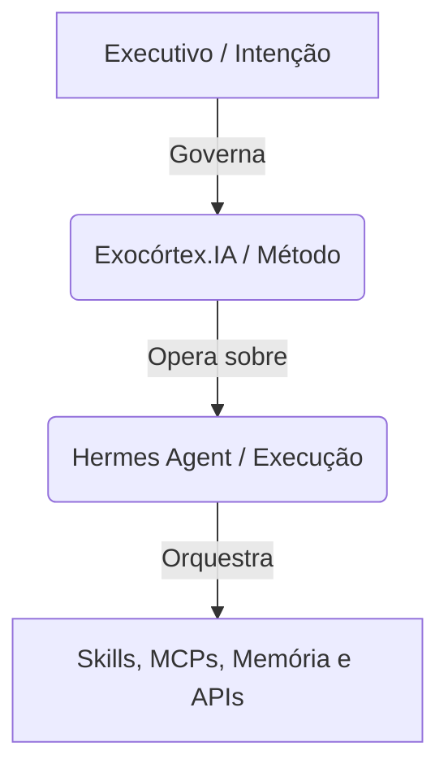

# Exocórtex.IA — Extensão Cognitiva Personalizada

> **Exoesqueleto para o pensamento.** A IA não tem alma. Você tem.
>
> O Exocórtex.IA é uma extensão cognitiva projetada para executivos. Ele não substitui sua inteligência — amplifica o que você já é capaz de fazer. A sua cognição continua no comando de pensar, criar e decidir, enquanto o Exocórtex gerencia a organização, persistência de memória, conexão e processamento do contexto.

---

## 📖 O Framework Cognitivo

O framework cognitivo do Exocórtex baseia-se na premissa de que a inteligência artificial possui uma memória vasta e conhecimento amplo do passado, mas não possui intenção própria e desconhece o seu presente. O Exocórtex serve como a ponte metodológica que traz a intenção do executivo e o contexto imediato para governar o poder de processamento da IA.



### 1. A Estrutura em Três Camadas Concêntricas
Toda a informação e tomada de decisão no framework são organizadas em três níveis de profundidade:

*   **🏛️ Macroverso (Quem você é):** É a "Constituição" pessoal do executivo. Define a identidade de raiz, os valores inegociáveis, o tom de comunicação e os limites pessoais. É gerado na sessão de onboarding inicial (`excrtx-onboard-welcome`) e muda raramente. Governa tudo.
*   **🌍 Microverso (Quem ancora e apoia a tarefa):** São entidades semânticas e operacionais autocontidas. Representam projetos, disciplinas, clientes ou áreas específicas (como um "microverso de finanças" ou "microverso de engenharia"). Um Microverso principal ancora a tarefa; Microversos secundários podem apoiar quando a tarefa cruza domínios. Cada um preserva suas próprias regras, memória, ferramentas e restrições de compartilhamento.
*   **🎯 Tarefa (A sala operacional aberta agora):** É a unidade de execução pontual e acionável. A tarefa é o espaço operacional em que um ou mais Microversos entram em jogo sob as diretrizes do Macroverso. Isso permite shared e cross-domain sem colapsar fronteiras, mantendo a entrega personalizada com a sua voz e método.

---

### 2. Os Três Vetores Operacionais
O Exocórtex funciona classificando a necessidade do executivo em três dinâmicas de raciocínio, chamadas de vetores operacionais:

| Vetor | Dinâmica | Foco Principal | Comportamento do Exocórtex |
| :--- | :--- | :--- | :--- |
| **🧠 Evolução (Para Dentro)** | Compreensão e refinamento de ideias | Clareza de pensamento e aprendizado | Postura socrática: desafia premissas, faz perguntas instigantes antes de propor respostas prontas e promove o conhecimento para o acervo. |
| **⚡ Execução (Para Fora)** | Produção de entregáveis e resultados | Artefatos completos e prontos para uso | Agente especialista: atua com velocidade e precisão técnica, construindo documentos, códigos, apresentações ou tarefas estruturadas. |
| **🧹 Manutenção (Modo Zelador)** | Cuidado e integridade do sistema | Saúde do ecossistema cognitivo | Varredura em background: organiza inbox, valida manifests, resolve pendências, limpa logs e checa links e tags. |

#### Alternância Natural
Os vetores de Evolução e Execução se alternam continuamente. Durante a criação de um documento (Execução), o executivo pode decidir aprofundar-se em um conceito (Evolução) e depois retornar à escrita de forma mais embasada. O Exocórtex ajuda a tornar essa alternância consciente e estruturada.

---

### 3. Protocolo Draft-First
Ações irreversíveis ou externas — como enviar um e-mail, agendar compromissos no calendário, fazer deploys ou publicar posts em nome do executivo — **nunca** são disparadas de forma automática. 

O Exocórtex adota o protocolo obrigatório de **Draft-First**:
1. O sistema prepara a minuta ou plano detalhado da ação.
2. Apresenta o resultado como um `DRAFT` na tela com o impacto listado.
3. Aguarda aprovação explícita ("ok", "pode enviar", etc.).
4. Executa a ação somente após consentimento inequívoco.

---

## 📂 Arquitetura do Acervo Cognitivo (4 Camadas)

O acervo de memória persistente segue a filosofia de *LLM Wiki*, dividido para balancear custo de contexto e relevância:

```
acervo/
├── macro/                      # 🧠 Identidade (sempre carregada em toda sessão)
│   ├── soul.md                 #    Quem sou, propósito
│   ├── valores.md              #    Princípios de tomada de decisão
│   └── estilo.md               #    Tom e voz do executivo
│
├── global/                     # 🌐 Operação Universal (Indexada no boot)
│   ├── _meta/ (SCHEMA, index, log)
│   ├── context/                #    Situação e prioridades universais
│   ├── knowledge/              #    Compliance, legal, fatos
│   ├── contracts/              #    Regras e contratos universais
│   ├── workflows/              #    Workflows globais
│   ├── tools/                  #    Tools em todo contexto
│   ├── reflections/            #    Lições transversais
│   └── raw/                    #    Fontes e documentações brutas universais
│
├── micro/                      # 🔬 Domínios Isolados (Ativado por escopo)
│   ├── _template/              #    Estrutura padrão para novos microversos
│   └── {slug}/                 #    Instância de um Microverso específico
│
└── shared/                     # 🔗 Ponte Cross-domain (Ponte semântica)
    ├── glossario.md            #    Vocabulário comum a múltiplos domínios
    └── cross-refs/             #    Referências cruzadas pragmáticas
```

---

## ⚡ Como o `.SaaS` Aplica a Metodologia

Este repositório (`exocortex.saas`) é o pacote de implementação técnica do framework cognitivo. Ele atua como a infraestrutura e o cérebro funcional do ecossistema ao unificar o runtime do **Hermes Agent** com uma suíte especializada de automações, qualidades e regras operacionais.

### 1. Provisionamento Automatizado e Modular
Os scripts `install.sh` e `setup.sh` instalam e configuram o runtime de maneira autocontida, estruturando o ecossistema nas seguintes camadas:
*   **Hermes Agent:** A fundação que fornece os harness de execução, controle de memória de curto prazo e drivers de execução de tarefas.
*   **35 Skills Nativas:** Organizadas modularmente em 9 categorias que cobrem desde o onboarding e as mecânicas de comportamento de vetores, até a integração com ferramentas e garantias de qualidade de entrega.

### 2. Controle de Qualidade (Quality Gates)
O Exocórtex.SaaS inclui barreira ativa contra respostas genéricas de inteligência artificial (o chamado *slop*):
*   **Anti-Slop Textual (`excrtx-quality-antislop`):** Filtra todo texto gerado para remover clichês de IA (ex: *"vamos explorar..."*, *"ótima pergunta!"*, voz passiva excessiva ou rodeios). O texto deve ser conciso e focado no tempo do executivo.
*   **Anti-Slop Visual (`excrtx-quality-taste`):** Garante que interfaces, slides e relatórios tenham apelo visual premium (esquemas de cores refinados, tipografia de alta qualidade, layouts equilibrados e dinâmicos), bloqueando grids vazios ou designs triviais.

### 3. Integração Multiferramental e MCPs (Model Context Protocol)
O ecossistema é preparado para plugar e operar ferramentas complexas de contexto de negócios:
*   **DocBrain:** Motor parser e processador de documentos para ingestão ágil de arquivos PDF e bases legadas.
*   **NotebookLM:** Ponte com ferramentas de pesquisa em fontes para curar conhecimento denso.
*   **Context7:** Acesso dinâmico a documentações de desenvolvimento de software e infraestrutura técnica de forma up-to-date.
*   **Google Workspace (Gmail, Calendar, Drive):** Viabiliza o protocolo Draft-First direto nas ferramentas de trabalho diário.
*   **Telegram Gateway:** Atua como a interface móvel por padrão, dividindo pensamentos em mensagens sequenciais de leitura rápida.

### 4. Profiles Operacionais Definidos
A metodologia separa a interface interativa do trabalho pesado de fundo através de profiles:
*   **Interactive Session (Default):** Focado na alternância ágil entre a execução e a evolução ao vivo com o executivo.
*   **Maintenance Profile (`manut`):** Executado em segundo plano (via cron ou gatilhos operacionais) para limpar logs, organizar o inbox e garantir a saúde estrutural de todos os Microversos sem interrupções.

---

## ⚙️ Instalação e Requisitos

### Requisitos Mínimos
*   Sistema Operacional: Linux ou macOS
*   Dependências do sistema: `git`, `curl`, `rsync`
*   Ambiente de execução: Python 3.11+

### Compatibilidade com Hermes Agent

| Versão Exocórtex | Hermes Mínimo | Hermes Máximo Testado |
|---|---|---|
| `release-candidate` | `2026.4.8` | `2026.4.16` |

O setup verifica automaticamente a compatibilidade (`step-00-hermes-compat.sh`). Para fixar uma versão do Hermes na instalação: `HERMES_PIN_VERSION=2026.4.16 bash install.sh`

### Instalação Rápida

Para realizar a instalação limpa e provisionar o Hermes Agent e as skills automaticamente:

```bash
curl -fsSL https://raw.githubusercontent.com/elderbernardi/exocortex.saas/main/install.sh | bash
```

#### Instalação com Gateway do Telegram Ativo
```bash
TELEGRAM_BOT_TOKEN="seu_token_do_telegram" curl -fsSL https://raw.githubusercontent.com/elderbernardi/exocortex.saas/main/install.sh | bash
```

#### Instalação de uma Versão Específica
```bash
VERSION=v1.0.0-rc2 curl -fsSL https://raw.githubusercontent.com/elderbernardi/exocortex.saas/main/install.sh | bash
```

### Seleção de contingência de modelos gratuitos do OpenRouter
Esse roteamento **não é default**.

Ele só entra em ação quando você aciona explicitamente o modo de contingência:
- via setup: `bash setup.sh --imbroke`
- via comando operacional do Exocórtex: `/xc imbroke`
- via script direto: `python scripts/openrouter_free_model_router.py --imbroke --format text`

Quando ativado, `scripts/openrouter_free_model_router.py` passa a:
- listar os modelos com `pricing.prompt == 0` e `pricing.completion == 0` no catálogo público do OpenRouter;
- cruzar os candidatos com o benchmark público `fox-in-the-box-ai/hermes-best-models`;
- usar uma cobertura secundária para modelos `unscored` com base em metadados públicos do catálogo OpenRouter;
- calcular um `intelligence_index` determinístico com foco em task completion + agentic reasoning;
- aplicar `model.provider=openrouter` e `model.default=<melhor_free>` no Hermes **somente** em modo `--imbroke` com `--apply`;
- gravar a cadeia de fallback em `~/.hermes/model-routing/openrouter-free-models.json`.

Execução manual:
```bash
python scripts/openrouter_free_model_router.py --format text
python scripts/openrouter_free_model_router.py --imbroke --format text
python scripts/openrouter_free_model_router.py --imbroke --apply --format json
```

---

## 🚀 Como Usar no Dia a Dia

### 1. Início e Onboarding (Sua primeira sessão)
Ao iniciar a primeira sessão interativa, o Exocórtex detecta se o seu acervo está vazio e exibe o fluxo de boas-vindas do `WELCOME.md`.
Para calibrar o Exocórtex com a sua identidade, digite:
```bash
# Dentro da sessão interativa ou via Telegram:
vamos começar o onboarding
```
Isso aciona a entrevista estruturada em 5 blocos (Identidade, Comunicação, Domínios, Preferências Operacionais e Integrações), gerando o seu `SOUL.md` personalizado no runtime.

### 2. Execução da Sessão Interativa
Inicie a conversa no terminal local para execução rápida de comandos ou exploração socrática:
```bash
hermes
```

### 3. Execução em Modo de Manutenção (Background)
Para rodar rotinas de varredura de inbox e auditoria de arquivos:
```bash
hermes -p manut
```

---

## ⚖️ Licença

Este projeto é distribuído sob a licença MIT. Veja o arquivo [LICENSE](LICENSE) para mais detalhes.
