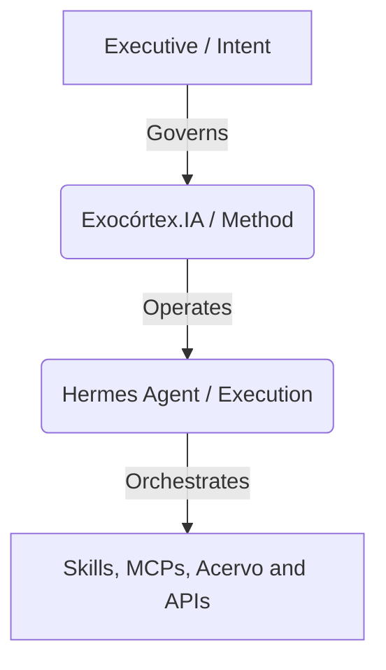
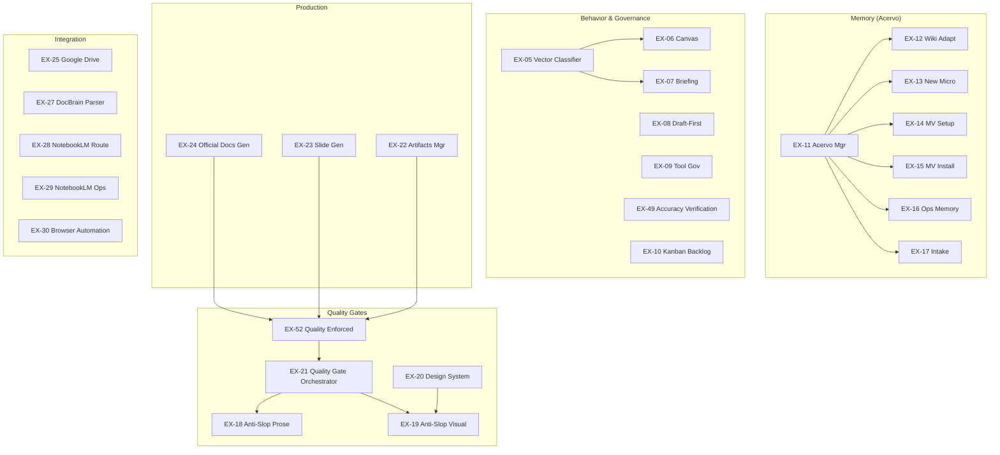

# Exocórtex.IA — Custom Cognitive Extension for Executives

> **An exoskeleton for the mind.** AI has no soul. You do.
>
> **Exocórtex.IA** is a structured cognitive extension designed for executives. It is not an autonomous replacement for your intelligence—it is a system designed to amplify what you are already capable of. Your cognition remains in command of thinking, creating, and deciding, while the Exocortex manages organization, memory persistence, context routing, and task execution.

---

## 🏛️ System Philosophy & Foundations

The Exocortex operates on a fundamental premise: LLMs have vast knowledge of the past but lack intent and are blind to your immediate present. The Exocortex acts as the structural bridge, translating your intent and immediate context to govern and focus the processing power of the AI.



### 1. The Three Concentric Layers (A Estrutura em Três Camadas Concêntricas)
To eliminate semantic drift and optimize contextual efficiency, all information and operations are organized into three concentric depth levels:

*   **🏛️ Macroverso (Who Speaks):** This is the executive's personal "Constitution." It defines your core identity, non-negotiable values, communication style, tone, and personal boundaries. Generated during the onboarding phase, it rarely changes and silently governs all interactions.
*   **🌍 Microversos (Semantic Domains):** These are live, self-contained semantic and operational entities. They represent specific clients, projects, disciplines, or areas of responsibility (e.g., `microverso-financas`, `microverso-juridico`). Each Microverso preserves its own context, rules, memory, and **sharing constraints** (e.g., `deny: [ALL]`, `allow: [gabinete]`, where `allow` takes precedence over `deny`).
*   **🎯 Tarefa (The Operational Room):** The concrete room where execution happens. A task is short-lived and represents the active project or action. A task is anchored to a primary Microverso and may pull secondary Microversos for support. **Crucial semantic rule (EX-06):** *A Microverso is never a room; the Tarefa is the room.*

---

### 2. The Three Operational Vectors
The Exocortex dynamically adjusts its cognitive posture by classifying every executive interaction into one of three operational vectors:

| Vector | Cognitive Posture | Focus Area | Exocortex Behavior |
| :--- | :--- | :--- | :--- |
| **🧠 Evolução (THINK)** | Socratic Guide | Idea refinement & understanding | Challenging assumptions, asking 2-3 deep analytical questions, and promoting learnings to the Acervo. Never provides lazy, ready-made answers. |
| **⚡ Execução (DO)** | Specialist Agent | Production of premium deliverables | Fast, precise, and highly technical. Builds documents, drafts code, or coordinates execution with quality validation. |
| **🧹 Manutenção (CLEAN)** | Ecological Housekeeper | Ecosystem health & integrity | Background verification: runs quality audits, updates indexes, archives stale logs, and validates paths/manifests. |

---

### 3. Core Governance & Safety Protocols

#### Draft-First Protocol (`excrtx-govern-draftfirst`)
Irreversible actions external to the local execution environment (e.g., sending emails, scheduling calendar events, committing/pushing to Git, publishing posts, or deploying code) **must never** be automated directly.
1. The Exocortex prepares the exact payload or plan.
2. The payload is displayed in the chat as a demarcated `📋 DRAFT`.
3. The system halts and waits for explicit approval (e.g., "OK", "proceed").
4. Execution occurs only after this consent.

#### Accuracy Verification (`excrtx-behavior-accuracy`)
The Exocortex is strictly forbidden from claiming that a system action (e.g., closing an issue, pushing a commit, creating a file) was successful without executing an empirical verification command and printing the raw command output as physical proof.

---

## 🧩 The 40 Custom Skills Catalog

This repository (`exocortex.saas`) packages the custom features and skills deployed on top of the **Hermes Agent** runtime. They are organized into 7 functional categories:



### 1. Onboarding & Assessment
*   **`excrtx-onboard-welcome` (EX-01)**: Welcome flow. Detects empty Acervo, presents `WELCOME.md`, and triggers calibration.
*   **`excrtx-onboard-interview` (EX-02)**: Conducts the structured 5-block interview to build the `SOUL.md` profile.
*   **`excrtx-assess-selftest` (EX-03)**: Self-test validator. Audits system state and prints a `N/5` checkpoint score.
*   **`excrtx-assess-repofit` (EX-04)**: Evaluates external repositories, identifying architectural fits and delta gaps.

### 2. Behavior & Governance
*   **`excrtx-behavior-vetor` (EX-05)**: Classifies user inputs silently into Execution, Evolution, or Maintenance.
*   **`excrtx-behavior-canvas` (EX-06)**: Implements the cognitive canvas (Macroverso Status, Primary vs. Secondary Microversos, Sharing Constraints, and Task Anchor).
*   **`excrtx-behavior-briefing` (EX-07)**: Generates brief summaries of active microverso states and priority context.
*   **`excrtx-govern-draftfirst` (EX-08)**: Intercepts all external integrations to enforce Draft-First gates.
*   **`excrtx-govern-tools` (EX-09)**: Rules of engagement for tools, preventing unnecessary executions and enforcing strict logging.
*   **`excrtx-harness-kanban` (EX-10)**: Maps current task states to the persistent Hermes Kanban system.
*   **`excrtx-behavior-accuracy` (EX-49)**: Restricts the agent from asserting completion without printing command proof.

### 3. Memory & Acervo
*   **`excrtx-memory-manager` (EX-11)**: Core memory manager for the 4-layer Acervo. Enforces access scopes and directory routing.
*   **`excrtx-memory-wikiadapt` (EX-12)**: Translates native Hermes LLM-Wiki structures into the 11 Natures of the Exocortex Acervo.
*   **`excrtx-memory-newmicro` (EX-13)**: Scaffolds a new Microverso directory structure from standard templates.
*   **`excrtx-memory-mvsetup` (EX-14)**: Designates a microverso as a replication seed for future setup runs.
*   **`excrtx-memory-mvinstall` (EX-15)**: Installs packaged microversos, resolving skill, python/node, and API dependencies.
*   **`excrtx-memory-opsmemory` (EX-16)**: Orchestrates operational memories (e.g., Hindsight) to act as short-term retrieval buffers.
*   **`excrtx-memory-intake` (EX-17)**: Multi-channel file and media intake pipeline (OCR, STT, PDF parsing) routed to `$ACERVO/_inbox/`.

### 4. Quality Gates
*   **`excrtx-quality-antislop` (EX-18)**: Text quality gate. Grades generated prose on directness, density, rhythm, and authenticity, rejecting AI cliches. Requires a minimum score of `35/50`.
*   **`excrtx-quality-taste` (EX-19)**: Visual quality gate. Rotes layouts to specialized sub-skills (`gpt-taste`, `brutalist`, `brandkit`). Rejects headers > 3 lines and repeating grid templates.
*   **`excrtx-quality-designsys` (EX-20)**: Design token cascade resolver (Global `DESIGN.md` -> Microverso `DESIGN.md`).
*   **`excrtx-quality-gate` (EX-21)**: Unified quality gate controller that intercepts all outbound responses.
*   **`excrtx-quality-gate-enforced` (EX-52)**: Strict validation engine ensuring all generated artifacts pass quality thresholds.

### 5. Production & Artifacts
*   **`excrtx-produce-artifacts` (EX-22)**: Manages creation, indexing, views, and exports of durable documents in `$ACERVO/_artifacts/`.
*   **`excrtx-produce-slides` (EX-23)**: Generates high-quality presentations using Marp Markdown to HTML/PDF/ZIP.
*   **`excrtx-produce-oficios` (EX-24)**: Builds formal institutional letters (IFSul) from DOCX/HTML templates.

### 6. Integration
*   **`excrtx-integrate-gdrive` (EX-25)**: Google Drive client. Hardened search queries (ignoring trashed files) and handle paginated list results.
*   **`excrtx-integrate-oauth` (EX-26)**: Setup and diagnostic utility for configuring external OAuth-based MCP servers.
*   **`excrtx-integrate-docbrain` (EX-27)**: Parser engine integration for ingesting legacy PDFs and documents.
*   **`excrtx-integrate-nlmroute` (EX-28)**: Routes research requests to NotebookLM CLI (`nlm`) or NotebookLM MCP.
*   **`excrtx-integrate-nlmops` (EX-29)**: Operational workflows to ingest sources and query NotebookLM notebooks.
*   **`excrtx-integrate-browser` (EX-30)**: Autonomously controls local Chrome instances using `playwright` and `browser-use`.

### 7. Harness & Infrastructure
*   **`excrtx-harness-promptlog` (EX-31)**: Auditable log of all configuration prompts written to `MEMORY.md`.
*   **`excrtx-harness-codexint` (EX-32)**: Configures OpenAI Codex CLI and Hermes provider integration.
*   **`excrtx-harness-core` (EX-33)**: Core execution wrapper for Codex CLI logging, capturing runs in `~/.hermes/codex-learning/`.
*   **`excrtx-harness-hermesops` (EX-34)**: Splits Codex work into clear pathways: execution (Trilho A) or delegation/reasoning (Trilho B).
*   **`excrtx-harness-surfaces` (EX-35)**: Routes communication interfaces (Telegram for Chat, TUI/CLI for Admin, Dashboard for cockpit).
*   **`excrtx-harness-imbroke` (EX-48)**: financial contingency model fallback (OpenRouter free model watchdog and recovery router).
*   **`excrtx-harness-tooldev` (EX-50)**: Standard API for writing and registering custom `/tool` extensions.
*   **`excrtx-hermes-extensions` (EX-51)**: Guidelines for writing custom commands and dispatch paths in `gateway/run.py`.

---

## ⚙️ Installation & Provisioning

### Prerequisites
*   **OS**: Linux (Debian, Ubuntu, Arch) or macOS.
*   **System Tools**: `git`, `curl`, `rsync`, `python3` (>=3.11), `pip`, `venv`.
*   **Containers**: `docker` & `docker compose` (Required only if Hindsight local memory is enabled).

---

### Step-by-Step Installation

#### 1. Execute the Bootstrap Installer
This command pulls the installer, checks for OS dependencies, installs the Hermes Agent CLI (if not present), and clones the Exocortex repository to a local cache directory:

```bash
# Standard interactive installation
curl -fsSL https://raw.githubusercontent.com/elderbernardi/exocortex.saas/main/install.sh | bash
```

To automatically install and bind the **Telegram Gateway**, pass the token in the environment:
```bash
TELEGRAM_BOT_TOKEN="your_telegram_bot_token" curl -fsSL https://raw.githubusercontent.com/elderbernardi/exocortex.saas/main/install.sh | bash
```

To pin a specific tag or version:
```bash
VERSION=v1.0.0-rc2 curl -fsSL https://raw.githubusercontent.com/elderbernardi/exocortex.saas/main/install.sh | bash
```

#### 2. The `setup.sh` Orchestrator
The installer will automatically invoke `setup.sh`. If you want to customize home paths, you can run `setup.sh` manually:
```bash
HERMES_HOME=~/.hermes EXOCORTEX_HOME=~/exocortex bash setup.sh
```

##### What `setup.sh` Executes:
*   **`step-00`**: Validates Hermes version compatibility (Expected bounds: `2026.4.8` to `2026.4.16`).
*   **`step-01`**: Provision Hindsight database container if `EXOCORTEX_ENABLE_HINDSIGHT=1` is provided.
*   **`step-02`**: Initializes the directory trees for the workspace, logs, task boards, and the 4-layer Acervo structure.
*   **`step-03` to `step-05`**: Copies and installs all 40 `excrtx` skills, bundles, and execution profiles (`default` and `manut`).
*   **`step-06` (Hardening)**:
    *   Applies a search paging patch to `google_api.py`.
    *   Removes legacy email skills (`himalaya` / `hymalaia`) to ensure Google Workspace takes precedence.
    *   Removes `composio` from the MCP registry in favor of direct API clients.
*   **`step-06b` to `step-11`**: Sets up Google Auth tools, clones and compiles the DocBrain engine, installs the NotebookLM CLI, provisions Browser Automation files, and links Context7 documentation MCP.
*   **`step-12` to `step-14`**: Performs final key verifications and validates that all 40 skills are correctly mapped in the runtime.
*   **`step-15`**: Launches the interactive prompt calibration if `--calibrate` is passed.

---

## 🛠️ Post-Installation & Integration Guide

For the Exocortex to operate at full capacity, complete the following post-installation steps:

### 1. Account Calibration & Onboarding
Upon launching your first session, the Exocortex checks if your `SOUL.md` (the Macroverso) is populated. If empty, it triggers the welcome flow:

1. Launch the interactive session:
   ```bash
   hermes
   ```
2. Initiate the onboarding questionnaire:
   ```text
   vamos começar o onboarding
   ```
3. Answer the structured questions covering **Identidade**, **Comunicação**, **Domínios**, **Preferências**, and **Integrações**. This writes your personality profile to `~/.hermes/SOUL.md`.

---

### 2. Prompt-Driven Development (PDD) Behavior Calibration
To ensure the LLM model respects the 12 core behavioural features (Vector classification, Draft-first, verification proofs, etc.), run the interactive calibration suite:

```bash
bash scripts/calibrate-hermes.sh
```
This script runs a test prompt for each feature, shows you the model output alongside the acceptance criteria, and asks for your verification. If the output drifts, it automatically injects a Socratic corrective prompt to recalibrate the model.

---

### 3. Google Workspace & Drive API Setup (OAuth 2.0)
The Google Workspace integration uses direct desktop OAuth credentials.

#### Step A: Configure the GCP Console
1. Go to the [Google Cloud Console](https://console.cloud.google.com/).
2. Create a project and name it (e.g., `Exocortex-Workspace`).
3. Search for **Google Drive API** in the API Library and click **Enable**.
4. Configure the **OAuth Consent Screen**:
    *   Set User Type to **External**.
    *   Add your email address under **Test Users**.
    *   Add the `.../auth/drive` scope.
5. Create Credentials:
    *   Click **Create Credentials** > **OAuth client ID**.
    *   Choose **Desktop application**.
    *   Download the credential JSON file and rename it to `google_client_secret.json`.

#### Step B: Complete the OAuth Flow locally
Move the credential file to your home config and execute the setup utility:

```bash
# 1. Move and register the client secret
cp /path/to/downloaded/secret.json ~/.hermes/google_client_secret.json
python3 ~/.hermes/skills/productivity/google-workspace/scripts/setup.py --client-secret ~/.hermes/google_client_secret.json

# 2. Request authorization URL
python3 ~/.hermes/skills/productivity/google-workspace/scripts/setup.py --auth-url
```
*   Copy the output URL, paste it into your browser, log in, and authorize the application.
*   Upon redirection, copy the string parameter after `code=` in the browser address bar.

```bash
# 3. Save the token using the code copied
python3 ~/.hermes/skills/productivity/google-workspace/scripts/setup.py --auth-code "PASTE_YOUR_OAUTH_CODE_HERE"

# 4. Verify credentials
python3 ~/.hermes/skills/productivity/google-workspace/scripts/setup.py --check
```
If this prints `AUTHENTICATED`, the Google Workspace driver is fully functional.

---

### 4. NotebookLM Integration (`nlm` CLI)
NotebookLM integration requires the `notebooklm-mcp-cli` python package.

1. Verify `uv` is installed, then install the package:
   ```bash
   uv tool install notebooklm-mcp-cli --force
   ```
   *(Fallback: `python3 -m pip install --upgrade notebooklm-mcp-cli`)*
2. Authenticate the CLI:
   ```bash
   nlm login
   ```
3. Verify the authentication:
   ```bash
   nlm login --check
   ```
4. Register the MCP server in Hermes:
   ```bash
   hermes mcp add notebooklm --command notebooklm-mcp
   ```

---

### 5. DocBrain Parser Engine Setup
DocBrain is used to parse complex documents and PDFs.

1. Ensure Node.js and `npm` are installed.
2. The setup script clones the parser repository to `~/exocortex/tools/docbrain`. Verify and build:
   ```bash
   cd ~/exocortex/tools/docbrain
   npm install
   npm run build
   ```
3. Set your API Key in your environment variables:
   ```bash
   export OPENROUTER_API_KEY="your-deepseek-or-openrouter-key"
   ```
   *(Alternatively, isolate the key: `export DOCBRAIN_LLM_API_KEY="your-key"`)*

---

### 6. Browser Automation Skill Runtime
The browser automation skill uses `browser-use` and `playwright`.

1. To install the chromium dependencies and python packages in the local skill sandbox:
   ```bash
   cd ~/.hermes/skills/excrtx/excrtx-integrate-browser
   # The wrapper script does auto-provisioning on first execution:
   bash scripts/browser-use.sh open https://example.com
   ```
2. This will download and cache Playwright Chromium binaries under `.runtime/ms-playwright/`.

---

### 7. Financial Contingency Mode (Modo Imbroke)
If your OpenRouter account runs out of credits, you can toggle the system to use free models via the free-routing CLI:

```bash
# Enable free-routing circuit breaker
python3 scripts/openrouter_free_model_router.py --imbroke --activate

# Check routing status
python3 scripts/openrouter_free_model_router.py --status
```
*Note: After enabling or disabling imbroke mode, restart your active Hermes sessions with `/new` to reload the settings.*

---

## 🏃 Daily Operation

### 1. Interactive Session (Execution & Evolution)
Launch the standard interative session for daily tasks and cognitive evolution:
```bash
hermes
```

### 2. Maintenance Profile (Background Cleaning)
Run the housekeeping agent profile to check for dead links, audit file schemas, and clean session logs:
```bash
hermes -p manut
```

### 3. Pre-flight Quality Checks
Before committing changes to this repository, run the validation suites:
```bash
# Run core quality audit checks
python3 .agent/scripts/checklist.py .

# Run complete validation, including E2E and Lighthouse
python3 .agent/scripts/verify_all.py . --url http://localhost:3000
```

---

## ⚖️ License

Distributed under the MIT License. See [LICENSE](LICENSE) for details.
