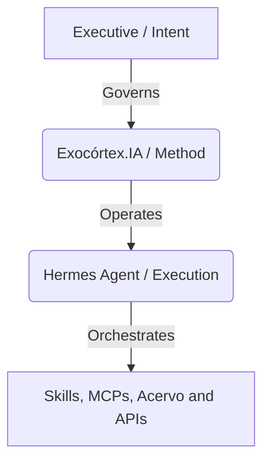
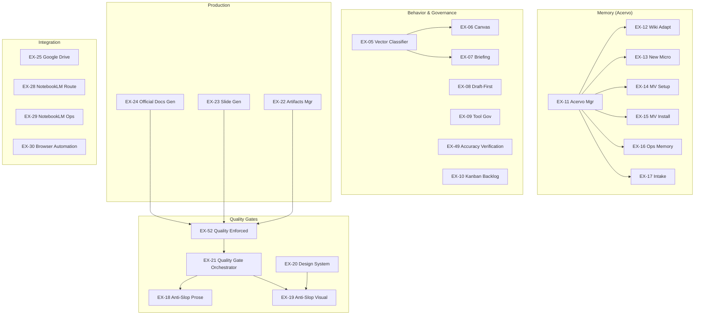

# Exocórtex.IA — Custom Cognitive Extension for Executives

> **An exoskeleton for the mind.** AI has no soul. You do.
>
> **Exocórtex.IA** is a structured cognitive extension designed for executives. It is not an autonomous replacement for your intelligence—it is a system designed to amplify what you are already capable of. Your cognition remains in command of thinking, creating, and deciding, while the Exocortex manages organization, memory persistence, context routing, and task execution.

---

## 🏛️ System Philosophy & Foundations

The Exocortex operates on a fundamental premise: LLMs have vast knowledge of the past but lack intent and are blind to your immediate present. The Exocortex acts as the structural bridge, translating your intent and immediate context to govern and focus the processing power of the AI.


```mermaid
graph TD
    A[Executive / Intent] -->|Governs| B(Exocórtex.IA / Method)
    B -->|Operates| C(Hermes Agent / Execution)
    C -->|Orchestrates| D[Skills, MCPs, Acervo and APIs]
```

### 1. The Three Concentric Layers (A Estrutura em Três Camadas Concêntricas)

To eliminate semantic drift and optimize contextual efficiency, all information and operations are organized into three concentric depth levels:

- **🏛️ Macroverso (Who Speaks):** This is the executive's personal "Constitution." It defines your core identity, non-negotiable values, communication style, tone, and personal boundaries. Generated during the onboarding phase, it rarely changes and silently governs all interactions.
- **🌍 Microversos (Semantic Domains):** These are live, self-contained semantic and operational entities. They represent specific clients, projects, disciplines, or areas of responsibility (e.g., `microverso-financas`, `microverso-juridico`). Each Microverso preserves its own context, rules, memory, and **sharing constraints** (e.g., `deny: [ALL]`, `allow: [gabinete]`, where `allow` takes precedence over `deny`).
- **🎯 Tarefa (The Operational Room):** The concrete room where execution happens. A task is short-lived and represents the active project or action. A task is anchored to a primary Microverso and may pull secondary Microversos for support. **Crucial semantic rule (EX-06):** _A Microverso is never a room; the Tarefa is the room._

---

### 2. The Three Operational Vectors

The Exocortex dynamically adjusts its cognitive posture by classifying every executive interaction into one of three operational vectors:

| Vector                    | Cognitive Posture      | Focus Area                         | Exocortex Behavior                                                                                                                             |
| :------------------------ | :--------------------- | :--------------------------------- | :--------------------------------------------------------------------------------------------------------------------------------------------- |
| **🧠 Evolução (THINK)**   | Socratic Guide         | Idea refinement & understanding    | Challenging assumptions, asking 2-3 deep analytical questions, and promoting learnings to the Acervo. Never provides lazy, ready-made answers. |
| **⚡ Execução (DO)**      | Specialist Agent       | Production of premium deliverables | Fast, precise, and highly technical. Builds documents, drafts code, or coordinates execution with quality validation.                          |
| **🧹 Manutenção (CLEAN)** | Ecological Housekeeper | Ecosystem health & integrity       | Background verification: runs quality audits, updates indexes, archives stale logs, and validates paths/manifests.                             |

---

### 3. Core Governance & Safety Protocols

#### Draft-First Protocol (`excrtx-govern-draftfirst`)

Irreversible actions external to the local execution environment (e.g., sending emails, scheduling calendar events, committing/pushing to Git, publishing posts, or deploying code) **must never** be automated directly.

1. The Exocortex prepares the exact payload or plan.
2. The payload is displayed in the chat as a demarcated `📋 DRAFT`.
3. The system halts and waits for explicit approval (e.g., "OK", "proceed").
4. Execution occurs only after this consent.

#### Accuracy Verification (`excrtx-behavior-accuracy`)

The Exocortex is strictly forbidden from claiming that a system action (e.g., closing an issue, pushing a commit, creating a file) was successful without executing an empirical verification command and printing the raw command output as physical proof.

---

## 🧩 The Skills Catalog — 58 Skills, 7 Categories

This repository (`exocortex.saas`) packages the custom features and skills deployed on top of the **Hermes Agent** runtime. **58 skills total**: 44 formally cataloged (each with a dogfood EX-ID test scenario) + 15 supporting/auxiliary skills. They are organized into 7 functional categories. See [FEATURES.md](FEATURES.md) for the full per-skill catalog with dependencies, usage, and test scenarios.


```mermaid
graph TD
    subgraph "Memory (Acervo)"
        EX11[EX-11 Acervo Mgr] --> EX12[EX-12 Wiki Adapt]
        EX11 --> EX13[EX-13 New Micro]
        EX11 --> EX14[EX-14 MV Setup]
        EX11 --> EX15[EX-15 MV Install]
        EX11 --> EX16[EX-16 Ops Memory]
        EX11 --> EX17[EX-17 Intake]
    end

    subgraph "Behavior & Governance"
        EX05[EX-05 Vector Classifier] --> EX06[EX-06 Canvas]
        EX05 --> EX07[EX-07 Briefing]
        EX08[EX-08 Draft-First]
        EX09[EX-09 Tool Gov]
        EX49[EX-49 Accuracy Verification]
        EX10[EX-10 Kanban Backlog]
    end

    subgraph "Quality Gates"
        EX18[EX-18 Anti-Slop Prose]
        EX19[EX-19 Anti-Slop Visual]
        EX20[EX-20 Design System] --> EX19
        EX21[EX-21 Quality Gate Orchestrator] --> EX18
        EX21 --> EX19
        EX52[EX-52 Quality Enforced] --> EX21
    end

    subgraph "Production"
        EX22[EX-22 Artifacts Mgr] --> EX52
        EX23[EX-23 Slide Gen] --> EX52
        EX24[EX-24 Official Docs Gen] --> EX52
    end

    subgraph "Integration"
        EX25[EX-25 Google Drive]
        EX28[EX-28 NotebookLM Route]
        EX29[EX-29 NotebookLM Ops]
        EX30[EX-30 Browser Automation]
    end
```

### 1. Onboarding & Assessment

- **`excrtx-onboard-welcome` (EX-01)**: Welcome flow. Detects an empty Macroverso, presents `WELCOME.md`, and starts onboarding.
- **`excrtx-onboard-interview` (EX-02)**: Conducts the structured 5-block interview to build the `SOUL.md` profile.
- **`excrtx-assess-selftest` (EX-03)**: Self-test validator. Audits system state and prints a `N/5` checkpoint score.
- **`excrtx-assess-repofit` (EX-04)**: Evaluates external repositories, identifying architectural fits and delta gaps.
- **`excrtx-assess-interactive-audit` (EX-59)**: Runs owner-in-the-loop audits of real artifacts with personas, evidence capture, issue backlog, and GO/NO-GO verdict.

### 2. Behavior & Governance

- **`excrtx-behavior-vetor` (EX-05)**: Classifies user inputs silently into Execution, Evolution, or Maintenance.
- **`excrtx-behavior-canvas` (EX-06)**: Implements the cognitive canvas (Macroverso Status, Primary vs. Secondary Microversos, Sharing Constraints, and Task Anchor).
- **`excrtx-behavior-briefing` (EX-07)**: Generates brief summaries of active microverso states and priority context.
- **`excrtx-govern-draftfirst` (EX-08)**: Intercepts all external integrations to enforce Draft-First gates.
- **`excrtx-govern-tools` (EX-09)**: Rules of engagement for tools, preventing unnecessary executions and enforcing strict logging.
- **`excrtx-harness-kanban` (EX-10)**: Maps current task states to the persistent Hermes Kanban system.
- **`excrtx-behavior-accuracy` (EX-49)**: Restricts the agent from asserting completion without printing command proof.

### 3. Memory & Acervo

- **`excrtx-memory-manager` (EX-11)**: Core memory manager for the 4-layer Acervo. Enforces access scopes and directory routing.
- **`excrtx-memory-wikiadapt` (EX-12)**: Translates native Hermes LLM-Wiki structures into the 11 Natures of the Exocortex Acervo.
- **`excrtx-memory-newmicro` (EX-13)**: Scaffolds a new Microverso directory structure from standard templates.
- **`excrtx-memory-mvsetup` (EX-14)**: Designates a microverso as a replication seed for future setup runs.
- **`excrtx-memory-mvinstall` (EX-15)**: Installs packaged microversos, resolving skill, python/node, and API dependencies.
- **`excrtx-memory-mvexport` (EX-58)**: Microverso Package Exporter — packages a microverso into a portable, self-contained `.mvpkg` (Docker-like bundle) with OKF gate, clean-portable transformation, embedded deps, and `MANIFEST.sum`. Counterpart of EX-15.
- **`excrtx-memory-opsmemory` (EX-16)**: Orchestrates operational memories (e.g., Hindsight) to act as short-term retrieval buffers.
- **`excrtx-memory-intake` (EX-17)**: Multi-channel file and media intake pipeline (OCR, STT, PDF parsing) routed to `$ACERVO/_inbox/`.

### 4. Quality Gates

- **`excrtx-quality-antislop` (EX-18)**: Text quality gate. Grades generated prose on directness, density, rhythm, and authenticity, rejecting AI cliches. Requires a minimum score of `35/50`.
- **`excrtx-quality-taste` (EX-19)**: Visual quality gate. Routes layouts to specialized sub-skills (`gpt-taste`, `brutalist`, `brandkit`). Rejects headers > 3 lines and repeating grid templates.
- **`excrtx-quality-designsys` (EX-20)**: Design token cascade resolver (Global `DESIGN.md` -> Microverso `DESIGN.md`).
- **`excrtx-quality-gate` (EX-21)**: Unified quality gate controller that intercepts all outbound responses.
- **`excrtx-quality-gate` (EX-52)**: Quality Gate Enforced — programmatic rejection at the harness level (validate_artifact_manifest.py) ensuring all produced artifacts pass anti-slop and taste gates.
- **`excrtx-quality-gepa` (EX-53)**: GEPA — closed-loop automated skill rewriting: judge → rewrite → re-judge → accept/rollback. Uses LLM-as-Judge for evaluation and LLM as rewriter, with safety gates preserving D1 structure and `compiled_rules`.
- **`excrtx-quality-skilljudge` (EX-54)**: Skill Judge — LLM-as-Judge framework evaluating skills on 5 dimensions (D1 Structural, D2 Clarity, D3 Alignment, D4 Fitness, D5 Economy). Generates baselines and PASS/IMPROVE/REWRITE verdicts.
- **`excrtx-brandkit-generator` (EX-55)**: Brandkit Generator — extracts brand identity from a corporate logo and generates a WCAG-ready `DESIGN.md` with design tokens for the Acervo.

### 5. Production & Artifacts

- **`excrtx-produce-artifacts` (EX-22)**: Manages creation, indexing, views, and exports of durable documents in `$ACERVO/_artifacts/`.
- **`excrtx-produce-slides` (EX-23)**: Generates high-quality presentations using Marp Markdown to HTML/PDF/ZIP.
- **`excrtx-produce-oficios` (EX-24)**: Builds formal institutional letters from DOCX/HTML templates.

### 6. Integration

- **`excrtx-integrate-gdrive` (EX-25)**: Google Drive client. Hardened search queries (ignoring trashed files) and handle paginated list results.
- **`excrtx-integrate-oauth` (EX-26)**: Setup and diagnostic utility for configuring external OAuth-based MCP servers.
- **`excrtx-integrate-nlmroute` (EX-28)**: Routes research requests to NotebookLM CLI (`nlm`) or NotebookLM MCP.
- **`excrtx-integrate-nlmops` (EX-29)**: Operational workflows to ingest sources and query NotebookLM notebooks.
- **`excrtx-integrate-browser` (EX-30)**: Autonomously controls local Chrome instances using `playwright` and `browser-use`.

### 7. Harness & Infrastructure

- **`excrtx-harness-promptlog` (EX-31)**: Auditable log of all configuration prompts written to `MEMORY.md`.
- **`excrtx-harness-surfaces` (EX-35)**: Routes communication interfaces (Telegram for Chat, TUI/CLI for Admin, Dashboard for cockpit).
- **`excrtx-harness-tooldev` (EX-50)**: Standard API for writing and registering custom `/tool` extensions.
- **`excrtx-hermes-extensions` (EX-51)**: Guidelines for writing custom commands and dispatch paths in `gateway/run.py`.
- **`excrtx-harness-maintenance` (EX-56)**: Síndico persona with 4 maintenance routines (weekly audit, inbox triage, artifact quality, publication check).
- **`last30days` (EX-57)**: Multi-platform research skill (community, MIT) scanning 15 sources over the last 30 days. Pipline: resolve → search → cluster → synthesize. Modes: comparison, hiring signals, deep research, briefing HTML, ELI5.

#### Supporting / Auxiliary Skills

The following 15 skills have no formal EX-ID but sustain cataloged features or provide cross-cutting capabilities. They are loaded by the main bundle:

- **`excrtx-harness-delivery`**: Delivery pipeline orchestration for artifact publication and distribution.
- **`excrtx-integrate-mcp`**: MCP server discovery, registration, and lifecycle management.
- **`excrtx-github-issue-planning`**: GitHub issue planning and roadmap coordination.
- **`assessment-question-authoring`**: Structured assessment question creation for calibration and evaluation.
- **`excrtx-memory-deprecate`**: Semantic revision on insert — detects contradictions and auto-deprecates superseded `volátil` Acervo files (ADR-014/016).
- **`excrtx-memory-quarantine`**: Quarantine cycle — moves stale/deprecated files, purges expired, restores within the 30-day window (ADR-015).
- **`excrtx-memory-syndic`**: Autonomous Acervo cleanup agent — scans, quarantines, purges. Runs under the `manut` profile (ADR-018).
- **`excrtx-integrate-last30days`**: Operator skill for the `last30days` research engine — install, provider config, patching, and tests.
- **`excrtx-integrate-agent-reach`**: Adapter for Agent-Reach CLI; produces normalized research items for the research pipeline.
- **`excrtx-crawler-brasil`**: Brazilian sector crawler for CPG/FMCG; scans 10+ RSS sources with local cache and normalized JSON output.
- **`excrtx-research-cpg-brasil`**: Research wrapper for Brazilian CPG industry — orchestrates public-source collectors and the research pipeline.
- **`excrtx-source-cnpj`**: Public CNPJ data collector (BrasilAPI + ReceitaWS) with normalized JSON envelope and local cache.
- **`excrtx-source-google-trends`**: Google Trends public API — interest over time, regional interest, related queries.
- **`excrtx-source-reclameaqui`**: Brazilian company reputation collector (Reclame Aqui), Cloudflare-aware, structured JSON output.

---

## ⚙️ Installation & Provisioning

### Prerequisites

- **OS**: Linux (Debian, Ubuntu, Arch) or macOS.
- **Runtime**: Hermes Agent already installed; `hermes config check` must pass.
- **Core capabilities**: `git`, `rsync`, `python3` (>=3.11), and `bash`.
- **Full capabilities**: Docker/Compose v2, `curl`, Node/npm, NotebookLM CLI/MCP,
  and the Firecrawl MCP adapter.

`setup/capabilities.json` is the canonical dependency contract. The read-only
checker detects the OS and its native package manager, validates commands,
versions and probes, and prints remediation without installing anything:

```bash
python3 scripts/check_capabilities.py --profile core
python3 scripts/check_capabilities.py --profile full --json
```

---

> **🤖 AI Agents**: If you are an AI agent (Claude, Gemini, GPT, etc.) installing or diagnosing this system via terminal, use [INSTALL.md](INSTALL.md) instead — a structured runbook with pre-conditions, executable commands, and verification steps designed for machine consumption.
>
> **`INSTALL.md` lives only in this source repository** (`elderbernardi/exocortex.saas`); it is **not** copied into the runtime (`~/.hermes`, `~/exocortex`). If you can't find it, you are not in the source checkout — `git clone https://github.com/elderbernardi/exocortex.saas.git && cd exocortex.saas`, then open `INSTALL.md`. A runtime-side pointer also lives in the Acervo at `micro/exocortex-ops/knowledge/install-runbook-location.md`.

### Installation v2

The installer now assumes a working Hermes installation. It does not install
Hermes, package managers, Python packages, or Node dependencies. Configure Hermes
first and verify it with `hermes config check`.

```bash
# Inspect the exact plan without changing the Hermes/Exocórtex runtime
curl -fsSL https://raw.githubusercontent.com/elderbernardi/exocortex.saas/main/install.sh \
  | bash -s -- --plan --profile full

# Full interactive install: harness + NotebookLM + Hindsight + Firecrawl + WebUI
curl -fsSL https://raw.githubusercontent.com/elderbernardi/exocortex.saas/main/install.sh | bash

# Core install: identity, vectors, memory harness, Acervo, profiles and MCP only
curl -fsSL https://raw.githubusercontent.com/elderbernardi/exocortex.saas/main/install.sh \
  | bash -s -- --profile core

# Headless full install
curl -fsSL https://raw.githubusercontent.com/elderbernardi/exocortex.saas/main/install.sh \
  | bash -s -- --profile full --yes
```

`full` is strict: NotebookLM tools, Docker/Compose, the Firecrawl adapter and the
three self-hosted services are verified. `--allow-degraded-services` relaxes only
capabilities declared as degradable; it does not hide a missing NotebookLM setup.

#### Execution model

1. Read-only preflight resolves capabilities through the host OS and emits native remediation.
2. A deterministic plan selects `core` or `full` stages.
3. Managed runtime files receive a local snapshot before mutation.
4. Stages run idempotently under an install lock with per-stage sanitized logs.
5. Deterministic verification rechecks capabilities, identity, compiled rules,
   skills, Acervo, memory routing, profiles, MCPs, authentication, and services.
6. Three live Hermes scenarios verify identity, the Evolução vector, and Draft-First.

The live acceptance is a conformance check, not model training. Persistent behavior
comes from `SOUL.md`, compiled skill rules, profiles, and the Acervo. The suite is
small by design; the full EX feature catalog remains a release/CI concern.

#### Installer flags

| Flag | Effect |
|---|---|
| `--profile core\|full` | Selects harness-only or harness plus integrations and self-hosted services |
| `--yes`, `-y` | Applies the plan without confirmation |
| `--plan` | Prints plan and preflight; no Hermes/Exocórtex runtime mutation |
| `--verify-only` | Verifies the existing installation |
| `--step-by-step` | Confirms each stage |
| `--skip-acceptance` | Explicitly skips the three live behavioral scenarios |
| `--allow-degraded-services` | Converts unavailable full-profile services to warnings |
| `--model ID` | Overrides the model only for behavioral acceptance |

Run the orchestrator directly from a checkout when needed:

```bash
python3 scripts/exocortex_install.py plan --profile full
python3 scripts/exocortex_install.py apply --profile full
python3 scripts/exocortex_install.py verify --profile full
```

Every run writes machine-readable state, verification output, and stage logs to
`$HERMES_HOME/exocortex-install/runs/<timestamp>/`. The installed seed identifies
itself as Exocórtex.IA before onboarding; onboarding fills the executive-specific
Macroverso without changing the runtime relationship.

---

## 🛠️ Post-Installation & Integration Guide

For the Exocortex to operate at full capacity, complete the following post-installation steps:

### 1. Account Calibration & Onboarding

Upon launching your first session, the Exocortex checks if your `SOUL.md` (the Macroverso) is populated. If empty, it triggers the welcome flow:

1. Launch the interactive session:
   ```bash
   hermes
   ```
2. Initiate the onboarding questionnaire:
   ```text
   vamos começar o onboarding
   ```
3. Answer the structured questions covering **Identidade**, **Comunicação**, **Domínios**, **Preferências**, and **Integrações**. This writes your personality profile to `~/.hermes/SOUL.md`.

---

### 2. Behavioral Acceptance

The installer already runs the three high-signal behavioral scenarios. Re-run them after changing the model or the compiled harness:

```bash
python3 scripts/verify_exocortex_behavior.py
```

This checks identity, the Evolução vector, and Draft-First with real Hermes turns. It does not inject corrective prompts and does not claim to train the model. Run the larger calibration catalog only during harness development or release qualification.

---

### 3. Google Workspace & Drive API Setup (OAuth 2.0)

The Google Workspace integration uses direct desktop OAuth credentials.

#### Step A: Configure the GCP Console

1. Go to the [Google Cloud Console](https://console.cloud.google.com/).
2. Create a project and name it (e.g., `Exocortex-Workspace`).
3. Search for **Google Drive API** in the API Library and click **Enable**.
4. Configure the **OAuth Consent Screen**:
   - Set User Type to **External**.
   - Add your email address under **Test Users**.
   - Add the `.../auth/drive` scope.
5. Create Credentials:
   - Click **Create Credentials** > **OAuth client ID**.
   - Choose **Desktop application**.
   - Download the credential JSON file and rename it to `google_client_secret.json`.

#### Step B: Complete the OAuth Flow locally

Move the credential file to your home config and execute the setup utility:

```bash
# 1. Move and register the client secret
cp /path/to/downloaded/secret.json ~/.hermes/google_client_secret.json
python3 ~/.hermes/skills/productivity/google-workspace/scripts/setup.py --client-secret ~/.hermes/google_client_secret.json

# 2. Request authorization URL
python3 ~/.hermes/skills/productivity/google-workspace/scripts/setup.py --auth-url
```

- Copy the output URL, paste it into your browser, log in, and authorize the application.
- Upon redirection, copy the string parameter after `code=` in the browser address bar.

```bash
# 3. Save the token using the code copied
python3 ~/.hermes/skills/productivity/google-workspace/scripts/setup.py --auth-code "PASTE_YOUR_OAUTH_CODE_HERE"

# 4. Verify credentials
python3 ~/.hermes/skills/productivity/google-workspace/scripts/setup.py --check
```

If this prints `AUTHENTICATED`, the Google Workspace driver is fully functional.

---

### 4. NotebookLM Integration (`nlm` CLI)

The `full` profile treats NotebookLM as a user-space capability. Setup registers
and tests the MCP server but never installs the package implicitly.

1. If the capability preflight reports it missing, install it explicitly:
   ```bash
   uv tool install notebooklm-mcp-cli
   ```
2. Authenticate the CLI:
   ```bash
   nlm login
   ```
3. Verify authentication with a real read:
   ```bash
   nlm notebook list --title
   ```
4. Registration normally happens in `apply --profile full`. To repair it manually:
   ```bash
   hermes mcp add notebooklm --command notebooklm-mcp
   hermes mcp test notebooklm
   ```

---

### 5. Browser Automation Skill Runtime

The browser automation skill uses `browser-use` and `playwright`.

1. To install the chromium dependencies and python packages in the local skill sandbox:
   ```bash
   cd ~/.hermes/skills/excrtx/excrtx-integrate-browser
   # The wrapper script does auto-provisioning on first execution:
   bash scripts/browser-use.sh open https://example.com
   ```
2. This will download and cache Playwright Chromium binaries under `.runtime/ms-playwright/`.

---

## 🧑‍💻 Developer Onboarding & Knowledge Base

For developers looking to contribute, extend, or troubleshoot Exocortex.IA, the primary and most up-to-date documentation is located inside the `exocortex-dev` Microverso:

- **Wiki Catalog & Schema**: Refer to the Microverso Index at [index.md](file:///home/elder/projetos/projetob/exocortex.saas/acervo/micro/exocortex-dev/_meta/index.md) and [SCHEMA.md](file:///home/elder/projetos/projetob/exocortex.saas/acervo/micro/exocortex-dev/_meta/SCHEMA.md).
- **System Architecture**: Detailed internal system structure and Trilho A/B pathways are documented in [architecture.md](file:///home/elder/projetos/projetob/exocortex.saas/acervo/micro/exocortex-dev/knowledge/architecture.md).
- **Development Standards**: For coding style guidelines, skill requirements, and automated validation gates, see [development-standards.md](file:///home/elder/projetos/projetob/exocortex.saas/acervo/micro/exocortex-dev/contracts/development-standards.md).
- **Skill vs. MCP Choice**: Deciding when to build a custom skill vs. adding an MCP server is documented in [skill-vs-mcp-selection.md](file:///home/elder/projetos/projetob/exocortex.saas/acervo/micro/exocortex-dev/decisions/skill-vs-mcp-selection.md) (ADR-006).
- **Acervo Control Plane**: The Acervo-specific authority model is documented in [adr-022-acervo-mcp-control-plane.md](file:///home/elder/projetos/projetob/exocortex.saas/acervo/micro/exocortex-dev/decisions/adr-022-acervo-mcp-control-plane.md) (ADR-022): filesystem stays the physical truth, while semantic agentic writes should converge on a shared core exposed by CLI and MCP.
- **Creating Custom Skills**: Step-by-step workflow (SOP) to scaffold, compile, and test skills is available in [create-custom-skill.md](file:///home/elder/projetos/projetob/exocortex.saas/acervo/micro/exocortex-dev/workflows/create-custom-skill.md).
- **Running Preflight Audits**: Process to execute deterministic and semantic checks before committing code can be found in [run-preflight-checks.md](file:///home/elder/projetos/projetob/exocortex.saas/acervo/micro/exocortex-dev/workflows/run-preflight-checks.md).
- **Acervo Control Plane (CLI + MCP)**: The local operational contract is `python3 scripts/acervoctl.py`, and the agentic MCP surface now lives in `python3 scripts/acervo_mcp_server.py` as a thin adapter over the same core. The installer auto-registers `acervo` in Hermes and runs both the local self-test and `hermes mcp test acervo`; if that health check fails, degraded mode is explicit: keep using `acervoctl` and direct file access for human/infra/maintenance.

  Use each surface on purpose:
  - **human / infra / corrective maintenance** → direct filesystem access is valid
  - **local scripts, tests, adapters, repeatable semantic flows** → `python3 scripts/acervoctl.py`
  - **agents already operating through Hermes tools** → MCP `acervo`
  - **if MCP health fails** → fall back to `acervoctl`, not ad hoc MCP-only logic

  ```bash
  python3 scripts/acervoctl.py list-microversos
  python3 scripts/acervoctl.py search --query macroverso
  python3 scripts/acervoctl.py prepare-write --microverso exocortex-dev --nature decisions --title "Nova decisão"
  python3 scripts/acervo_mcp_server.py --self-test --acervo-root "$PWD/acervo"
  hermes mcp test acervo
  ```

Always check this Microverso memory first to ensure your development aligns with the active conventions and architectural guidelines of the Exocortex.

> Installer note: `setup.sh` now wires the local `acervo` MCP automatically. If health fails, the fallback is deliberate — `acervoctl` remains the official local surface and direct filesystem access stays valid for human/infra/maintenance.

---

## 🏃 Daily Operation

### 1. Interactive Session (Execution & Evolution)

Launch the standard interative session for daily tasks and cognitive evolution:

```bash
hermes
```

### 2. Maintenance Profile (Background Cleaning)

Run the housekeeping agent profile to check for dead links, audit file schemas, and clean session logs:

```bash
hermes -p manut
```

### 3. Pre-flight Quality Checks

Before committing changes to this repository, run the validation suites:

```bash
# Run core quality audit checks
python3 .agent/scripts/checklist.py .

# Run complete validation, including E2E and Lighthouse
python3 .agent/scripts/verify_all.py . --url http://localhost:3000
```

---

## 📋 Release Notes — v1.1.0 (GA)

**Released:** 2026-06-29

This is the General Availability release of Exocórtex.IA. Key changes from v1.0.x:

- **EX-32/33/34 removed:** The OpenAI code-model integration trio (EX-32/33/34) has been cut from the GA surface. These features were never part of the stable skill surface and are no longer wired in the installer or bundles. See CHANGELOG.md for details.
- **Installer hardening:**
  - Unguarded `rm -rf` in `step-06b-google-auth.sh` replaced with guarded removal.
  - Silent `npm run build` failure now surfaces as an explicit error.
  - Setup logs are now durable under `$HERMES_HOME/logs/setup/` (survives reruns).
  - `step-12-verify-keys.sh` now validates model-id format before committing it to `config.yaml`.
  - Cron creation is idempotent: `create_cron_if_missing` prevents duplicate síndico entries.
  - `persist-env` now correctly persists the `CONTEXT7` toggle.
- **4 optional services promoted to first-class GA:** Context7, Hindsight, Hermes WebUI, and Firecrawl each have dedicated provisioning scripts, health checks, smoke tests, and documentation. Tiered Firecrawl support: self-host → existing server → degrade gracefully.
- **Catalog truth-up:** FEATURES.md, README.md, CHANGELOG.md, and INSTALL.md now reflect the canonical counts: 58 skills (44 EX-IDs plus supporting/auxiliary coverage), 7 functional categories, and the 4 first-class optional services. Supporting Skills and Serviços Opcionais sections added to FEATURES.md.

See [CHANGELOG.md](CHANGELOG.md) for the detailed change log.

---

## ⚠️ Known Limitations

- **Optional-service live smoke requires a real environment:** The smoke harnesses for Context7, Hindsight, WebUI, and Firecrawl need a live box with real API keys, a running Docker daemon, and network access. They are not gating in CI runs against emulated environments.
- **Firecrawl self-host stack:** The self-hosted Firecrawl tier pulls a multi-container stack (~large image). Budget download time and ensure sufficient disk space before provisioning.
- **D2–D5 skill quality tests are non-gating in CI:** The LLM-judge dimensions (D2 Clarity, D3 Alignment, D4 Fitness, D5 Economy) require a live LLM key and introduce non-determinism. They are scheduled/advisory in CI; only D1 (structural check) is gating.

- **Hermes WebUI is a controlled fork:** `provision/hermes-webui` is a customized fork of `nesquena/hermes-webui`. Upstream changes are not blindly merged — see `hermes-webui/EXOCRTX_MODIFICATIONS.md` for the customization catalog.

---

## ⚖️ License

Distributed under the MIT License. See [LICENSE](LICENSE) for details.
