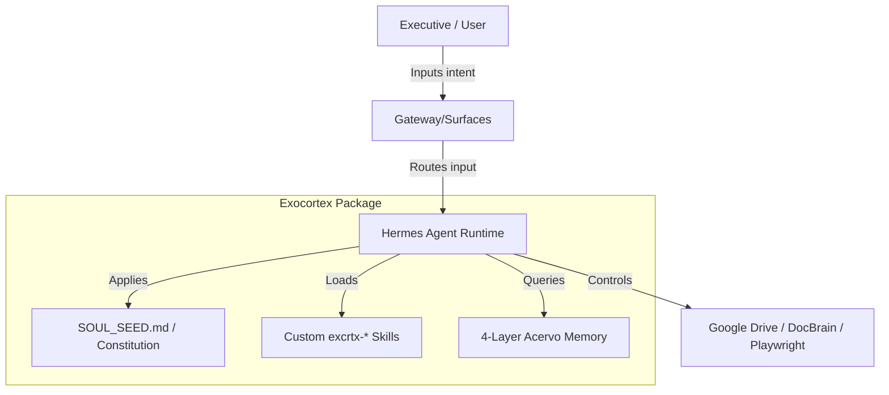

# Exocortex.IA System Architecture

This document describes the core architecture of the Exocortex.IA cognitive extension system, its components, integration with the Hermes Agent runtime, and execution pathways.

---

## 1. System Philosophy & Runtime Integration

Exocortex.IA is not an autonomous agent; it is a **cognitive extension package** designed to run on top of the **Hermes Agent runtime**. It acts as a bridge between executive intent (governed by the Macroverso/Constitution) and LLM-powered execution.

### Core Specifications
- **Host Runtime**: Hermes Agent CLI (`hermes`) with version boundaries `2026.4.8` to `2026.4.16`.
- **Packaging**: Consists of 40 custom behavior, memory, and utility skills (`skills/excrtx-*`), runtime configurations (`profiles/`), and a structured file-based wiki memory (`acervo/`).

---

## 2. Core Operational Vectors (Behavior Routing)

Every user input is silently classified into one of three operational postures by `excrtx-behavior-vetor`:

1. **🧠 Evolução (THINK)**: Triggered by open questions, study, or design requests. The agent adopts a **Socratic Guide** posture—challenging assumptions and asking 2-3 deep questions rather than giving immediate answers.
2. **⚡ Execução (DO)**: Triggered by action verbs, deadlines, or request for factual information. The agent becomes a **Specialist Agent** delivering high-quality files, scripts, or executing CLI actions.
3. **🧹 Manutenção (CLEAN)**: Triggered by cleanup requests, dependency audits, or index updates. The agent acts as an **Ecological Housekeeper** verifying path validity, logs, and system states.

---

## 3. Trilho A vs. Trilho B Execution (EX-34)

Work is routed into two primary tracks inside `gateway/run.py` and handled by the execution wrapper:

*   **Trilho A (Execution Track)**: Focused on direct tool call executions, local scripts execution, code compilation, and staging validations. This track is optimized for low latency and high accuracy, terminating with an empirical verification check (EX-49).
*   **Trilho B (Reasoning/Delegation Track)**: Focused on research, complex multi-agent orchestrations, and planning. It leverages advanced LLM reasoning to decompose requirements and coordinates subagents using parallel worker dispatch.

---

## 4. Key Integration Components

Exocortex interacts with external tools and APIs through specialized wrappers:

### A. The Gateway (EX-35)
Handles multi-surface communications, converting Telegram chat logs, web dashboard requests, or local CLI terminals into unified Hermes events.

### B. Hindsight Memory Database (EX-16)
An optional local containerized vector database running via `docker compose` to maintain short-term retrieval buffers and session context histories, preventing long-context degradation.

### C. DocBrain Parser Engine (EX-27)
An external Node.js parser (`~/exocortex/tools/docbrain`) that uses LLMs to convert messy legacy documents, scanned images, and PDFs into clean, structured markdown.

### D. NotebookLM Routing (EX-28 & EX-29)
Hooks into the local `notebooklm-mcp-cli` (`nlm`) to route deep research questions to NotebookLM notebooks, bypassing direct context limit constraints.

### E. Browser Automation Skill (EX-30)
Enables local headless/headed Chrome execution using `playwright` and `browser-use` to perform web searches, fill forms, and download documentation.

---

## 5. Security & Isolation Firewalls

- **Draft-First Interceptor (EX-08)**: Direct outward actions (e.g., git push, email dispatch, oauth consent updates) are intercepted. The payload is rendered in chat as a `📋 DRAFT`, and the agent halts execution until explicit approval is granted.
- **Microverso Isolation**: Sharing constraints defined in a microverso's metadata (e.g., `deny: [ALL]`, `allow: [gabinete]`) are enforced by the `excrtx-memory-manager` (EX-11). If a cross-domain request occurs, the system routes the reference to the `shared/` layer.
