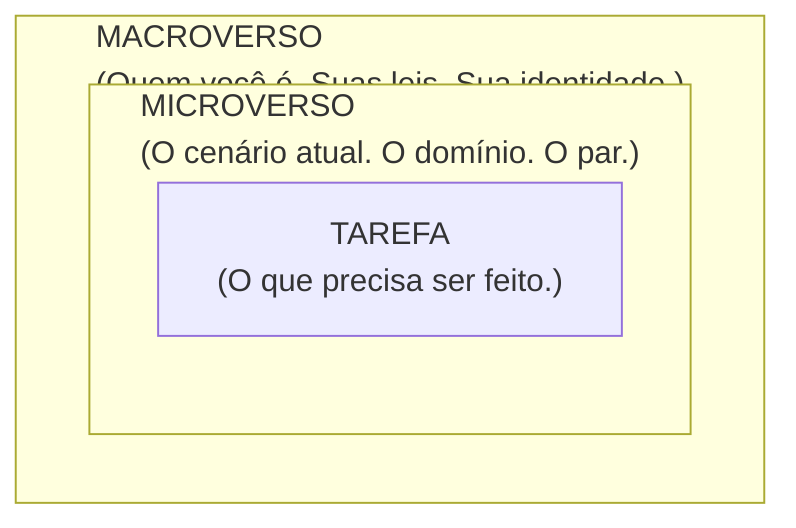
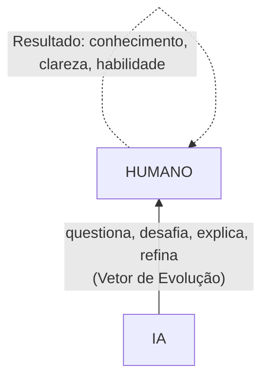
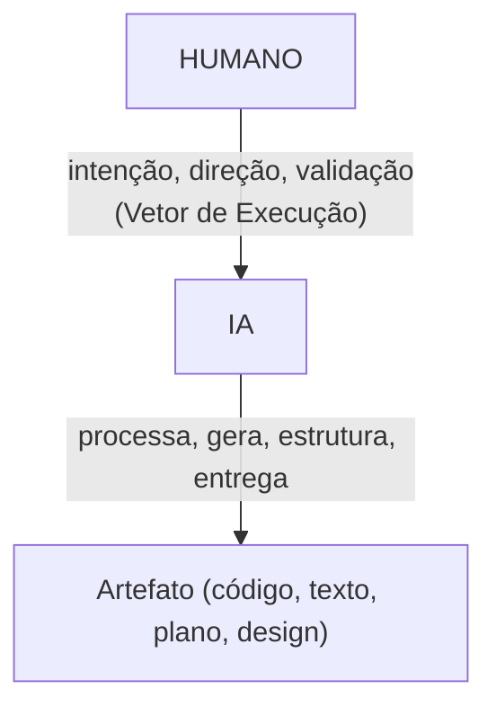
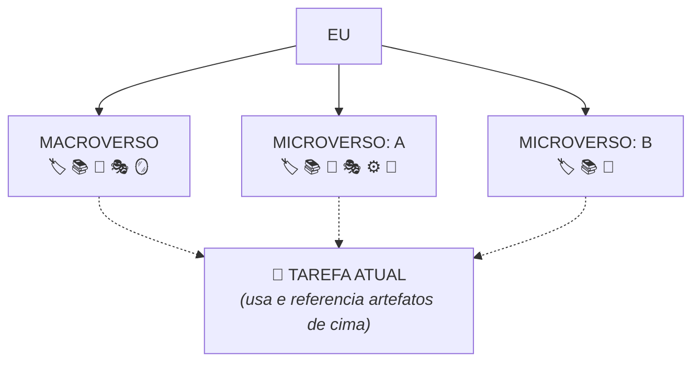
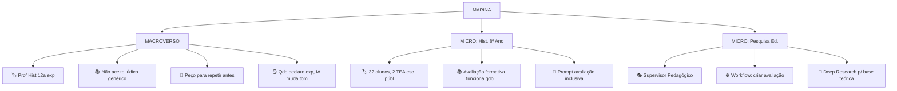
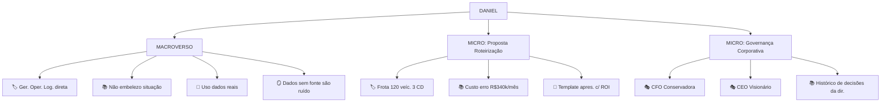
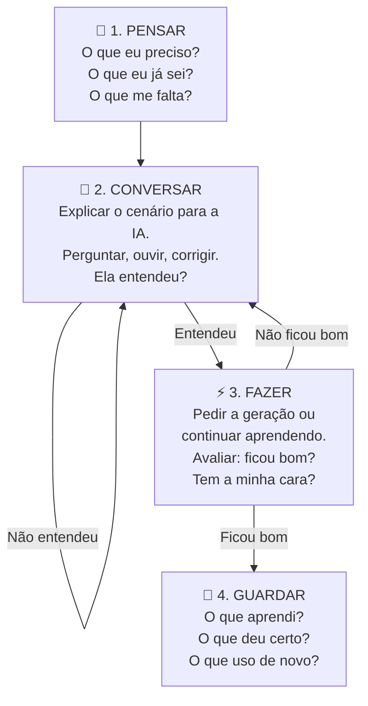
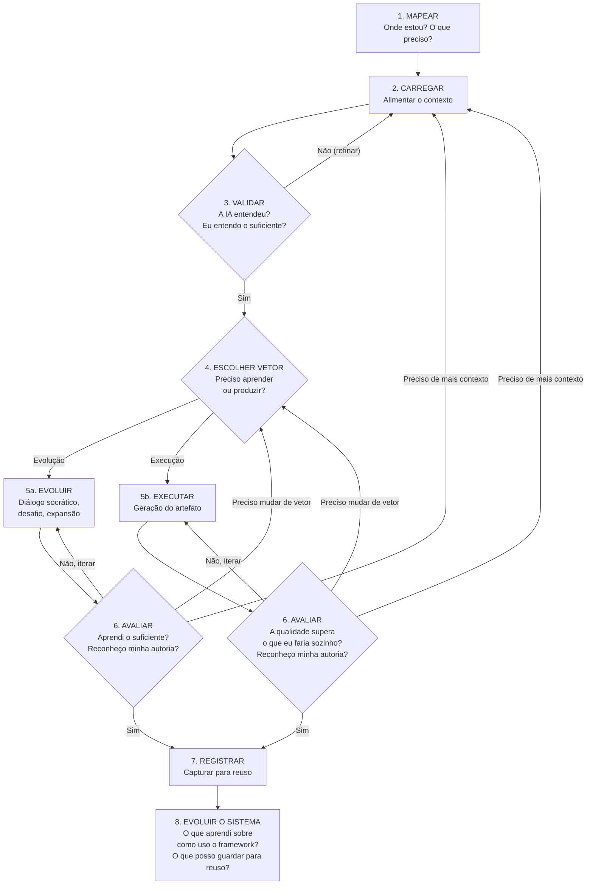

# O Exocórtex.IA — O Framework

> *"A IA não vai emburrecer ninguém. Vai apenas permitir que sejamos burros sem consequências imediatas. O Exocórtex existe para quem escolheu não aceitar essa permissão."*

---

## O que é o Exocórtex.IA

Você sabe o que é um exoesqueleto? Uma estrutura externa que se acopla ao corpo e amplifica o que ele já consegue fazer. Não substitui os músculos — multiplica a força que já existe. Se o corpo é fraco, o exoesqueleto o torna funcional. Se é forte, o torna capaz do que antes era impensável.

O Exocórtex.IA é um exoesqueleto para o pensamento.

Não é um software. Não é um plugin. Não é um template de prompt que você copia e cola. É um **modelo mental** — uma forma de pensar sobre como você pensa antes de envolver qualquer ferramenta de IA. Uma arquitetura que organiza a relação entre o que você sabe, onde está, o que precisa fazer e como a inteligência artificial pode amplificar cada uma dessas dimensões.

A IA entra depois. Primeiro, o humano pensa.

Existe uma diferença fundamental entre *usar* IA e *se relacionar* com IA. Usar é abrir o chat, digitar uma pergunta, aceitar a resposta, seguir em frente. É um atalho — e como todo atalho, leva a um resultado previsível e raso. Relacionar-se é outra coisa. É entender quem você é naquele momento, o que está tentando alcançar, onde estão as suas lacunas, e então — só então — envolver a máquina como parceira de um processo que *você* conduz.

O Exocórtex.IA é a estrutura que torna essa relação possível.

---

## As Três Camadas: Universos dentro de Universos

O framework se organiza em três camadas concêntricas — como esferas que se contêm mutuamente. A metáfora não é acidental: cada camada externa governa e limita as que estão dentro dela.

### Camada 1 — Macroverso: Quem sou eu?

O Macroverso é o solo onde tudo cresce. É a resposta para a pergunta mais fundamental: *quem sou eu quando penso?*

É formado por quatro componentes:

- **Identidade Raiz** — Quem sou eu profissionalmente e intelectualmente? Um professor de história? Uma enfermeira pesquisadora? Um gestor público que se interessa por dados?
- **Valores** — O que é inegociável no meu trabalho? Rigor intelectual, honestidade, transparência, empatia, atenção ao aluno?
- **Tom** — Qual a minha voz natural? Direta e técnica? Acolhedora e socrática? Informal mas precisa?
- **Limites** — O que eu recuso que a IA faça por mim? Simplificar sem justificativa? Dar respostas prontas quando estou estudando? Ignorar minha capacidade de pensar?

O Macroverso muda raramente. É a sua "Constituição" pessoal — ele limita e orienta tudo que acontece dentro dele. Uma IA que opera sem Macroverso é uma IA sem alma: funciona, mas não te representa.

No filme *Memento* (2000), de Christopher Nolan, o protagonista Leonard Shelby não forma memórias novas. Cada cena, ele acorda sem lembrar o que aconteceu antes. Para sobreviver, ele tatua no próprio corpo as verdades que não pode esquecer — as coisas permanentes, as leis que governam suas decisões. O Macroverso é isso: são as tatuagens. O que não muda. O que te define.

### Camada 2 — Microverso: Onde estou?

O Microverso é o cenário atual — o domínio, o contexto, a "sala" onde o trabalho vai acontecer. Diferente do Macroverso, ele muda a cada sessão ou projeto.

Seus componentes incluem:

- **Domínio** — Onde estou operando? Uma aula de ciências? A escrita de um artigo? A preparação de uma palestra?
- **Persona da IA** — Que tipo de mente preciso ao meu lado? Um tutor socrático? Um crítico técnico? Um par criativo? Um avaliador rigoroso?
- **Pares** — Quem mais está "na sala"? Que especialista eu gostaria que estivesse comigo? Um pedagogo, um designer, um aluno-alvo?
- **Inputs** — Que material bruto tenho? PDFs, anotações, código existente? E o que *não* tenho, mas gostaria de ter?
- **Skills** — Que habilidades o trabalho exige? Análise crítica, síntese, geração de texto, design visual?
- **Ferramentas** — Que recursos podem ampliar o alcance do trabalho?

Ainda na analogia de *Memento*: se o Macroverso são as tatuagens, o Microverso são as fotos polaroid. As anotações situacionais, o contexto de cada cena — quem está na foto, o que aconteceu, o que precisa ser lembrado *agora*.

Um professor pode ter um Microverso para cada disciplina. Um desenvolvedor, um para cada projeto. A chave é que o Microverso **herda** do Macroverso — nunca contradiz a Constituição.

### Camada 3 — Tarefa: O que preciso fazer?

A Tarefa é o núcleo — o que precisa ser feito *agora*. Vive dentro de um Microverso e herda todas as suas regras.

Toda tarefa tem uma **natureza**, e reconhecer essa natureza é o primeiro ato de inteligência do framework:

| Natureza | O que acontece | Exemplo |
|---|---|---|
| **Aprender** | A IA ensina. Você absorve. | Estudar um conceito novo |
| **Aprofundar** | A IA desafia. Você refina. | Investigar algo que já conhece |
| **Criar** | A IA executa. Você valida. | Produzir uma apresentação |
| **Decidir** | A IA apresenta cenários. Você julga. | Avaliar alternativas |
| **Revisar** | A IA analisa. Você aceita ou rejeita. | Criticar um texto existente |

A natureza da tarefa determina o que vem a seguir — o *vetor* que a interação vai seguir.

Mas há algo que a tabela acima não mostra e que muda a forma de enxergar cada interação: **toda tarefa gera contexto**. Não apenas as tarefas de criação — *todas*.

Quando você estuda um conceito novo (Aprender), a conversa que teve com a IA — as perguntas, as respostas, as analogias que fizeram sentido, os pontos que você pediu para expandir — tudo isso é contexto rico. Quando você investiga algo que já conhece (Aprofundar), as nuances que emergiram, os contra-argumentos que a IA apresentou, as conexões inesperadas — tudo isso é material intelectual denso. Quando você produz algo (Criar), o artefato final é apenas a ponta do iceberg: as decisões intermediárias, os rascunhos descartados, as justificativas — tudo isso carrega valor.

Esse contexto não precisa — e não deve — morrer no chat. Ele pode ser **capturado, organizado e reutilizado**.

Imagine que você passou 40 minutos conversando com a IA sobre avaliação formativa. Ao final, você entende o tema muito melhor. Mas se fechar a conversa e seguir em frente, tudo o que aprendeu vive apenas na sua cabeça — e a próxima vez que precisar desse conhecimento, terá que reconstruí-lo do zero. Agora imagine o gesto simples de, ao final da sessão, pedir para a IA consolidar os pontos principais da conversa num resumo estruturado. Ou você mesmo anotar, no seu formato, os insights que mais importaram. Esse resumo se torna um **artefato de conhecimento** — um documento que pode ser salvo, organizado e, na próxima sessão, carregado como contexto. A IA que recebe esse artefato no início de uma nova conversa não começa do zero — começa de onde você parou.

É assim que se constrói uma **biblioteca de conhecimento pessoal**: arquivo por arquivo, sessão por sessão, cada interação intelectual deixando um rastro organizado que alimenta as próximas. Não é um projeto grandioso — é um hábito pequeno e cumulativo. Um arquivo com suas anotações sobre pedagogia. Outro com decisões de design que já tomou. Outro com os prompts que funcionaram e por quê. Organizados em pastas simples, nomeados de forma que você encontre quando precisar.

Essa prática transforma a relação com a IA de **transacional** (pergunta → resposta → descarte) em **cumulativa** (pergunta → resposta → registro → contexto futuro). E é cumulativa que importa, porque a IA não acumula por você — cada sessão começa zerada. Você é a memória. Seus arquivos são a memória.

→ Ver Capítulo 6: Engenharia de Contexto para estratégias práticas de como transformar interações em artefatos reutilizáveis e como estruturar sua biblioteca de conhecimento.

---

## Os Dois Vetores de Valor

Esta é a contribuição central do framework. A IA não serve apenas para *produzir*. Ela serve para *expandir quem você é*.

### Vetor de Evolução — Para Dentro

Quando a tarefa exige que você aprenda, aprofunde ou refine seu entendimento, o resultado principal não é um artefato externo — é a **alteração do seu estado cognitivo**. Você entende algo que não entendia, vê algo que não via, conecta algo que estava desconectado.

Nesse vetor, a IA atua como Tutor Socrático ou parceiro de embate intelectual. Ela questiona, desafia, explica, refina. O produto principal fica *dentro de você*.

Mas há um efeito colateral precioso: o processo de evolução gera **subprodutos documentais** de alta qualidade. A conversa em que você aprendeu sobre avaliação formativa pode ser destilada num resumo que se torna referência futura. O diálogo em que você refinou sua compreensão sobre um framework técnico pode gerar um glossário pessoal. A sessão de embate intelectual onde a IA desafiou seus argumentos pode produzir uma lista de contra-argumentos que fortalece qualquer texto futuro sobre o tema.

Esses subprodutos não são o objetivo da interação — o objetivo continua sendo a sua evolução. Mas quando capturados e organizados, eles **fecham um ciclo virtuoso**: a evolução de hoje se torna o contexto de amanhã. Você aprende, registra, e na próxima tarefa — seja de aprendizado ou de criação — parte de um patamar mais alto porque tem contexto acumulado.

É a diferença entre caminhar e caminhar deixando mapas para si mesmo.

### Vetor de Execução — Para Fora

Quando a tarefa exige que você produza, o resultado é um **artefato tangível**: um texto, um código, uma apresentação, um plano. Algo exportável, entregável.

Nesse vetor, a IA atua como Agente Especialista ou braço direito. Você direciona, ela processa, estrutura e entrega. Você valida.

Aqui também opera a lógica cumulativa: o artefato final é o objetivo, mas o *processo* de criação gera contexto rico. As decisões que você tomou durante a produção ("preferi a estrutura A em vez da B porque..."), os critérios de qualidade que aplicou, os ajustes de tom ou abordagem — tudo isso é conhecimento implícito que, se registrado, se torna explícito e reutilizável. Um professor que documenta as decisões por trás de uma avaliação não apenas tem a avaliação pronta — tem um registro de *como pensa sobre avaliação*, que pode alimentar todas as avaliações futuras.

### O Entrelaçamento

Na prática, os dois vetores se alternam — muitas vezes dentro da mesma sessão. Você está criando uma aula (Execução) e percebe que não domina um conceito (Evolução). Pausa. Aprende. Volta a criar com mais profundidade.

O framework não força uma escolha. Ele **torna o momento da alternância consciente**. E essa alternância consciente *é* metacognição aplicada.

→ Ver Capítulo 4: Caso Educacional e Capítulo 5: Caso Corporativo para exemplos completos de alternância entre vetores.

---

## O Princípio HITL — Human-in-the-Loop

O Exocórtex.IA tem uma trava de segurança embutida: o humano não sai do circuito. Nunca.

A IA propõe — você valida. A IA executa — você julga. A IA sugere um caminho — você decide se segue. A analogia é direta: você é o piloto, a IA é o piloto automático. Nos dois casos, a mão fica no leme.

Isso se manifesta concretamente no *Loop de Validação* (Passo 3 do workflow completo): antes de qualquer geração, a IA deve **provar que entendeu**. Não é o humano que prova para a IA — é a IA que prova para o humano. "Me diga o que você entendeu antes de fazer." Essa inversão da dinâmica usual garante que o humano permanece no controle cognitivo.

E se aplica igualmente à avaliação do resultado (Passo 6): o artefato que sai da IA tem a sua marca? Seus valores? Seu julgamento? Se não, o ciclo não terminou — volta-se a alimentar contexto, a trocar de vetor, a iterar. O resultado só é aceito quando o autor o reconhece como seu.

---

## O Canvas Cognitivo — Pensar Antes da Máquina

O framework é *unplugged-first*. Os momentos mais importantes acontecem **antes** de abrir qualquer ferramenta.

O Canvas Cognitivo é um exercício de 5 minutos. Pode ser feito num caderno, num mapa mental, num post-it, numa folha solta. Use o que você já domina quando vai planejar uma tarefa. O Canvas apenas estrutura esse gesto natural.

Seus 10 campos:

  
CANVAS COGNITIVO

  <table>
    <tr><th>EU HOJE:</th><td>(Quem sou eu neste contexto?)</td></tr>
    <tr><th>VALORES:</th><td>(O que me importa de verdade? Que princípios não são negociáveis? Que tipo de pessoa eu sou diante deste trabalho — e diante da IA?)</td></tr>
    <tr><th>CENÁRIO:</th><td>(Qual é o domínio? O que está ao redor?)</td></tr>
    <tr><th>TAREFA:</th><td>(O que precisa acontecer?)</td></tr>
    <tr><th>NATUREZA:</th><td>[ ] Aprender &nbsp; [ ] Aprofundar &nbsp; [ ] Criar [ ] Decidir &nbsp; [ ] Revisar</td></tr>
    <tr><th>PAR:</th><td>(Com quem quero trabalhar? Que tipo de mente?)</td></tr>
    <tr><th>JÁ SEI:</th><td>(O que já domino sobre isso?)</td></tr>
    <tr><th>NÃO SEI:</th><td>(O que me falta? Onde está minha lacuna?)</td></tr>
    <tr><th>E SE...?:</th><td>(E se eu mudasse o ângulo? Que possibilidade me faz sorrir só de imaginar?)</td></tr>
    <tr><th>SUCESSO:</th><td>(Como vou saber que deu certo?)</td></tr>
  </table>

> **Nota de Contexto: Quem são Marina e Daniel?**
> A partir daqui, usaremos dois personagens para ilustrar a aplicação prática do framework: **Marina**, uma professora de História que busca criar avaliações inclusivas (cenário educacional), e **Daniel**, um gerente de operações focado em apresentar resultados com transparência (cenário corporativo). Seus estudos de caso completos serão detalhados nos Capítulos 4 e 5.

O campo **VALORES** é o mais importante para a autenticidade — e opera em duas camadas. A primeira é a camada de **domínio**: o que importa *neste trabalho específico*. Marina valoriza a inclusão genuína; Daniel valoriza a honestidade com sua equipe. São valores que filtram o resultado — quando a IA devolve algo que os viola, o humano reconhece imediatamente que precisa corrigir.

A segunda camada é mais profunda: a **identidade de quem interage**. Quem preenche o Canvas está declarando, antes de tudo, *que tipo de pessoa é*. Alguém que quer aprender, não apenas receber respostas. Alguém que pensa antes de perguntar. Alguém que não delega decisões importantes para uma máquina. Honestidade intelectual — reconhecer o que não sabe sem fingir que sabe. Transparência — deixar explícito o porquê de cada escolha, para si mesmo e para quem vier depois.

Essa declaração de identidade não é decorativa. É funcional. Quando Marina escreve que não aceita "adaptações de fachada", está dizendo à própria consciência: *eu sou alguém que faz o trabalho de verdade, não alguém que marca uma checkbox de acessibilidade*. Quando Daniel escreve que não vai "embelezar" a situação, está se comprometendo com a autenticidade antes de entrar na sala. A IA não precisa ler isso — *o humano* precisa escrever. Porque escrever é pensar, e pensar é se posicionar.

Sem esse campo, valores ficam implícitos no macroverso da narrativa mas ausentes do instrumento de trabalho — e o que não está escrito é fácil de esquecer sob pressão.

O campo **NÃO SEI** é o mais importante para a qualidade. Quem sabe exatamente o que não sabe já tem metade do caminho andado — porque é ali que mora o valor real da interação com a IA. A máquina responde melhor quando você sabe *o que perguntar*.

O campo **E SE...?** é o mais importante para a originalidade. É o espaço para expansão criativa deliberada — o momento de suspender as restrições práticas e perguntar: *e se fosse diferente?* A criatividade não surge do vazio. Surge quando um contexto bem definido encontra uma pergunta que o desestabiliza. O Canvas cria o contexto. O "E SE...?" o sacode. Dessa tensão produtiva entre estrutura e liberdade nascem as ideias que surpreendem.

→ Ver Apêndice B: Canvas Cognitivo para a versão completa com guia de preenchimento e exemplos.

---

## O Mapa Hierárquico — Visualizar o que Você Já Tem

O Canvas responde à pergunta *"o que preciso pensar antes desta tarefa?"*. Mas à medida que o uso da IA se torna recorrente, surge outra: *"o que já tenho que pode me ajudar?"*

O Mapa Hierárquico é uma representação visual de tudo que você acumulou ao longo das suas interações — organizado pelas camadas do framework. Se o Canvas é o *rascunho no guardanapo* (pré-tarefa, efêmero), o Mapa é o *mural na parede do escritório* — a vista panorâmica. Você olha e sabe onde está cada coisa. Quando inicia uma tarefa nova, olha o mural e identifica quais peças precisa.

### Para que serve

1. **Visualizar** — ver de relance o que existe em cada camada
2. **Compor** — identificar quais artefatos "arrastar" para a tarefa atual
3. **Promover** — perceber quando algo nasceu no lugar errado (um aprendizado que vale para todo o Microverso, não apenas para uma tarefa)
4. **Navegar** — encontrar o que precisa sem abrir vários arquivos ou revirar anotações

### A estrutura

O Mapa é uma árvore com dois níveis fixos — **Macroverso** e **Microversos** — mais um nó especial: a **Tarefa**, que não pertence a nenhuma camada, mas *referencia* artefatos de qualquer uma delas.

Cada nó do Mapa pode conter artefatos de 7 naturezas, representados por ícones:

| Ícone | Natureza | O que é | Exemplo |
|---|---|---|---|
| 🏷️ | **Contexto** | Quem sou, onde estou | Identidade profissional, perfil da turma |
| 📚 | **Conhecimento** | O que sei — já tinha ou aprendi | Base teórica, insight de sessão, material de referência |
| 📝 | **Instrução** | Prompt refinado, template | Janela de Contexto que funcionou |
| 🎭 | **Persona** | Perfil de comportamento com personalidade e formações | Supervisor Pedagógico (15 anos de experiência, formação em Educação Especial, tom direto) |
| ⚙️ | **Processo** | Sequência de passos, workflow | Roteiro para criar avaliação inclusiva |
| 🔧 | **Ferramenta** | Capacidade da IA que descobri | Pesquisa profunda, geração de imagens, modo socrático |
| 🪞 | **Reflexão** | Meta-reflexão, o que funcionou | "Quando declaro experiência, a IA muda o tom" |

A estrutura visual:

A Tarefa não *pertence* a um único Microverso — ela **referencia** artefatos de onde precisar. Uma tarefa pode combinar o Macroverso (sempre), um Microverso principal e, excepcionalmente, artefatos de outro Microverso. Um professor que prepara uma aula interdisciplinar pode precisar do conhecimento do Microverso de História *e* do Microverso de Geografia. Um gestor preparando uma apresentação para a diretoria pode combinar o Microverso do projeto atual com personas do Microverso de governança corporativa.

### Exemplo: O Mapa de Marina

### Exemplo: O Mapa de Daniel

**Cenário de composição:** Daniel precisa preparar uma nova apresentação. Olha o Mapa:

- Do **Macroverso**: identidade + instrução ("uso dados reais")
- Do **Micro Roteirização**: contexto operacional + conhecimento de custos + template
- Do **Micro Governança**: personas da CFO e do CEO

Mentalmente "arrasta" esses artefatos para a Tarefa. Monta a Janela de Contexto com eles. A sessão já começa com profundidade — sem repetir 20 minutos de setup.

### Como fazer o seu

O Mapa pode ser feito em qualquer suporte:

| Suporte | Para quem |
|---|---|
| **Papel** (folha A3, mural na parede) | Quem pensa melhor no analógico |
| **Mapa mental digital** (MindMeister, XMind, draw.io) | Quem já usa ferramentas visuais |
| **Markdown indentado** (arquivo `.md`) | Quem trabalha com texto |
| **Ferramentas de IA** (Antigravity, Claude Cowork) | Quem usa agentes com memória |

O ponto de transição natural: quando o Mapa começa a ter mais itens do que cabem numa visualização confortável, os artefatos precisam de um lugar persistente — arquivos. O Mapa então se torna o **índice** do Acervo. E essa transição é suave, porque a organização mental já estava feita.

→ Ver Apêndice B: Canvas Cognitivo para o template em branco do Mapa Hierárquico.

---

## O Acervo Cognitivo — Onde o Conhecimento Persiste

O Canvas estrutura o pensamento antes da tarefa. O Mapa visualiza o que já existe. Mas *onde* esses artefatos vivem? Onde o prompt que funcionou fica guardado para ser reutilizado? Onde a persona que rendeu bons resultados fica registrada para a próxima sessão?

A resposta é o **Acervo Cognitivo** — sua coleção pessoal de artefatos intelectuais, organizados pelas camadas do framework.

### As 7 Naturezas

Todo artefato cognitivo pertence a uma de 7 naturezas:

| Ícone | Natureza | O que guarda | Exemplo |
|---|---|---|---|
| 🏷️ | **Contexto** | Quem sou, onde estou, com quem trabalho | Macroverso pessoal, perfil de turma, cenário de projeto |
| 📚 | **Conhecimento** | O que sei — material que já tinha *e* o que aprendi com a IA | Bibliografia, sínteses de estudo, insights de sessão |
| 📝 | **Instrução** | Prompts, templates, janelas de contexto que funcionaram | "Este prompt gera avaliações inclusivas consistentes" |
| 🎭 | **Persona** | Perfis de comportamento com personalidade, formação e tom | "Aluno com TEA, 14 anos, processa melhor estímulos visuais, precisa de mais tempo" |
| ⚙️ | **Processo** | Sequências de passos — workflows testados | "Para criar avaliação: 1. pesquisar base teórica, 2. definir competências, 3. gerar estações..." |
| 🔧 | **Ferramenta** | Capacidades da IA que você descobriu e quer lembrar de usar | "Pedir pesquisa profunda antes de criar conteúdo melhora a base teórica" |
| 🪞 | **Reflexão** | O que funcionou, o que não funcionou, o que mudaria | "Quando peço 3 versões alternativas, a segunda costuma ser a melhor" |

A natureza **Persona** merece atenção especial. Uma persona não é apenas um prompt dizendo "aja como professor" — é um perfil com profundidade: formação acadêmica, anos de experiência, traços de personalidade, estilo de comunicação, vieses conhecidos. Marina pode criar a persona "Aluno com TEA" numa sessão e reutilizá-la em qualquer avaliação futura — cada uso a enriquece, porque cada interação revela nuances que são incorporadas ao perfil.

A natureza **Ferramenta** funciona como um *cardápio pessoal de capacidades*. Conforme o leitor ganha fluência, descobre que pode pedir à IA coisas que não sabia serem possíveis:

- **Pesquisa profunda** — "Antes de criar, pesquise o estado da arte sobre X"
- **Visualização** — "Gere um diagrama para ilustrar este conceito"
- **Modo aprendizado** — "Não me dê a resposta, me guie até ela"
- **Simulação** — "Encarne o papel de Z e avalie minha proposta"
- **Análise de documentos** — "Leia este arquivo e extraia os pontos-chave"

Registrar essas descobertas como artefatos de Ferramenta é construir um repertório que cresce organicamente com a experiência.

### Promoção: artefatos que sobem de camada

Artefatos nascem onde a necessidade os cria — geralmente na Tarefa. Mas alguns provam seu valor e merecem subir.

O mecanismo é simples: no final de uma sessão (Passo 7 — Registrar, Passo 8 — Evoluir), pergunte:

- *"Esse prompt funcionou só agora ou vai servir de novo?"* → Se sim, promova para o Microverso.
- *"Essa persona serve só para esta disciplina ou para todo o meu trabalho?"* → Se sim, promova para o Macroverso.
- *"Esse workflow é específico ou genérico?"* → Se genérico, promova.

A promoção é o gesto que transforma o **efêmero** (morreu no chat) em **persistente** (vive no Acervo). É o ato mínimo de curadoria que, repetido ao longo do tempo, constrói a diferença entre quem usa IA de forma transacional e quem constrói um patrimônio intelectual cumulativo.

### Progressão: do caderno aos arquivos

O Acervo não precisa começar organizado. Ele cresce com você:

| Estágio | O que faz | Suporte |
|---|---|---|
| **Caderno** | Anota 2-3 frases ao final de cada sessão significativa | Papel, app de notas |
| **Gaveta** | 4 arquivos num lugar fixo (eu.md, conhecimentos.md, prompts.md, reflexões.md) | Pasta simples |
| **Estante** | Separa por Microverso (uma pasta por projeto/disciplina) | Pastas organizadas |
| **Biblioteca** | Índice com cabeçalhos padronizados — o Mapa Hierárquico vira índice do Acervo | Arquivos com metadados |

A transição de *caderno* para *arquivos organizados* não é obrigatória — mas é fortemente recomendada. Arquivos de texto (Markdown, texto puro) são universais, portáteis e preparados para o futuro: quando você estiver pronto para um Agent Harness (→ Cap. 8), esses mesmos arquivos se tornam o contexto que a IA carrega automaticamente. Sem conversão, sem migração — apenas apontar a ferramenta para a pasta certa.

→ Ver Capítulo 8: Introdução ao Agent Harness para como o Acervo se conecta à automação.
→ Ver Apêndice D: Guia de Workflows para como criar processos eficazes e reutilizáveis.

---

## Os Workflows: Do Post-it ao Algoritmo Humano

### O Workflow Iniciante — 4 Passos

Se o framework completo parece demais, comece por aqui. São 4 passos. Cabem num post-it. Funcionam para qualquer tarefa com IA.

| Passo | O que você faz |
|---|---|
| **Pensar** | Antes de abrir a IA, pare. O que precisa ser feito? O que você já sabe? Onde está a sua dúvida real? |
| **Conversar** | Explique o cenário à IA como explicaria para um colega inteligente que não sabe nada do seu contexto. Peça para ela repetir o que entendeu. Se errou, corrija. Se acertou, avance. |
| **Fazer** | Peça o que precisa — ou volte a conversar se perceber que precisa aprender mais. Avalie o resultado: ficou bom? Tem a sua cara? Se não, refine. |
| **Guardar** | Reflita 30 segundos: o que aprendi? O que funcionou? O que posso reaproveitar? |

Esses 4 passos bastam para transformar qualquer interação com IA de superficial em significativa.

### O Workflow Completo — 8 Passos

Os 4 passos do iniciante **mapeiam diretamente** para os 8 passos do workflow completo. A transição é natural: quando os 4 passos se tornarem automáticos e você sentir que precisa de mais controle sobre o processo, a expansão para 8 é nomear o que já estava fazendo.

| # | Passo | O que acontece |
|---|---|---|
| 1 | **Mapear** | Identificar Macroverso, Microverso e natureza da tarefa |
| 2 | **Carregar** | Alimentar a IA com contexto: inputs, referências, restrições, resultados anteriores |
| 3 | **Validar** | A IA demonstra compreensão. Você confirma ou corrige. *O porteiro.* |
| 4 | **Escolher Vetor** | Decisão consciente: vou aprender ou vou produzir? |
| 5 | **Atuar** | Evolução (diálogo) ou Execução (geração), conforme o vetor |
| 6 | **Avaliar** | O resultado atende ao padrão? Reconheço minha autoria? |
| 7 | **Registrar** | Capturar o que foi produzido, aprendido ou decidido |
| 8 | **Evoluir o Sistema** | Refletir sobre o processo: o que funcionou? O que melhorar? |

A correspondência:
- **Pensar** = Mapear
- **Conversar** = Carregar + Validar + Escolher Vetor
- **Fazer** = Atuar + Avaliar
- **Guardar** = Registrar + Evoluir o Sistema

Dois passos merecem atenção especial. O **Passo 3 — Loop de Validação** é o mecanismo anti-emburrecimento: a IA prova que entendeu antes de agir, invertendo a dinâmica passiva usual. O **Passo 8 — Motor de Evolução** transforma o framework num sistema que ensina a si mesmo.

→ Ver Capítulo 4 e Capítulo 5 para os dois workflows aplicados a casos reais, passo a passo.

---

## O Motor de Evolução — O Framework que Ensina a si Mesmo

O Passo 8 do workflow não é cosmético. É o mecanismo que torna o framework **auto-aprimorante**.

Após cada ciclo significativo de uso, três perguntas:

1. **O que aprendi sobre o domínio?** → Enriquece o Microverso
2. **O que aprendi sobre mim?** → Refina o Macroverso
3. **O que aprendi sobre como uso a IA?** → Evolui o processo

Essas perguntas geram **artefatos de evolução** — registros que alimentam o Acervo Cognitivo (ver seção anterior) e se acumulam ao longo do tempo:

| Artefato | Natureza | O que é |
|---|---|---|
| **Biblioteca de Prompts** | 📝 Instrução | Prompts que funcionaram, com o contexto de quando e por quê |
| **Personas Refinadas** | 🎭 Persona | Perfis de comportamento enriquecidos a cada uso |
| **Skills Pessoais** | ⚙️ Processo | Padrões de interação refinados para tarefas recorrentes |
| **Mapa de Lacunas** | 📚 Conhecimento | Registro honesto do que você ainda não domina |
| **Log de Decisões** | 📚 Conhecimento | Por que escolheu X e não Y em momentos-chave |
| **Meta-Reflexões** | 🪞 Reflexão | Observações sobre o seu próprio processo cognitivo |

O Motor de Evolução é o *produtor* de artefatos. O Acervo Cognitivo é o *destino*. E o Mapa Hierárquico é a *visualização* de tudo que foi acumulado. Juntos, formam o ciclo: usar → refletir → registrar → reutilizar.

A diferença entre um usuário iniciante e alguém que efetivamente opera como parceiro cognitivo da IA não está nas ferramentas — está na **espessura do Acervo** que acumulou. O framework cresce com você porque *você* alimenta esse crescimento.

→ Ver Capítulo 6: Janela de Contexto e Capítulo 7: Técnicas de Prompt para estratégias práticas de evolução.

---

## A Escalada Gentil — Estratégia de Adoção

Ninguém começa pela simbiose. O framework é projetado para adoção incremental — cada fase prepara a próxima, sem forçar saltos.

### Fase 1 — A Semente

**Quem:** Qualquer pessoa. Zero pré-requisitos.

Preencher o Canvas Cognitivo antes de interagir com a IA. Papel e caneta. 5 minutos. O que muda: você para de "jogar perguntas" e começa a modelar intenções. A qualidade dos resultados sobe imediatamente — porque a entrada melhorou.

**Quando avançar:** Quando o Canvas se tornar automático — quando você não precisar mais do papel porque a estrutura já virou pensamento.

### Fase 2 — A Consolidação

**Quem:** Quem já usa o Canvas naturalmente.

Começar a construir Macroverso e Microversos persistentes. Carregar contexto entre sessões. Ser o conector humano entre janelas de contexto — copiar resultados de uma conversa para outra, levar aprendizados de uma interação para a próxima. Nesta fase, *você* é a cola que mantém tudo junto. E isso não é limitação — é o estágio mais importante de aprendizado, porque ao transportar e conectar contexto manualmente, você entende a topografia do seu próprio pensamento.

É nesta fase que a prática de construir **bibliotecas de conhecimento pessoal** se torna natural. O gesto de "guardar" (Passo 4 do workflow iniciante, Passo 7 do completo) evolui de uma reflexão interna para uma ação concreta: salvar artefatos em arquivos organizados, prontos para serem reutilizados.

Na prática, isso pode ser tão simples quanto:

- Uma pasta `contexto/` com seus Macroverso e Microversos escritos em texto simples
- Uma pasta `aprendizados/` com resumos de sessões de estudo organizados por tema
- Uma pasta `prompts/` com os prompts que funcionaram, acompanhados do *porquê* funcionaram
- Uma pasta `decisoes/` com registros de escolhas importantes e seus critérios

O formato importa menos que o hábito. Pode ser Markdown, pode ser texto puro, pode ser um caderno digital — o que importa é que exista um lugar onde o conhecimento gerado nas interações com IA sobrevive além da sessão. Quando você inicia uma nova conversa e carrega um desses arquivos como contexto, a IA não precisa adivinhar quem você é, o que já tentou, ou o que já decidiu — está tudo ali. A qualidade do resultado salta porque a qualidade da entrada saltou.

Cada arquivo que você cria é uma **tatuagem transferível** — informação que persiste entre sessões, que acumula ao longo do tempo, e que transforma sessões isoladas em um processo contínuo de crescimento intelectual.

→ Ver Capítulo 6: Engenharia de Contexto para técnicas detalhadas de como estruturar, nomear e carregar artefatos de conhecimento de forma eficaz.

**Quando avançar:** Quando seus Microversos tiverem profundidade suficiente para gerar resultados que te surpreendem — quando a IA produzir algo que você não teria pensado sozinho, não por ser melhor que você, mas porque o contexto que você proporcionou permitiu conexões inesperadas.

### Fase 3 — A Simbiose

**Quem:** Quem domina Macroversos e Microversos.

Fluidez total. Alternância orgânica entre vetores. Microversos interconectados. Ferramentas com acesso direto ao sistema — o humano deixa de ser o carregador manual e passa a ser o orquestrador. O framework se torna **invisível** — não é mais algo que você "usa", é como você pensa.

A Fase 3 é um vetor, não um destino. Nunca se atinge completamente. O Macroverso se expande continuamente. Novos Microversos aparecem. O teto sobe com você.

→ Ver Capítulo 8: Introdução ao Agent Harness para o horizonte tecnológico da Fase 3.

---

## O Princípio da Autoria — O que a IA Nunca Substitui

O Exocórtex.IA carrega uma trava de segurança que permeia cada camada:

> **A IA é o instrumento. Você é o autor.**

Isso significa quatro coisas, inegociáveis:

- A **intenção** é sua. A IA não define o que vale a pena fazer.
- A **validação** é sua. A IA propõe, você julga.
- A **autoria** é sua. O que sai do sistema carrega a sua marca, seus valores, seu julgamento.
- A **evolução** é sua. A IA não cresce sozinha — você a faz crescer ao crescer.

Quem perde qualquer uma dessas dimensões perde o exoesqueleto — e volta a ser apenas um usuário de chatbot.

---

## A Regra 60/40

Uma heurística prática que sintetiza a filosofia do framework:

**60% do esforço na formulação do contexto. 40% na iteração com a máquina.**

Se a proporção se inverte — se você gasta mais tempo pedindo e iterando do que pensando e contextualizando — o resultado é medíocre. Independente da IA utilizada. Independente do prompt.

A qualidade do que sai é proporcional à qualidade do que entra. Não existe atalho para isso.

O Exocórtex.IA é, na essência, uma disciplina que organiza esses 60% — os minutos de pensamento que precedem o primeiro comando, o contexto que alimenta a máquina, a intenção que dirige o processo. Os 40% que sobram para a interação em si se tornam exponencialmente mais produtivos quando os 60% foram bem investidos.

---

*O que você leu neste capítulo é a arquitetura. Nos próximos dois capítulos, veremos essa arquitetura em ação — aplicada a dois cenários reais, passo a passo, com resultados concretos. O primeiro, no contexto educacional. O segundo, no corporativo.*

→ Ver Capítulo 4: Caso Educacional — Avaliação em Estações
→ Ver Capítulo 5: Caso Corporativo — A Apresentação Estratégica
