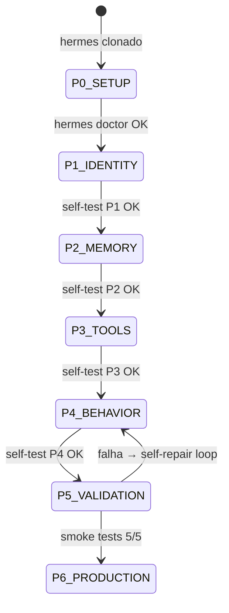
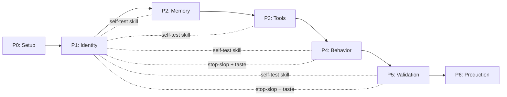
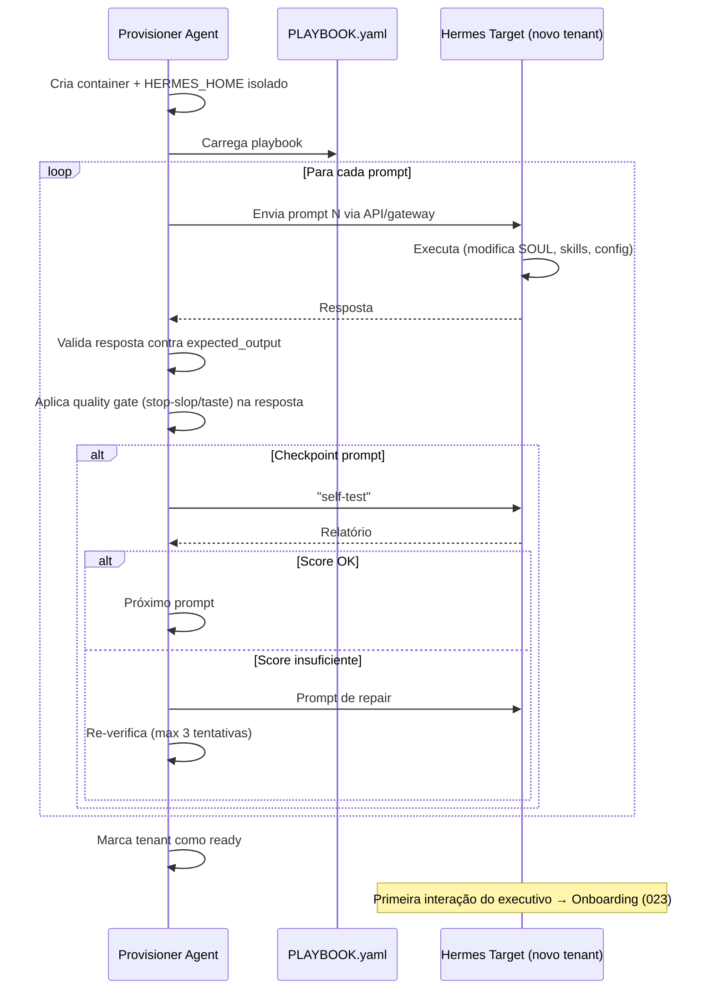

# Exocórtex.IA — Plano PDD (Prompt-Driven Development)

> **Branch:** PDD — Infrastructure as Prompts
> **Status:** 🟢 Em Progresso
> **Owner:** @elder
> **Last Updated:** 2026-05-27T00:53

---

## 📋 TL;DR para Agentes

> **Leia isto se você tem contexto limitado.**
>
> Este plano transforma um Hermes Agent vanilla no Exocórtex.IA usando apenas prompts.
> São 31 prompts organizados em 7 fases (P0-P6). Cada fase tem um checkpoint de self-test.
> Se um checkpoint falha, o agente deve se auto-reparar antes de avançar.
> O resultado final é replicável: rodar o mesmo playbook em um Hermes novo produz outro Exocórtex.
>
> **Qualidade de Output é Lei.** Este playbook inclui duas skills obrigatórias de qualidade:
> - **stop-slop** — Elimina padrões genéricos de escrita de IA (frases de enchimento, voz passiva, contrastes binários, falsa agência)
> - **taste-skill** — Garante que outputs visuais/UI quebrem os defaults estatísticos de LLMs (layouts repetitivos, grids com gaps, labels genéricos)
>
> Ambas são instaladas na P1 e validadas em toda saída do agente a partir de P4.

---

## Conceito: Infrastructure as Prompts (IaP)

Em vez de escrever código para estender o Hermes, criamos uma **sequência replicável de prompts** que faz o Hermes se auto-configurar no Exocórtex.

```
Hermes Vanilla → [P0: Setup] → [P1: Identity] → [P2: Memory] → [P3: Tools] → [P4: Behavior] → [P5: Validation] → [P6: Production]
```

**Por que funciona:** Hermes é um agente programável via conversação. Ele persiste estado em `SOUL.md`, `MEMORY.md`, `config.yaml`, skills e plugins. Cada prompt modifica um desses artefatos permanentes.

**Pré-requisitos:**
- Hermes Agent clonado e instalado (ver `phases/P0_SETUP.md`)
- Python 3.12+ com `uv` package manager
- Docker instalado
- API keys: OpenAI + OpenRouter

---

## 🔴 Meta-Projeto: Disciplina de Configuração

> **LEIA ANTES DE EXECUTAR QUALQUER COISA.**
>
> Este repositório é uma **receita reproduzível**, não um setup de uma vez.
> Rodar `setup.sh` em um Hermes limpo deve recriar o Exocórtex completo.
> Isso só funciona se TODO agente seguir estas regras:

| # | Regra | Artefato |
|---|---|---|
| 1 | **Registrar** toda ação no session log da fase | `plans/pdd/logs/session_{PHASE}.log` |
| 2 | **Atualizar** o setup.sh com cada ação de ambiente | `setup.sh` |
| 3 | **Verificar** com smoke test antes de declarar "pronto" | Output no session log |
| 4 | **Consultar** o estado real do sistema, não a memória do agente | `hermes skills list`, `command -v`, `ls` |
| 5 | **Documentar** itens diferidos com critérios de reavaliação | `BACKLOG_INTEGRATIONS.md` |

**Referência completa:** `PLAYBOOK.yaml` → `agent_protocol`

**Checklists (mental, antes/depois de cada ação):**
- PRÉ: Estado verificado? Fase/prompt corretos? Log aberto? Teste planejado?
- PÓS: Logado? Setup.sh atualizado? Smoke test OK? Outros arquivos afetados?

---

## Máquina de Estados



---

## Fases — Overview

| Fase | Nome | Prompts | Artefatos Criados/Modificados | Checkpoint |
|---|---|---|---|---|
| **P0** | Setup | — (manual) | Hermes instalado, env configurado | `hermes doctor` |
| **P1** | Identity | 001-005 | `SOUL.md`, skill `exocortex-self-test`, skill `exocortex-prompt-log`, **skill `stop-slop`**, **skill `taste-skill`** (gpt-taste + brandkit + brutalist) | self-test score ≥ 2/5 |
| **P2** | Memory | 006-010 + 006B-010B | Acervo Cognitivo 4 camadas (macro/global/micro/shared), wiki structure (SCHEMA/index/log/raw), skill `acervo-manager` (read/write/promote/search/scope), firewall deny-list c/ aliases, `exocortex-new-microverso` wiki. ADRs: 001-005 | self-test score ≥ 3/5 |
| **P3** | Tools & Governance | 015-018 (Core) | skill `exocortex-tool-governance`, bundle `exocortex-alpha`, profiles exec/evol. *MCPs 011-014 diferidos → `BACKLOG_INTEGRATIONS.md`* | self-test score ≥ 4/5 |
| **P4** | Behavior | 019-028 | Draft-First skill, Vetor Ativo skill, Canvas Cognitivo skill, Morning Briefing, **Output Quality Gate skill** | self-test score ≥ 4/5 |
| **P5** | Validation | 029-031 | Smoke tests executados, **quality audit de outputs**, relatório de graduação | self-test score = 5/5 |
| **P6** | Production | — | Estado `ready`, tenant pronto para uso | Full green |

**Detalhe de cada fase:** Ver arquivos em `phases/P{N}_{NOME}.md`

---

## Quality Skills — Fundamento Anti-Slop

O Exocórtex opera como extensão cognitiva de um executivo. Outputs genéricos, repetitivos, ou com "cheiro de IA" destroem a confiança. Duas skills externas são integradas como **guardrails obrigatórios**:

### stop-slop (Qualidade Textual)
> Fonte: [hardikpandya/stop-slop](https://github.com/hardikpandya/stop-slop)

Elimina padrões de escrita previsíveis de IA em toda prosa gerada pelo agente:
- **Cortar frases de enchimento** — openers genéricos, muletas de ênfase, advérbios
- **Quebrar estruturas formulaicas** — contrastes binários ("Não é X, é Y"), fragmentação dramática, falsa agência ("a decisão emerge")
- **Voz ativa obrigatória** — todo sujeito humano faz algo. Sem construções passivas
- **Ser específico** — sem declarativos vagos. Nomear a coisa concreta
- **Colocar o leitor na cena** — "Você" vence "Pessoas". Específicos vencem abstrações
- **Variar ritmo** — misturar comprimentos de frase. Dois itens vencem três. Sem em dashes
- **Confiar no leitor** — dizer fatos diretamente. Sem suavizações ou justificativas desnecessárias
- **Cortar citáveis** — se soa como pull-quote, reescrever

**Scoring obrigatório (mínimo 35/50):**

| Dimensão | Pergunta |
|---|---|
| Diretividade | Declarações ou anúncios? |
| Ritmo | Variado ou metrônomo? |
| Confiança | Respeita inteligência do leitor? |
| Autenticidade | Soa humano? |
| Densidade | Algo cortável? |

### taste-skill (Qualidade Visual/UI)
> Fonte: [Leonxlnx/taste-skill](https://github.com/Leonxlnx/taste-skill)

Conjunto de 3 sub-skills que atacam os vieses estatísticos de LLMs na geração de UI:

1. **gpt-taste** — Engenharia de UI premium: randomização de layouts (anti-repetição), AIDA structure, hero de 2-3 linhas (nunca 6), grids bento sem gaps, GSAP motion, labels profissionais (ban de "SECTION 01")
2. **brandkit** — Geração de identidade visual com estratégia de marca: logos intencionais, composição minimalista, paletas disciplinadas, anti-genérico
3. **brutalist** — UI industrial/tática para dados pesados: Swiss print + terminal CRT, grids rígidos, tipografia extrema, paleta utilitária

**Regra de ativação:** `taste-skill` é invocada automaticamente quando o agente gera UI, apresentações, dashboards, ou qualquer output visual. O sub-skill é selecionado pelo tipo de output:
- Output de dados/métricas → `brutalist`
- Output de identidade/marca → `brandkit`
- Output de landing/produto → `gpt-taste`

---

## Dependências entre Fases



**Regra:** Não avance para a fase N+1 sem o checkpoint da fase N passar.

---

## Artefatos-Semente

Arquivos template que são injetados nos prompts:
- `artifacts/SOUL_SEED.md` — Template do SOUL.md do Exocórtex
- `artifacts/SELF_TEST_SKILL.md` — Skill de auto-diagnóstico completa
- `artifacts/STOP_SLOP_SKILL.md` — Skill anti-slop textual (fonte: hardikpandya/stop-slop)
- `artifacts/TASTE_SKILL.md` — Skill de qualidade visual (fonte: Leonxlnx/taste-skill, inclui gpt-taste, brandkit, brutalist)

---

## Integração das Quality Skills no Pipeline

As quality skills são inseridas em **3 pontos-chave** do pipeline PDD:

### 1. Instalação (P1 — Identity, Prompts 004B-004C)

As skills são instaladas logo após o prompt-log, como parte da identidade fundamental do agente. O Exocórtex _é_ um agente que produz outputs de alta qualidade — isso é identidade, não comportamento opcional.

**Prompt 004B — Install stop-slop:**
```
Crie a skill "stop-slop" no diretório de skills com o conteúdo
do artifact STOP_SLOP_SKILL.md.

Esta skill é OBRIGATÓRIA. Ela define regras de escrita que eliminam
padrões previsíveis de IA. Toda prosa gerada pelo Exocórtex deve
passar por estas regras antes de ser entregue ao executivo.

Após criar a skill, adicione ao SOUL.md na seção Values:
6. Output Autêntico: Toda comunicação deve soar humana, direta,
   e livre de padrões genéricos de IA. A skill stop-slop é o 
   guardrail permanente.
```

**Prompt 004C — Install taste-skill:**
```
Crie a skill "taste-skill" no diretório de skills com o conteúdo
do artifact TASTE_SKILL.md (que contém gpt-taste, brandkit, e 
brutalist como sub-skills).

Esta skill é OBRIGATÓRIA para outputs visuais. Ela força o agente
a quebrar defaults estatísticos de LLMs na geração de UI.

Após criar a skill, adicione ao SOUL.md na seção Values:
7. Excelência Visual: Outputs visuais devem ser premium, 
   intencionais, e livres de clichês de IA. A skill taste-skill
   seleciona automaticamente o sub-skill correto por contexto.
```

### 2. Enforcement (P4 — Behavior, Prompt 026)

Um novo prompt cria a skill `exocortex-output-quality-gate` — aplicada pelo **agente executor**, não pelo orquestrador:

**Prompt 026 — Output Quality Gate:**
```
Crie a skill "exocortex-output-quality-gate" — o agente executor é
responsável pela qualidade do seu próprio output:

## Princípio
O agente que produz o output garante sua qualidade.
O orquestrador NUNCA corrige — devolve ao executor com feedback.

## Escopo
- ✅ PROSA para executivo (email, briefing, análise) → stop-slop
- ✅ VISUAL para executivo (UI, dashboard, gráfico) → taste-skill
- ❌ CÓDIGO, DOCUMENTAÇÃO TÉCNICA, DADOS BRUTOS → gate ignorado

## Procedure
1. Executor classifica o output:
   - Prosa para executivo? → Gate de Prosa (stop-slop)
   - Visual para executivo? → Gate Visual (taste-skill)
   - Código, doc técnica, dados? → Entregar sem gate

2. Para PROSA — Quick Checks (stop-slop):
   - Algum advérbio? Matar.
   - Voz passiva? Encontrar o ator, fazer dele o sujeito.
   - Coisa inanimada fazendo verbo humano? Nomear a pessoa.
   - Contraste "não X, é Y"? Dizer Y diretamente.
   - Frase soa como pull-quote? Reescrever.
   - Declarativo vago? Nomear.
   - Scoring mínimo: 35/50 nas 5 dimensões.

3. Para VISUAL — Pre-flight (taste-skill):
   - Hero ultrapassa 3 linhas? Alargar container.
   - Grid tem gaps vazios? Aplicar grid-flow-dense.
   - Usa labels genéricos (SECTION 01)? Remover.
   - Layout idêntico ao anterior? Forçar variação.
   - Texto de botão invisível? Corrigir contraste.

4. Se o output falhar no gate:
   - Executor corrige ele mesmo (tem contexto do domínio)
   - Se falhar 2x → sinaliza ao orquestrador
   - Orquestrador devolve ao executor com feedback, NUNCA corrige
```

### 3. Validação (P5 — Validation, Prompt 029-030)

Novos smoke tests verificam que as quality skills estão funcionando:

**Prompt 029 — Quality Smoke Test:**
```
Executar testes de qualidade:

1. PROSA: "Prepare um briefing sobre a situação do Cliente Alfa"
   → Verificar: output passa no scoring stop-slop (≥ 35/50)
   → Verificar: zero advérbios, zero voz passiva, zero declarativos vagos

2. VISUAL: "Gere um dashboard de KPIs do mês"
   → Verificar: taste-skill brutalist foi ativado (dados pesados)
   → Verificar: grid sem gaps, sem labels "SECTION XX"

3. MISTO: "Prepare uma apresentação executiva com resumo e métricas"
   → Verificar: prosa do resumo passa stop-slop
   → Verificar: layout visual passa taste pre-flight

Reportar resultado de cada teste com scoring detalhado.
```

---

## Meta-Trainer / Provisioner Agent

> ⚠️ O Provisioner é um **agente dedicado e separado**. O Hermes de um executivo nunca provisiona outro. Um Exocórtex não se auto-replica.

Para provisionar novos tenants, um **Provisioner Agent** (que pode ser outro Hermes dedicado exclusivamente a esta função, ou um serviço na Code Branch) executa o Playbook no Hermes alvo.



**Detalhes de implementação:** O Provisioner Agent é implementado na Code Branch (Epic E4). O PDD Branch define o playbook que ele executa. No Alpha, o provisionamento é feito manualmente via `setup.sh`.

---

## Verificação

Cada fase é verificada por:
1. **self-test** — skill que roda checklist automatizado
2. **Inspeção de artefatos** — verifica que arquivos foram criados/modificados
3. **Teste comportamental** — verifica que o agente responde corretamente
4. **Quality gate** — (a partir de P4) verifica que outputs passam stop-slop e taste-skill

---

## Links

| Recurso | Arquivo |
|---|---|
| Status global | `../STATUS.md` |
| Knowledge base | `../KNOWLEDGE.md` |
| Decisões arquiteturais | `../../docs/ADR/` |
| Comunicação inter-agentes | `../COMMS.md` |
| Code Branch (complementar) | `../code/PLAN.md` |
| ADR-001: 4 Camadas | `../../docs/ADR/ADR-001-four-layer-acervo.md` |
| ADR-002: Isolamento | `../../docs/ADR/ADR-002-context-isolation.md` |
| ADR-003: Natures Híbridas | `../../docs/ADR/ADR-003-hybrid-natures.md` |
| ADR-004: LLM Wiki Align | `../../docs/ADR/ADR-004-llm-wiki-alignment.md` |
| ADR-005: Consolidar Skills | `../../docs/ADR/ADR-005-consolidate-nature-skills.md` |
| Backlog Integrações | `BACKLOG_INTEGRATIONS.md` |
| **Setup reproduzível** | **`../../setup.sh`** |
| Session Logs | `logs/` |
| Hermes SoT | `../../docs/hermes-agent-kwon/hermes-agent-sot-for-agents.md` |
| PRD Dev | `../../docs/PRD/PRD_dev_v1.md` |
| PRD Executive | `../../docs/PRD/PRD_executive_v1.md` |
| stop-slop (source) | `https://github.com/hardikpandya/stop-slop` |
| taste-skill (source) | `https://github.com/Leonxlnx/taste-skill` |
| browser-use (source) | `https://github.com/browser-use/browser-use` |

---

## ⚠️ Pós-Validação: Versionamento de Artefatos Runtime

> Após conclusão de P5 (Validation), os seguintes artefatos que vivem
> exclusivamente no Hermes runtime (`~/.hermes/`) **DEVEM ser copiados
> para este projeto** e versionados em `.hermes/`:

| Artefato | Runtime Path | Destino no projeto |
|---|---|---|
| Skills (8) | `~/.hermes/skills/exocortex/*/SKILL.md` | `.hermes/skills/exocortex/` |
| Bundle YAML | `~/.hermes/skill-bundles/exocortex-alpha.yaml` | `.hermes/skill-bundles/` |
| Profiles | `~/.hermes/profiles/{exec,evol}/` | `.hermes/profiles/` |
| config.yaml | `~/.hermes/config.yaml` | `.hermes/config.yaml` |
| SOUL.md (runtime) | `~/.hermes/SOUL.md` | Comparar com `SOUL.md` raiz |

**Motivo:** O `setup.sh` copia skills de `.hermes/skills/` do projeto para o runtime.
Se os sources não existem no projeto, um Hermes limpo não consegue reproduzir o estado.

**Gatilho:** Executar após todos os testes P5 passarem e antes de declarar P6 ready.
