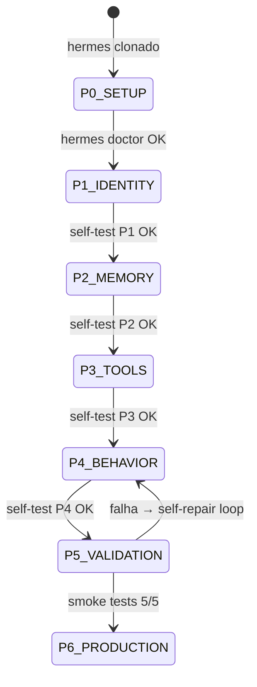
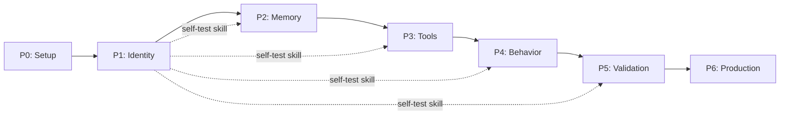
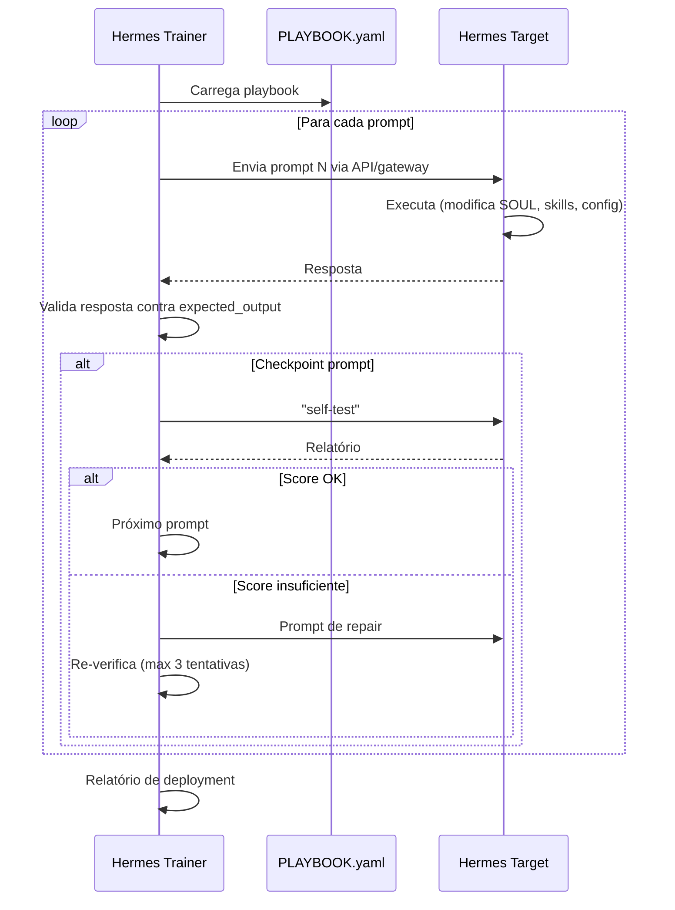

# Exocórtex.IA — Plano PDD (Prompt-Driven Development)

> **Branch:** PDD — Infrastructure as Prompts
> **Status:** 🟡 Em Revisão
> **Owner:** @elder
> **Last Updated:** 2025-05-25T23:30

---

## 📋 TL;DR para Agentes

> **Leia isto se você tem contexto limitado.**
>
> Este plano transforma um Hermes Agent vanilla no Exocórtex.IA usando apenas prompts.
> São 28 prompts organizados em 7 fases (P0-P6). Cada fase tem um checkpoint de self-test.
> Se um checkpoint falha, o agente deve se auto-reparar antes de avançar.
> O resultado final é replicável: rodar o mesmo playbook em um Hermes novo produz outro Exocórtex.

---

## Conceito: Infrastructure as Prompts (IaP)

Em vez de escrever código para estender o Hermes, criamos uma **sequência replicável de prompts** que faz o Hermes se auto-configurar no Exocórtex.

```
Hermes Vanilla → [P0: Setup] → [P1: Identity] → [P2: Memory] → [P3: Tools] → [P4: Behavior] → [P5: Validation] → [P6: Production]
```

**Por que funciona:** Hermes é um agente programável via conversação. Ele persiste estado em `SOUL.md`, `MEMORY.md`, `config.yaml`, skills e plugins. Cada prompt modifica um desses artefatos permanentes.

**Pré-requisitos:**
- Hermes Agent clonado e instalado (ver `phases/P0_SETUP.md`)
- Python 3.12+ com `uv` package manager
- Docker instalado
- API keys: OpenAI + OpenRouter

---

## Máquina de Estados



---

## Fases — Overview

| Fase | Nome | Prompts | Artefatos Criados/Modificados | Checkpoint |
|---|---|---|---|---|
| **P0** | Setup | — (manual) | Hermes instalado, env configurado | `hermes doctor` |
| **P1** | Identity | 001-005 | `SOUL.md`, skill `exocortex-self-test`, skill `exocortex-prompt-log` | self-test score ≥ 2/5 |
| **P2** | Memory | 006-010 | Acervo Cognitivo dirs, 7 Nature skills, `exocortex-new-microverso` skill | self-test score ≥ 3/5 |
| **P3** | Tools | 011-018 | `config.yaml` MCPs, skill `exocortex-tool-governance`, bundle `exocortex-alpha` | self-test score ≥ 4/5 |
| **P4** | Behavior | 019-025 | Draft-First skill, Vetor Ativo skill, Canvas Cognitivo skill, Morning Briefing | self-test score ≥ 4/5 |
| **P5** | Validation | 026-028 | Smoke tests executados, relatório de graduação | self-test score = 5/5 |
| **P6** | Production | — | Estado `ready`, tenant pronto para uso | Full green |

**Detalhe de cada fase:** Ver arquivos em `phases/P{N}_{NOME}.md`

---

## Dependências entre Fases



**Regra:** Não avance para a fase N+1 sem o checkpoint da fase N passar.

---

## Artefatos-Semente

Arquivos template que são injetados nos prompts:
- `artifacts/SOUL_SEED.md` — Template do SOUL.md do Exocórtex
- `artifacts/SELF_TEST_SKILL.md` — Skill de auto-diagnóstico completa

---

## Meta-Trainer (Automação)

Para provisionar novos tenants automaticamente, um segundo Hermes (o "Trainer") executa o Playbook no Hermes alvo.



**Detalhes de implementação:** O Meta-Trainer é implementado na Code Branch (Beta). O PDD Branch define o playbook que ele executa.

---

## Verificação

Cada fase é verificada por:
1. **self-test** — skill que roda checklist automatizado
2. **Inspeção de artefatos** — verifica que arquivos foram criados/modificados
3. **Teste comportamental** — verifica que o agente responde corretamente

---

## Links

| Recurso | Arquivo |
|---|---|
| Status global | `../STATUS.md` |
| Knowledge base | `../KNOWLEDGE.md` |
| Decisões arquiteturais | `../DECISIONS.md` |
| Comunicação inter-agentes | `../COMMS.md` |
| Code Branch (complementar) | `../code/PLAN.md` |
| Hermes SoT | `../../docs/hermes-agent-kwon/hermes-agent-sot-for-agents.md` |
| PRD Dev | `../../docs/PRD/PRD_dev_v1.md` |
| PRD Executive | `../../docs/PRD/PRD_executive_v1.md` |
